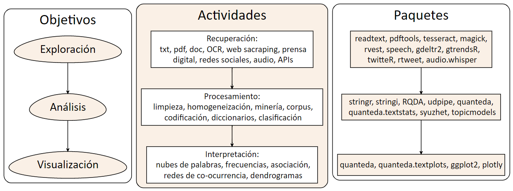
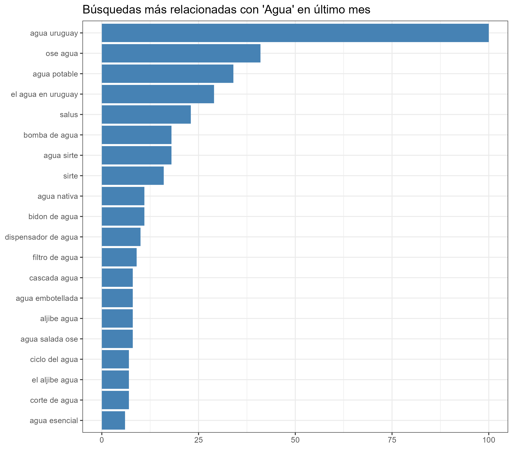

```{r echo=FALSE}
knitr::knit_hooks$set(mysize = function(before, options, envir) {
  if (before) 
    return(options$size)
})
```


```{r include=FALSE}
knitr::opts_chunk$set(mysize = TRUE, size = "\\tiny")

```


<center>

<!-- { width=25% }  -->
</center>


**Mag. Elina Gómez (UMAD)**

[elina.gomez@cienciassociales.edu.uy](elina.gomez@cienciassociales.edu.uy)

[www.elinagomez.com](www.elinagomez.com)


#


{ width=18% }  

Este trabajo se distribuye con una licencia Creative Commons Attribution-ShareAlike 4.0 International License


# **Objetivos del curso**

**Exploración de fuentes de datos textuales:** 

- Exploración y obtención de datos de diversa índole, contemplando las diferentes fuentes posibles: OCR, web sacraping, prensa digital, redes sociales, audio, Youtube, APIs. 


# **Objetivos del curso**

**Análisis textual:** 

- Abordaje de los requerimientos previos (limpieza y homogeneización) para el análisis de textos.
- Trabajo con minería de textos, el cual se centrará en la noción de _corpus_ y sus posibilidades analíticas, desde lo más descriptivo a la aplicación de técnicas más complejas. 

# **Objetivos del curso**

**Análisis textual:** 

- Trabajo con diccionarios: Introducción al uso de diccionarios (manuales y automáticos), para la clasificación de documentos masivos según intereses particulares.

- Clasificación de textos:  clasificación de textos según temas o emociones asociadas a partir de la aplicación de diferentes técnicas existentes. 


# **Objetivos del curso**

**Visualización:** 

- Exploración de las diferentes posibilidades gráficas de visualización de los resultados del análisis textual (nubes de palabras, frecuencias, dendrogramas, etc.) y algunos ejemplos de visualización interactiva. 


# **Esquema del curso**




# **Consejo**

- Elegir un tema de interés
- Hacerse una pregunta inicial
- Identificar una fuente textual para responderla


# **Ideas / Ejemplos**

tema|política forestal uruguay
-----|-----
preguntas|¿cómo se desarrolló el debate parlamentario acerca de las modificaciones a la ley forestal? ¿qué palabras fueron más frecuentes? ¿qué temas fueron los preponderantes? ¿qué emociones y sentimientos se desprenden de cada texto? ¿hay diferencias entre los diferentes partidos políticos?
 | 
fuentes|diarios de sesiones parlamento

# **Ideas / Ejemplos**

tema|investigación ciencias sociales
-----|-----
preguntas|¿cuáles son los temas predominantes en la investigación en la FCS? ¿qué grado de pluralidad hay en las temáticas de investigación? ¿en qué nivel son citados los investigadores de la FCS?
 | 
fuentes|revistas de departamentos de FCS

# **Ideas / Ejemplos**

tema| carnaval murgas
-----|-----
preguntas|¿qué temas preponderan en los textos de murga 2023? Son textos positivos, negativos o neutros? ¿hay diferencias según el puesto de concurso? ¿hay diferencias según participación de mujeres?
 | 
fuente|textos de murgas


# **Ideas / Ejemplos**

tema|conflictividad laboral
-----|-----
preguntas|¿qué características tuvo la conflictividad laboral en Uruguay en la segunda quincena de agosto de 2021?
 | 
fuentes|la diaria


# **Ideas / Ejemplos**

tema|estudios constitucionales
-----|-----
preguntas|¿qué similitudes y diferencias tienen las constituciones de Uruguay y Costa Rica en materia de libertad economica y civil?
 | 
fuentes|constituciones

# **Ideas / Ejemplos**

tema|género y política
-----|-----
preguntas|¿cómo se componen los discursos parlamentarios alrededor de los productos de gestión menstrual y la  menstruación en Uruguay y Colombia?
 | 
fuentes|diarios de sesiones, leyes


# **Ideas / Ejemplos**

tema|política usa
-----|-----
preguntas|¿qué sentimientos preponderan en los tweets de Biden y Trump?
 | 
fuentes|twitter


# **Recursos bibliográficos básicos**


- [Bit by bit (Matthew J. Salganik)](https://www.bitbybitbook.com/)
- [Data Feminism o Feminismo de Datos (Catherine D'Ignazio y Lauren F. Klein)](https://data-feminism.mitpress.mit.edu/bienvenida)
- [R para Ciencia de Datos (Hadley Wickham y Garrett Grolemund)](https://github.com/elinagomez/analisistextoEPUdelar2023/blob/master/Bibliograf%C3%ADa/r-para-ciencia-de-datos-r-for-datascience-spanish-r4ds.pdf)
- [Text Mining with R!(Julia Silge y David Robinson)](https://www.tidytextmining.com/)
- [Hojas de ruta en español](https://github.com/rstudio/cheatsheets/tree/main/translations/spanish)
- [Intro web scraping con R (Riva Quiroga)](https://programminghistorian.org/es/lecciones/introduccion-al-web-scraping-usando-r)
- [Tutoriales Ciencias Sociales Computacionales - SICSS](https://sicss.io/overview)

[Repositorio con recursos varios](https://www.rstudio.com/resources/books/)


# Introducción conceptual y teórica

**Contexto**

- El abordaje metodológico y técnico que veremos en el curso se enmarca en las llamadas **ciencias sociales computacionales**


# Introducción conceptual y teórica

_"Una nueva disciplina como las Ciencias Sociales Computacionales (Cioffi-Revilla, 2017; Lazer et al., 2009; Mann, 2016) que aglutina la aplicación tanto de las ciencias de la complejidad como del análisis computacional en las Ciencias Sociales, aporta un enfoque innovador para la comprensión del comportamiento humano y social (...) Se promueven así no solo otro tipo de preguntas, sino también la cooperación y la colaboración entre disciplinas. Asimismo, se pueden explorar también nuevas hipótesis a partir de la disponibilidad de nuevos conjuntos de datos y nuevas capacidades de exploración de estos. El desarrollo de nuevos paradigmas y la colaboración entre diferentes campos de conocimiento tienen el potencial de promover nuevos escenarios de investigación, evitando la reiteración en construcciones interpretativas preexistentes (Cioffi-Revilla, 2017; Conte et al., 2012)."_ [(Caro, Jorge et al., 2020)](https://pressbooks.pub/terraincognita/chapter/ciencias-sociales-computacionales-y-humanidades-digitales-un-ejemplo-de-praxis-transdisciplinar/)


# Introducción conceptual y teórica

**Características:**

- Perspectiva transdisciplinar

- Dialogo con nuevos desarrollos vinculados a la ciencia de datos, el aprendizaje automático o estadístico, modelado, análisis espacial.

- Explotación del _big data_ como fuente de datos y nuevos campos de estudio. 


# Sobre Big data

_"Researchers are in the process of making a change akin to the transition from photography to cinematography."_ (Salganik, 2018)


- Bit by Bit: Social Research in the Digital Age (Matthew J. Salganik, 2018). [Reseña en español](https://blog.scielo.org/es/2018/08/09/resena-del-libro-bit-by-bit-social-research-in-the-digital-age/#.Y2k58eTMIol)


- Big Data: datos en línea (búsquedas y rrss); registros administrativos.

# Sobre Big data

- Diez características según Salganik (2018): _grande; siempre encendido; no reactivo; incompleto; inaccesible; no representativo; a la deriva; algorithmically confounded; sucio; y sensible_.

- Procesamiento: _"contar cosas; pronosticar cosas; y aproximar experimentos"_.

- Complementariedad con técnicas tradicionales (encuestas): preguntas enriquecidas y pregunta amplificada.

- Nuevas formas de colaboración (crowd-sourcing) y comunidades de desarrollo.

- Desafíos éticos, cajas negras


# Panorama regional 

- En América Latina existen diversos grupos académicos que trabajan esta línea ya sea desde las llamadas _humanidades digitales_ o de las _ciencias sociales computacionales_


# Panorama regional 


Algunas iniciativas regionales interesantes:

* [Programming Historian](https://programminghistorian.org/es/)
* [Laboratorio de Humanidades Digitales - UFBA](https://www.labhd.ufba.br/)
* [Observatorio de conflictividad - UNMdP](http://observatoriodeconflictividad.org/)
* [Nucleo de Innovación Social - Colegio de Sociólogos de la Provincia de Buenos Aires](https://www.nucleodeinnovacion.com/)
* [factor~data - Escuela IDAES (UNSAM)](https://unsam.edu.ar/escuelas/idaes/671/idaes/ciencias-sociales-computacionales-humanidades-digitales)
* [Observatorio de Redes](https://politicosentwitter.com/#quienes)
* [Instituto Milenio Fundamento de los Datos](https://imfd.cl/)
* [Maestría en Humanidades Digitales - Uniandes ](https://posgradosfacartes.uniandes.edu.co/programas/humanidades-digitales/)


# Stringr

- Para manipulación de strings hay varias funciones básicas de _R base_: `nchar()`, `paste()`, `grep()`, `grepl()`, `sub()`, `gsub()`, `substr()`, `substring()`, `regexec()`, entre otras

- Sin embargo, en el curso veremos principalmente las funciones de manipulación de strings que se incluyen en la librería [stringr](https://stringr.tidyverse.org/) de Tidyverse. 

- Una de las ventajas de stringr es que todas la funciones comienzan con `str_` a diferencia del base que hay que memorizar distintos nombres

```{r echo=FALSE, out.width = "10%", fig.align = "right"}
knitr::include_graphics("imagenes/stringr.png")
```

# Stringr

- [Hoja de ruta stringr](https://github.com/rstudio/cheatsheets/blob/main/translations/spanish/strings_es.pdf) 

- En esta [Introducción a la ciencia de datos](http://rafalab.dfci.harvard.edu/dslibro/procesamiento-de-cadenas.html#expresiones-regulares) encuentran una buena introducción al procesamiento de cadenas 

```{r echo=FALSE, out.width = "10%", fig.align = "right"}
knitr::include_graphics("imagenes/stringr.png")
```

<!-- # Stringr -->

<!-- Funciones para separar un texto: -->

<!-- [str_split](https://stringr.tidyverse.org/reference/str_split.html) -->

<!-- ```{r eval=FALSE} -->
<!-- library(stringr) -->

<!-- str_split(x "\r) -->

<!-- str_split(x, boundary("word")) -->

<!-- ##type = c("character", "line_break", "sentence", "word") -->
<!-- ``` -->

# Stringr

Funciones para separar un texto:

[str_split](https://stringr.tidyverse.org/reference/str_split.html)

```{r eval=FALSE}
x <- "Este es un curso de Recuperacion y analisis de texto con R"

# divido por espacio en blanco
str_split(x, " ")  # string, pattern

#> [[1]]
 [1] "Este" "es" "un" "curso" "de" "Recuperacion" "y" "analisis" "de"          
[10] "texto" "con" "R"

# la cadena puede ir en el argumento string sin crear un objeto previo
str_split("Este es un curso de Recuperacion y analisis de texto con R", " ") 

# variante con regex
str_split(x, "\\s") # string, pattern
# otra variante divido por palabra
str_split(x, boundary("word")) #string, boundary()
```

<!-- # Stringr -->

<!-- Funciones para combinar un texto: -->

<!-- [str_c](https://stringr.tidyverse.org/reference/str_c.html) -->

<!-- ```{r eval=FALSE} -->
<!-- library(stringr) -->

<!-- str_c("x", "y", sep = ", ") -->
<!-- > [1] "x, y" -->
<!-- ##sep para controlar -->
<!-- ``` -->

# Stringr

Funciones para combinar un texto:

[str_c](https://stringr.tidyverse.org/reference/str_c.html)

```{r eval=FALSE}
x <- "Este es un curso de Recuperacion y analisis de texto con R"
y <- "Es un curso de educación permanente."

# combino los vectores con un punto seguido de un espacio
str_c(x, y, sep = ". ") # string1, string2, separador

#> [1] "Este es un curso de Recuperacion y analisis de texto con R. Es un curso de educación permanente."
```

<!-- # Stringr -->

<!-- Funciones para reemplazar un texto: -->

<!-- [str_replace](https://stringr.tidyverse.org/reference/str_replace.html) -->

<!-- ```{r eval=FALSE} -->
<!-- library(stringr) -->
<!-- #la primera coincidencia -->
<!-- str_replace(string, pattern, replacement) -->

<!-- #todas las coincidencias -->
<!-- str_replace_all(string, pattern, replacement) -->

<!-- ``` -->

# Stringr

Funciones para reemplazar un texto:

[str_replace](https://stringr.tidyverse.org/reference/str_replace.html)

```{r eval=FALSE}
x <- "Este es un curso de Recuperacion y analisis de texto con R"

# reemplazo primera ocurrencia de "de" por un .
str_replace(x, "de", ".") # string, pattern, replacement 

#> [1] "Este es un curso . Recuperacion y analisis de texto con R"

# reemplazo todas las ocurrencias de "de" por un .
str_replace_all(x, "de", ".") # string, pattern, replacement

#> [1] "Este es un curso . Recuperacion y analisis . texto con R"

```


<!-- # Stringr -->

<!-- Funciones para pasar mayúscula/minúscula: -->

<!-- [str_to_upper / to_lower](https://stringr.tidyverse.org/reference/case.html) -->

<!-- ```{r eval=FALSE} -->
<!-- library(stringr) -->

<!-- str_to_upper(c("i", "ı")) -->
<!-- #> [1] "I" "I" -->

<!-- str_to_lower(c("I", "I")) -->
<!-- #> [1] "i" "ı" -->

<!-- ``` -->


# Stringr

Funciones para pasar mayúscula/minúscula:

[str_to_upper / str_to_lower](https://stringr.tidyverse.org/reference/case.html)

```{r eval=FALSE}
x <- "Este es un curso de Recuperacion y analisis de texto con R"

str_to_upper(x) # string

#>[1] "ESTE ES UN CURSO DE RECUPERACION Y ANALISIS DE TEXTO CON R"

str_to_lower(x) # string

#> [1] "este es un curso de recuperacion y analisis de texto con r"

```


# Stringr

Funciones para eliminar espacios en blanco:

[str_trim](https://stringr.tidyverse.org/reference/str_trim.html)

```{r eval=FALSE}
x <- "  Este es un curso de Recuperacion y analisis de texto con R  "

# elimino espacios al inicio de la cadena
str_trim(x, side = "left") # string, side = c("both", "left", "right")

#> [1] "Este es un curso de Recuperacion y analisis de texto con R  "

# elimino espacios al inicio y final de la cadena
str_trim(x) # por defecto side = both

#> [1] "Este es un curso de Recuperacion y analisis de texto con R"

```


# Stringr

Funciones para eliminar espacios en blanco:

[str_squish](https://stringr.tidyverse.org/reference/str_trim.html)

```{r eval=FALSE}
# elimino espacios al inicio y final de la cadena y reemplaza a un espacio el resto 
# str_squish(string)
str_squish(" Este es un   curso de Recuperacion   y analisis de texto con R\t")

#> [1] "Este es un curso de Recuperacion y analisis de texto con R"

```

# Stringr

Ejemplo extrayendo texto de internet:

```{r eval=FALSE}
library(readtext)
url_texto <- "https://www.ingenieria.unam.mx/dcsyhfi/material_didactico/Literatura_Hispanoamericana_Contemporanea/Autores_B/BENEDETTI/Poemas.pdf"
# Extraemos el texto
mario <- readtext(url_texto)

library(stringr)

# divido el texto en oraciones

# usando %>% 
mario_sentencias <- str_split(mario$text, boundary("sentence"))%>% # divido el texto en oraciones
  unlist()%>% # convierto el texto en un vector
  str_trim("both") # elimino espacios

# sin %>% 
mario_sentencias2 <- str_trim(unlist(str_split(mario$text, boundary("sentence"))), "both") 

# compruebo que son iguales
identical(mario_sentencias, mario_sentencias2)
#> [1] TRUE

```

# stringr, R-base y stringi

- `stringr` tiene muchas más funciones, algunas sin equivalente directo en R-base
[Comparativo stringr - base](http://rafalab.dfci.harvard.edu/dslibro/procesamiento-de-cadenas.html#stringr)

- `str_view()`, `str_detect()`, `str_extract()`,`str_sub()`, `str_count()` son algunas de las funciones más útiles para el procesamiento 

- Además existe el paquete [`stringi`](https://cran.r-project.org/web/packages/stringi/index.html) que tiene aún más funciones que `stringr`

# Ejercicio 3: stringr

## Manipulación de strings

1. Cargue, extraiga de internet o cree una cadena de texto

2. Aplique, de forma separada, al menos tres funciones de stringr

3. Simplifique el ejercicio anterior utilizando el %>% 


# Caracteres especiales

Para construir consultas que incluyan metacaracteres, i.e.

`\\$ \\* \\+ \\. \\? \\[ \\] \\^ \\{ \\} \\| \\( \\)`

Se debe agregar una retrobarra  `\\`

# Metacaracteres especiales

`\\t` : Tabulador

`\\n` : Nueva línea

`\\v` : Tabulación vertical

`\\f` : Salto de formulario

`\\r` : Salto de línea


# Cuantificadores

Los Cuantificadores especifican cuantas veces el patrón consultado pueda ocurrir.

`*` : coincide al menos 0 veces.

`+` : coincide al menos 1 vez.

`?` : coincide a lo sumo 1 vez.

`{n}` : coincide exactamente $n$ veces.

`{n,}` : coincide al menos $n$ veces.

`{,m}` : coincide a lo sumo $m$ vez.

`{n,m}` : coincides entre $n$ y $m$ veces.


# Cuantificadores

El cuantificador refiere al caracter inmediatamente anterior

- Ejemplos

```{r eval=FALSE}
str_detect(string, pattern)

vec <- c("AB", "A1B", "A11B", "A111B", "A1111B", "A2B", "A1q2")

str_detect(vec, "A1*B") # `*` : coincide al menos 0 veces.
#> [1]  TRUE  TRUE  TRUE  TRUE  TRUE FALSE FALSE

#detecta coincidencia siempre que a una A le siga una B 
#y en los casos en que una A y una B estén separadas por 1 o muchos 1.
#Si hay algún otro caracter en el medio no detecta coincidencia

str_detect(vec, "A1+B") # `+` : coincide al menos 1 vez.
#> [1] FALSE  TRUE  TRUE  TRUE  TRUE FALSE FALSE
#detecta coincidencia siempre que una A y B estén separadas por 1 o muchos 1.
#Si hay ninguno o algún otro caracter en el medio no detecta coincidencia

str_detect(vec, "A1?B")
#> [1]  TRUE  TRUE FALSE FALSE FALSE FALSE FALSE
#detecta coincidencia siempre que una A y B estén juntas o separadas por un 1.
#Si algún otro caracter o más de un 1 en el medio no detecta coincidencia

```

Fuente: adaptado de [Introducción a la ciencia de datos](http://rafalab.dfci.harvard.edu/dslibro/procesamiento-de-cadenas.html#expresiones-regulares)


# Posición

`^` : Al inicio de la cadena.

`$` : Al final de la cadena.

`\b` : En los extremos de la palabra.

`\B` : No en los extremos de la palabra.

`\<` : Al inicio de la palabra.

`\>` : Al final de la palabra.


# Posición

- Ejemplos

```{r eval=FALSE}

str_detect(string, pattern)

vec <- c("abxxxx", "xxxxabxxxx", "xxxxxab")

str_detect(vec, "^ab")
#> [1]  TRUE FALSE FALSE
#detecta coincidencia sólo cuando "ab" está al inicio de la cadena

str_detect(vec, "ab$")
#> [1] FALSE FALSE  TRUE
#> #detecta coincidencia sólo cuando "ab" está al final de la cadena

```

# Caracteres por clases

`[[:digit:]] or \\d or [0-9]` : digitos 0 1 2 3 4 5 6 7 8 9

`\\D or [^0-9]` : no-digitos

`[[:lower:]] or [a-z]` : letras minúsculas

`[[:upper:]] or [A-Z]` : letras mayúsculas

`[[:alpha:]] or [[:lower:][:upper:]] or [A-z]` : caracteres alfabeticos

# Caracteres por clases

`[[:alnum:]] or [[:alpha:][:digit:]] or [A-z0-9]`: caracteres alfanuméricos

`\\w or [[:alnum:]_] or [A-z0-9_]` : caracteres de palabra

`\\W or  [^A-z0-9_]` : No caracteres de palabra

`[[:xdigit:]] or [0-9A-Fa-f]` :  dígitos hexadecimales (base 16) 0 1 2 3 4 5 6 7 8 9 A B C D E F a b c d e f


# Caracteres por clases

- Ejemplos

```{r eval=FALSE}

str_detect(string, pattern)

vec <- c("12345", "hola", "HOLA", "Hola", "Hola12345", "$#&/(#")

str_detect(vec, "[[:alnum:]]")
#> [[1]  TRUE  TRUE  TRUE  TRUE  TRUE FALSE
#detecta coincidencia si hay caracteres alfanuméricos

str_detect(vec, "[[:digit:]]")
str_detect(vec, "\\d")
str_detect(vec, "[0-9]")
#> [1]  TRUE FALSE FALSE FALSE  TRUE FALSE
#detecta coincidencia si hay números

str_detect(vec, "[[:alpha:]]")
str_detect(vec, "[A-z]")
#> [1] FALSE  TRUE  TRUE  TRUE  TRUE FALSE
#detecta coincidencia si hay letras

str_detect(vec, "[A-Z]")
#> [1] FALSE FALSE  TRUE  TRUE  TRUE FALSE
#detecta coincidencia si hay letras mayusculas

str_detect(vec, "[a-z]")
#> [1] FALSE  TRUE FALSE  TRUE  TRUE FALSE
#detecta coincidencia si hay letras minúsculas

```


# Caracteres y espacios

`[[:blank:]]` : espacios y tabulaciones

`[[:space:]] or \s` : todo tipo de caracteres de espaciado: tabulación, nueva línea, tabulación vertical, salto de formulario, Salto de linea, espacios

`\\S` : Caracteres que no sean espacios

`[[:punct:]]` :  caracteres de punctuación
`! " # $ % & ( ) * + , - . / : ; < = > ? @ [  ] ^ _  { | } ~`

# Caracteres y espacios

`[[:graph:]] or [[:alnum:][:punct:]]` : caracteres gráficos (legibles)

`[:print:]] or [[:alnum:][:punct:]\\s]` : caracteres sin espacios

`[[:cntrl:]] or \\c` :  caracteres de control, como `\n` or `\r`, etc.


# Expresiones regulares

Las expresiones regulares mas complejas combinan los ejemplos anteriores (y otros)

- Ejemplo:

Necesito una expresión regular que detecte solo el quinto elemento de este vector 

```{r eval=FALSE}

vec <- c("12312342312345", "hola", "HOLA", "Hola", "Hola12345", "$#&/(#")

str_detect(vec, "^[A-Z].*\\d$") # inicio mayuscula, fin número, pueden existir caracteres en medio
#> [1]  FALSE FALSE FALSE FALSE  TRUE FALSE


```


# Fuentes de datos

Las fuentes de datos que vamos a ver son:

1. Recuperación de documentos en imagen o pdf (OCR) 

2. Scraping web y parlamentario

3. Prensa digital

4. Google Trends

5. Audio

6. YouTube


# Objetivos 

- Fuentes de datos:

1. Recuperación de documentos en imagen o pdf (OCR) 

2. Scraping web y parlamentario

3. Prensa digital


# Previo: carga de archivos de texto

Existen diferentes librerías de R que nos permiten recuperar documentos en diferentes formatos:


- [readtext](https://cran.r-project.org/web/packages/readtext/vignettes/readtext_vignette.html)

- [pdftools](https://docs.ropensci.org/pdftools/)


# readtext

- El paquete [readtext](https://cran.r-project.org/web/packages/readtext/vignettes/readtext_vignette.html) tiene una función con le mismo nombre _readtext()_ que permite cargar archivos en cualquier formato de texto (txt, pdf, doc, docx, odt o incluso alojado en uno de estos formatos en la web).

- `readtext::readtext()`

```{r eval=FALSE, message=FALSE, warning=FALSE}
library(readtext)
##Abro los textos en formato .txt y visualizo cómo los carga
txt <- readtext::readtext("Clase2/Material/Mujeres_Adultos_1.txt")
# Determinamos el pdf con el que trabajar
pdf <- readtext("Clase2/Material/text.pdf")
url <- readtext("https://www.ingenieria.unam.mx/dcsyhfi/material_didactico/Literatura_Hispanoamericana_Contemporanea/Autores_B/BENEDETTI/Poemas.pdf")
```

# pdftools

Para recuperar textos en pdf existe la librería [pdftools](https://docs.ropensci.org/pdftools/) que se basa en el paquete _Rpoppler_ (Kurt Hornik).

- `pdftools::pdf_text()`

```{r eval=FALSE, message=FALSE, warning=FALSE}
library(pdftools)
# Extraemos el texto
pdf_texto <- pdf_text("Clase2/Material/marcha_1973.pdf")
```


# 1. Recuperación de documentos en imagen o pdf (OCR)

Tesseract es un motor de OCR _(reconocimiento óptico de caracteres)_ para varios sistemas operativos. Es software libre, liberado bajo la licencia Apache, Versión 2.0 y su desarrollo es financiado por Google desde el 2006.

[Acá se encuentra la documentación](https://opensource.google/projects/tesseract), cuenta con *más de 100 idiomas.*

# tesseract OCR

Existe un paquete de R [bien documentado](https://cran.r-project.org/web/packages/tesseract/vignettes/intro.html) que se llama _tesseract_ y que cuenta con funciones que permiten el reconocimiento de caracteres incluso en español, descargando una base de entrenamiento del motor.

# tesseract OCR 

Descargo un documento histórico del repositorio [Internet Archive](https://archive.org/search.php?query=creator%3A%22Ateneo+del+Uruguay%22)

```{r message=FALSE, warning=FALSE, eval=FALSE}
##Chequear los idiomas disponibles 
tesseract_info()
# Bajar por unicamente español para entrenar
tesseract_download("spa")
# asignar
(espanol <- tesseract("spa"))
#Probamos:
transcribopdf <- ocr("analesUruguay.pdf", engine = espanol)

```

# tesseract OCR

La función _ocr_data()_ devuelve una tabla dónde cada fila es una palabra con la confianza asociada a la misma y la ubicación exacta. 


# magick

El paquete _magick_ complementa a _tesseract_ en cuento a mejora de la calidad de las imagenes que sirven de input. Cuenta con varias funciones para mejorar la resolución, el color, contraste, espacios en blanco. Puede ser utilizado como paso previo. 

# Ejercicio 1

## Reconocimiento óptico de caracteres

1. Replicar el OCR para los archivos _analesUruguay3_ y _marcha_1973_

2. Hacer la tabla de ambas 


# 2. Web scraping


*¿Qué es web scraping?*

__Web scraping__ es una __técnica__ para obtener datos no estructurado (etiquetas HTML) de una página web, a un formato estructurado de columnas y renglones, en los cuales se puede acceder y usar más fácilmente.


# 2. Web scraping

*¿Para qué sirve Web scraping?*

- Obtener datos de texto.
- Consolidar datos de redes sociales o extraer comentarios de usuarios/as.
- Precios de tiendas online, a través del análisis histórico de la competencia.
- Búsqueda en Google de diversas palabras clave.
- Etiquetas de imágenes, para clasificación de imágenes.


# 2. Scraping web y parlamentario


En el curso vamos a ver tres formas de Web scraping:

- Paquete _rvest_
- Paquete _speech_ (Uruguay)
- Gdelt project


# rvest

*rvest* es un paquete para scraping (raspado) y análisis web de Hadley Wickham.

[Documentación](https://cran.r-project.org/web/packages/rvest/rvest.pdf)

- Tutorial recomendado de Riva Quiroga (Chile)

[https://programminghistorian.org/es/lecciones/introduccion-al-web-scraping-usando-r](https://programminghistorian.org/es/lecciones/introduccion-al-web-scraping-usando-r)


# ¿Cómo usar rvest?

Para usar rvest, se requiere conocer las instrucciones en código, a las que llamaremos funciones, para para hacer las tareas más comunes en la extracción y manipulación de datos web. 

- `read_html(«url»)` con esta función se crea un objeto que contiene todo el código o etiquetas HTML.
- `html_elements(«objeto html», «etiqueta css»)` se usa para seleccionar partes del objeto que contiene todo el código html. El segundo parámetros es la clase CSS que está relacionada con la sección que deseamos extraer. 

# ¿Cómo usar rvest?

- `html_elements()` devuelve los elementos html seleccionados
- `html_name()` devuelve el nombre de un elemento html
- `html_attr()` regresa los atributos específicos html (ej. href)
- `html_text()` extrae el texto html
- `html_table()` convierte una tabla html en una estructura de datos en R


# Ejemplo rvest: texto

- Opción 1: Descargo la extensión del [SelectorGadget](http://selectorgadget.com/) de Chrome e [instalo](https://chrome.google.com/webstore/detail/selectorgadget/mhjhnkcfbdhnjickkkdbjoemdmbfginb) y busco el nombre del nodo o elementos en una pagina que me interese scrapear 

- Opción 2: Usar las herramientas de desarrollo de los navegadores a través de la opción _inspect_ o _inspeccionar_ que muestra el código html de la página y las reglas de estilo (CSS)

- Opción 3: Usar plataformas web con herramientas de scrapeo como [Apify](https://apify.com/)


# Ejemplo rvest: texto

```{r message=FALSE, warning=FALSE, eval=FALSE}
library(rvest)
library(dplyr)

#Defino mi sitio html: Montevideo portal
mvdportal = read_html("https://www.montevideo.com.uy/index.html") 

resumenes = mvdportal %>%
  html_elements(".text")%>% #defino los elementos que identifiqué con el SelectorGadget 
  html_text()

titulares = mvdportal %>%
  html_elements("a")%>%
  html_text()

```

# Ejemplo rvest: texto

[Un ejemplo](https://d4tagirl.com/2018/04/scrapeando-las-sesiones-parlamentarias-de-uruguay) concreto para el caso uruguayo !


# Ejemplo rvest: tabla


```{r eval=FALSE, message=FALSE, warning=FALSE}

url <- 'https://es.wikipedia.org/wiki/Anexo:Ríos_de_Uruguay'

url %>% read_html() %>%
  html_elements(css = '.wikitable') %>%
  html_table() 

```

# Ejercicio 2

## Scrapeo web con rvest

1. Descargar noticias o información de otra web
2. Scapear dos elementos html diferentes 


# _speech_


# _speech_

El [paquete speech](https://CRAN.R-project.org/package=speech) convierte los diarios de sesiones legisladorxs uruguayxs, en un marco de datos ordenado donde cada observación es la intervención de unx solx legisladorx.

Acá se encuentra la [documentación](https://cran.r-project.org/web/packages/speech/speech.pdf) del paquete con descripción de las funciones y argumentos.


# _speech_

```{r eval=FALSE, message=FALSE, warning=FALSE}

##Recomiendo instalar versión en desarrollo:

if (!require("remotes")) install.packages("remotes")
remotes::install_github("Nicolas-Schmidt/speech")

library(speech)

```


# _speech_

```{r eval=FALSE, message=FALSE, warning=FALSE}

url <- "https://parlamento.gub.uy/documentosyleyes/documentos/diarios-de-sesion/5515/IMG"

sesion <- speech::speech_build(file = url)

```


# _speech_

```{r eval=FALSE, message=FALSE, warning=FALSE}

#Función completa

sesion <- speech::speech_build(file = url, 
#url a pdf
compiler = FALSE, 
#compila discursos de unx mismx legisladorx
quality = TRUE,
#aporta dos índices de calidad
add.error.sir = c("SEf'IOR"),
##forma errónea que lo que identifica a el/la legisladorx
rm.error.leg = c("PRtSIDENTE", "SUB", "PRfSlENTE"))
##identifica a el/la legisladorx que debe eliminarse
```

# _speech_

Variables que incluye la tabla ordenada:

- legislator: nombre
- speech: discurso/s
- date: fecha de sesión
- id: identificador
- legislature: número de legislatura
- chamber:  cámara del documento (representantes, senadores, asamblea general, comisión permanente)  

Si quality es TRUE:

- index_1: index_1. Proporción del documento recuperado con respecto al original. 
- index_2: index_2. Proporción del documento final en función del recuperado. Proporción del documento donde hay intervenciones de lxs legisladorxs.


# _puy_

- Es posible combinar con el paquete _puy_ para recuperar el dato del partido político al que pertenece 

- `puy::add_party()`

```{r eval=FALSE, message=FALSE, warning=FALSE}

#agrego partido político
sesion <- puy::add_party(sesion)

```

# _speech App_

- Existe una Shiny de speech que permite descargar de forma tabulada las sesiones sin escribir código: [https://bancodedatos-fcs.shinyapps.io/shiny_speech/](https://bancodedatos-fcs.shinyapps.io/shiny_speech/)


# Ejercicio 3

## Scrapeo parlamentario con speech

1. Elegir una sesión parlamentaria
2. Aplicar la funcion speech_build 
3. Agregar etiqueta partidaria 
4. Guardar en formato tabulado 


# Fuentes de datos

Las fuentes de datos que vamos a ver son:

1. Recuperación de documentos en imagen o pdf (OCR) 

2. Scraping web y parlamentario

3. Prensa digital

4. Google Trends

5. Audio

6. YouTube


# Objetivos 

- Fuentes de datos: Google Trends, Audio y YouTube


# 4. _gtrendsR_


- El paquete [gtrendsR](https://github.com/PMassicotte/gtrendsR)

- Permite realizar búsquedas de los términos más buscados en Google, proporciona una métrica propia para saber el volumen de búsqueda asociado. 

- Permite análisis longitudinales, por países,departamentos, etc. 

- Es útil para analizar intereses/preocupaciones de las personas lo cual nos puede dar información del ámbito _privado_, trascendiendo o complementando con los mensajes emitidos de carácter público (rrss)


# 4. _gtrendsR_: ejemplo con análisis del tema **agua**


```{r echo=FALSE, out.width = "80%", out.height = "80%", fig.align = "center"}

```


# 4. _gtrendsR_: ejemplo con análisis del tema **agua**


```{r echo=FALSE, out.width = "80%", out.height = "80%", fig.align = "center"}

```


# 4. _gtrendsR_: ejemplo con análisis del tema **agua**


```{r echo=FALSE, out.width = "80%", out.height = "80%", fig.align = "center"}

```


# 4. _gtrendsR_: ejemplo con análisis del tema **agua**


```{r echo=FALSE, out.width = "80%", out.height = "80%", fig.align = "center"}

```

# EJERCICIO 1

## Búsquedas de google con gtrendsR

1. Realizar una búsqueda de interés general para el último mes 
2. Realizar una búsqueda de interés general para el último año
3. Graficar ambos resultados

# 5. Audio 

El paquete [audio.whisper](https://github.com/bnosac/audio.whisper) permite utilizar en R la herramienta de reconocimiento de voz _["Whisper" Automatic Speech Recognition model](https://github.com/openai/whisper)_ desarrollada por openaAI.

Recuperar texto de audios es una fuente casi inagotable (entrevistas, discursos, conversaciones, podcast, etc.).

Trabajar en el entorno local de R, garantiza privacidad de la información (ejemplo entrevistas confidenciales)


# audio.whisper

- Tiene diferentes modelos que van desde el menos potente _(tiny)_ al más potente _(large)_

- Cuanto mayor es la potencia y precisión del modelo más demora la transcripción

- Es multilingüe

- Los pasos son sencillos y están bien explicados en el [repositorio del paquete](https://github.com/bnosac/audio.whisper)

- Se combina con la librería `av` para transformar los audios a formato de archivo _.wav de 16 bit_, que es el requerido por `audio.whisper`


# audio.whisper + av

Obtengo un audio de interés y lo convierto a **.wav** con el paquete `av`

```{r, whisper1, eval=F, echo=T}
library(av) # conversor a .wav
library(audio.whisper) # transcpción

# 1. OBTENGO UN ARCHIVO DE AUDIO
# descargo para el ejemplo un audio de la web (podría ser un archivo que ya tengo en mi pc)
download.file("https://medios.presidencia.gub.uy/tav_portal/2018/noticias/AD_103/vazquez-cuidados.mp3", # url del audio
              "cuidados.mp3", # nombre del archivo que quedará en mi pc
              mode="wb") # modo web

# 2. CONVERSIÓN (av)
# convierto a .wav 
av_audio_convert("cuidados.mp3", # nombre del archivo en mi pc
                 output = "cuidados.wav", # nombre del archivo convertido
                 format = "wav", sample_rate = 16000) # formato
```

# audio.whisper

Realizo la transcripción con el modelo _tiny_ (el menos potente)

```{r, whisper2, eval=F, echo=T}
# Descargo el modelo 
# (podría saltear este paso poniendo la ruta en la función predict())
model <- whisper("tiny") # descargo modelo liviano 
# lo corro indicando el idioma (es multilingual)
transcript <- predict(model, newdata = "cuidados.wav", language = "es")
# extraigo el df donde está el texto transcripto
texto_df <- transcript$data # df tiene 4 cols segmento, inicio, fin, texto 
# guardo el df
save(texto_df,file="texto_df.RData") #o en el formato que quieras

```
# audio.whisper

Construyo un cuadro con  `knitr` y `kableExtra` con el texto

```{r, whisper3, eval=F, echo=T}
#olapso la columna text también podría usar un identificador y agrupar
texto_vec <- paste(texto_df$text,collapse="")
tabla1 <- knitr::kable(texto_vec,
          col.names = "Tabaré Vázquez - Sistema de Cuidados", # agrego nombre 
          format = "html", table.attr = "style='width:100%;'") %>% #formato
  kableExtra::kable_styling(font_size = 24) %>% # defino tamaño de letra
  kableExtra::kable_classic() # defino el estilo de la tabla
```

# audio.whisper

```{r echo=FALSE, out.width = "100%", fig.align = "center"}
knitr::include_graphics("imagenes/ej_whisper.jpeg")
```

# audio.whisper

- Los modelos utilizan mucha memoria RAM y esto puede crashear la sesión

- Una alternativa eficiente, sobre todo cuando se trabaja con modelos potentes es descargar los modelos y cargar los archivos locales

- [Sitio para descargar modelos](https://huggingface.co/ggerganov/whisper.cpp/tree/main)

# audio.whisper + scraping

- La utilidad de la transcripción es mayor cuanto más audios tengamos

- Transcribir una entrevista puede ser divertido, 10 es agotador, más de 10 hay contratar a alguien y en general no tenemos recursos

- La potencia se acrecienta combinando herramientas

- Un buen ejemplo es realizar scrapeo de audios de la web con `rvest`


# audio.whisper + scraping + rgtp3

También podemos usar el paquete `rgtp3` que permite conectar R con la herramienta de openAI _chatGPT3_

La API es de pago, pero para un ejercicio básico alcanza con lo que te permite utilizar gratis

- [Acá](https://github.com/elinagomez/analisistextoEPUdelar2023/blob/master/Clase2/Material/Recuperación_texto_audios.html) pueden descargar un ejemplo con:

1. Descarga de audios `rvest`

2. Transcripción con `audio.whisper`

3. Resumen e identificación de tema principal con `rgpt3`

- _[Acá](https://www.elinagomez.com/blog/2023-02-21-gpt3-ccss/)_ hay otro ejemplo de uso de `rgtp3` (no de audio) donde pueden ver los pasos para conectar con la API


# EJERCICIO 2 

## Recuperación de texto de audios

1. Recuperar y transcribir con modelo tiny un audio breve (menos de 3 minutos)
2. Recuperar y transcribir con modelo medium el mismo audio
3. Imprimir en consola ambos resultados y comparar los textos

_Opción de descarga: [sitio Presidencia de la República](https://www.gub.uy/presidencia/comunicacion/audios/breves)_


# 6. YouTube

El paquete [`youtubecaption`](https://github.com/jooyoungseo/youtubecaption) permite descargar los subtítulos de los videos de YouTube

Trabaja sobre la librería de Python `youtube-transcript-api` 

Es necesario conectar R y Pyhton, lo que puede realizarse con librería `reticulate` que permite la instalación de _miniconda_ o la interfaz _Anaconda_ para gestionar los paquetes (ver archivo _[instalaciones](https://github.com/elinagomez/analisistextoEPUdelar2023/blob/master/Clase1/Instalaciones.pdf)_ del curso)

```{r echo=FALSE, out.width = "30%", fig.align = "right"}
knitr::include_graphics("imagenes/youtube.png")
```

# 6. youtubecaption

- Es posible recuperar texto de todos los videos que cuentan con subtítulos (incoprorados o generados automáticamente)

- Si los subtítulos son automáticos la fidelidad generalmente depende de la claridad del audio 

- `youtubecaption` recupera la transcripción de forma tabulada y ordenada para cada secuencia del video, por lo que luego es necesario agrupar por el identificador y recuperar la metadata original (fecha, resumen, canal, visualizciones, etc.)

# 6. youtubecaption

Hay tantas alternativas como videos de YouTube existan: discursos, conferencias, entrevistas, canciones, películas, programas de tv...

```{r, youtube1, eval=F, echo=T}
# hadley wickham
url <- "https://www.youtube.com/watch?v=cpbtcsGE0OA"
caption <- get_caption(url)

# suarez
url2 <- "https://www.youtube.com/watch?v=KsE8a9NOtnU"
caption2 <- get_caption(url2, language = "es")

# agarrate catalina
url3 <- "https://www.youtube.com/watch?v=LApsPiejZLI"
caption3 <- get_caption(url3, language = "es")
```

# 6. youtubecaption

También `youtubecaption` se potencia con la combinación de herramientas

- [Acá](https://www.elinagomez.com/blog/2023-05-4-palabras-presidente/#fn1) hay un ejemplo de uso con videos del presidente Lacalle Pou:

1. Scraping con [Apify](https://apify.com/)

2. Descarga con  `youtubecaption`

3. Análisis con `quanteda` y `udpipe`

4. Visualización con `ggplot2`


# EJERCICIO 3

## Subtítulos de YouTube

1. Recuperar el texto de los subtítulos de un video corto de YouTube


# Otros recursos disponibles

- Recursos en línea para el estudio de la conflictividad [http://observatoriodeconflictividad.org/](http://observatoriodeconflictividad.org/)

- Paquete [ACEP: Analisis Computacional de Eventos de Protesta](https://github.com/agusnieto77/ACEP)

- _ACEP es un paquete de funciones en lenguaje R utiles para la deteccion y el analisis de eventos de protesta en corpus de textos periodísticos. Sus funciones son aplicables a cualquier corpus de textos. Ademas de las funciones, ACEP contiene también bases de datos con colecciones de notas sobre protestas y una colección de diccionarios de palabras conflictivas y otros tópicos referidos a diferentes aspectos del análisis de eventos de protesta._

- Autor: Agustín Nieto (Universidad Nacional de Mar del Plata)

# Otros recursos disponibles

- Paquete [internetarchive](devtools::install_github("ropensci/internetarchive", build_vignettes = TRUE)) permite scrapear del sitio **Internet Archive**

- Hemeroteca o biblioteca digital [archive.org](https://archive.org/) _gestionada por una organización sin ánimo de lucro dedicada a la preservación de archivos, capturas de sitios públicos de la Web, recursos multimedia, etc._


# Objetivos 

- Presentación del paquete **quanteda** para el análisis de textos. 
- Nubes de palabras
- Asociaciones
- Redes
- Categorías gramaticales con paquetes **spacyr** y **udpipe**


# Algunas nociones previas

- Pre procesamiento: antes del análisis necesitamos realizar un conjunto de actividades destinadas a preparar el texto
- Su complejidad dependerá de las características del texto que tengamos 
- Siempre está en función de los objetivos de la tarea que nos propongamos
- No hay una receta única


# Algunas nociones previas

 Pre-procesamiento:
 
- Limipeza o eliminación del ruido (ej. números de página, encabezados, saltos de línea, etc.)

- Normalización:
1. Tokenización: dividir el texto en unidades más pequeñas (caracteres, palabras, oraciones)
2. Steeming: cortar las palabras para quedarnos con la raíz (gato, gata, gatitos -> gat*)
3. Lematización: quedarnos con la forma canónica de la palabra (ej. entradas de un diccionario)
4. Homogeneización: eliminación de números, puntuación, símbolos, convertir a minúsculas, eliminación de stopwords (palabras no sustantivas para el análisis), etc.


# Algunas nociones previas

- El lenguaje (y sus usos) son complejos y eso genera muchas veces necesidad de desambiguar. 

- Ejemplo: tokenizando por palabras ¿Nueva York o Graciela Bianchi son una palabra o dos? ¿Las tomamos como un token o como dos?

- En última instancia, la respuesta es una decisión que hay que justificar como cualquier otra decisión metodológica

- Además: es importante conocer cómo tokenizan las diferentes herramientas, especialmente si vamos a usar distintas
 

# Algunas nociones previas

- **Corpus**: colección de textos escritos, orales o ambos. 
En linguística [1] conjunto cerrado de textos o de datos destinado a la investigación científica concreta. 
[2] Muestra representativa de una lengua (datos lingüísticos reales que reflejen el uso de la lengua)

- **Palabras**: en nuestro contexto de análisis son palabras distintas en un corpus

- **Tokens**: en nuestro contexto de análisis son el total de palabras (apariciones) en un corpus (siempre que tokenizemos por palabras)


# Paquete quanteda

- **quanteda** es un paquete R para administrar y analizar datos textuales desarrollados por _Kenneth Benoit_ y otros colaboradores. Su desarrollo inicial fue apoyado por la beca del Consejo Europeo de Investigación.

- El paquete está diseñado para usuarios de R que necesitan aplicar el procesamiento de lenguaje natural a los textos, desde los documentos originales hasta el análisis final. 

- Sus capacidades coinciden o superan las que se ofrecen en muchas aplicaciones de software para usuarios finales, muchas de las cuales son caras y no de código abierto. 


# quanteda

- [Documentación quanteda](https://cran.r-project.org/web/packages/quanteda/quanteda.pdf)
- [Tutorial](https://tutorials.quanteda.io/) 
- [Cheat Sheet](https://posit.co/wp-content/uploads/2022/10/quanteda.pdf)
- [Más información](https://quanteda.io/) 


Algunos de los conjuntos de funciones de quanteda fueron independizándose en paquetes específicos:
`quanteda.textplots`, `quanteda.textmodels` y `quanteda.textstats`


# quanteda: objetos

`quanteda` tiene sus propios tipos de objetos

- `corpus`  
Guarda cadenas de caracteres y variables en un marco de datos  
Combina textos con variables a nivel de documento  

- `tokens`  
Almacena tokens en una lista de vectores  
Conserva las posiciones de las palabras

- `dfm` (document-feature matrix)   
Representa frecuencias de características en documentos en una matriz  
No tiene información sobre las posiciones de las palabras  

# quanteda: flujo

```{r echo=FALSE, out.width = "80%", out.height = "80%", fig.align = "center"}
knitr::include_graphics("imagenes/quanteda.png")
```


# quanteda: corpus

- Creo un corpus a partir de un diario de sesión compilado con speech (por legislador/a)

```{r eval=FALSE}
library(speech)
library(quanteda)

# diario de sesion
url <- "https://parlamento.gub.uy/documentosyleyes/documentos/diarios-de-sesion/3339/IMG"

# compilo por legislador/a
sesion <- speech_build(url, compiler = TRUE)

# creo un corpus con la variable speech
sesion_corpus <- corpus(sesion, text_field = "speech") # data, variable donde está el texto

```

# quanteda: corpus

- El corpus permite trabajar con el texto y mantener el vínculo con las variables de origen 

- También da un conteo de types (palabras), tokens, sentences 

- En el ejemplo, el speech de cada legislador es un documento (text1, text2... text57) y en docvars se guardan todas las variables restantes de la base compilada con un identificador que permite combinar texto y variables

```{r eval=FALSE}

# Corpus consisting of 57 documents and 7 docvars.

```

# quanteda: tokens

- Tokenizo el corpus de la sesion en palabras y en oraciones

```{r eval=FALSE}
# tokenizo en palabras
sesion_corpus_toks <- tokens(sesion_corpus, what = "word") # what por defecto es palabras

# tokenizo en oraciones
sesion_corpus_toks3 <- tokens(sesion_corpus, what = "sentence")

# tokenizo en palabras y elimino puntuacion
sesion_corpus_toks2 <- tokens(sesion_corpus, what = "word", remove_punct = TRUE) 
```

# quanteda: tokens

- Los tokens permiten trabajar con unidades de texto más pequeñas que el corpus original, realizar análisis con operaciones posicionales y mantener el vínculo con las variables de origen de cada documento

- En el ejemplo, el speech de cada legislador es un string (text1, text2... text57) dividido en la unidad que definamos (caracter, palabra, oración) y en el objeto se guardan todas las variables restantes de la base compilada con un identificador que permite combinar tokens y variables

# quanteda: tokens

- Al tokenizar muchas veces se realizan conjuntamente operaciones de limpieza y homogeneización (ej, `remove_punct()`, `remove_numbers()`, `remove_url()`, etc.)

- Se puede clasificar los tokens a partir de diccionarios específicos con `tokens_lookup()` e identificar el contexto de aparición con `kwic()`


# quanteda: dfm

- Construyo una matriz de características del documento (dfm) al corpus de la sesion tokenizado en palabras

```{r eval=FALSE}
# creo un dfm con el corpus de la sesion tokenizado en palabras
sesion_corpus_toks_dfm <- dfm(sesion_corpus_toks)

# número de documentos (es el mismo número que en corpus y tokens: 57 = cada legislador/a)
ndoc(sesion_corpus_toks_dfm)

# número de caracetrísticas (es algo así como el token o unidad básica de un dfm)
nfeat(sesion_corpus_toks_dfm)

# número de tokens es distinto (devuelve tokens por documento)
ntoken(sesion_corpus_toks_dfm)
```

# quanteda: dfm

Es el objeto "estrella" de quanteda y permite entre otras cosas:

- Hacer análisis estadísticos a partir de las unidades básicas de un texto (ej. palabras)
- Realizar selecciones por características (ej. número de caracteres)
- Clasificar con diccionarios con `dfm_lookup()` 
- Agrupar por alguna variable de interés con `dfm_group()`

# quanteda: fcm

- Un `fcm` (feature co-occurrence matrix) es una matriz de co-ocurrencia de tokens
- Técnicamente es otro tipo de objeto de quanteda, que se construye a partir de un `dfm`
- Es lo que nos permite hacer análisis de redes de co-ocurrencia
- Generalmente se usa en conjunto con otras funciones que permiten selecciones más precisas de tokens, como las palabras más frecuentes con `top_features()`


# quanteda: análisis básicos

- Frecuencia de palabras y frecuencias ponderadas de términos
- Asociación y correlación 
- Identificación del contexto de aparición de palabras y co-ocurrencia
- Uso de diccionarios para identificar o clasificar textos
- Visualizaciones específicas: nubes de palabras, redes de co-ocurrencia


# Caso práctico: LUC en el Senado

- Análisis de los discursos vinculados a la discusión de la _Ley de Urgente Consideración (LUC)_ en la Cámara de Senadores del 5 de junio de 2020.


```{r message=FALSE, warning=FALSE, include=FALSE}

load("Material/intervenciones.RData")

```


# _"Limpieza"_ del texto


- Creo un Document feature matrix (DFM), aplicando algunos argumentos que me permiten limpiar las palabras que no me interesan al efecto del análisis. 
    - Homogeneizo las palabras en minúscula
    - Elimino números
    - Elimino puntuaciones 
    - Elimino stopwords (por defecto y lista propia con palabras varias (ej. "Risas"))
    - Elimino palabras con pocos caracteres (1 y 2)


# _"Limpieza"_ del texto

```{r eval=FALSE, message=FALSE, warning=FALSE}
dfm_intervenciones <- quanteda::dfm(quanteda::tokens(intervenciones$speech,
remove_punct = TRUE, ##saco puntuación
remove_numbers = TRUE), #saco números
tolower=TRUE, #paso a minúsculas
verbose = FALSE) %>% 
  quanteda::dfm_remove(pattern = c(quanteda::stopwords("spanish"),tolower(intervenciones$legislator)),
  min_nchar=3)%>% ##saco palabras específicas
   quanteda::dfm_trim(min_termfreq = 6)%>% 
  quanteda::dfm_group(groups = intervenciones$party) #defino grupos
```


```{r dfm, message=FALSE, warning=FALSE, include=FALSE}

library(quanteda) 
library(readtext) 
library(stringr)
library(dplyr)
library(ggplot2)
library(quanteda.textstats)
library(quanteda.textplots)
library(knitr)
library(kableExtra)
dfm_intervenciones <- quanteda::dfm(quanteda::tokens(intervenciones$speech,
                                                     remove_punct = TRUE,
                                                     remove_numbers = TRUE),
                                    tolower=TRUE,
                                    verbose = FALSE) %>%
  quanteda::dfm_remove(pattern = c("señor","señora","presidente","presidenta",quanteda::stopwords("spanish"),tolower(intervenciones$legislator)),min_nchar=3)%>%
  quanteda::dfm_trim(min_termfreq = 6)%>% 
  quanteda::dfm_group(groups = intervenciones$party)

```

# Ponderación

- Como factor de ponderación del dfm puedo usar la métrica *_tf-idf_* que relativiza el peso de cada término, poniendo en relación la frecuencia de aparición por el inverso de la frecuencia en los documentos. 
- Ayuda a identificar los términos más frecuentes en un documento pero que no lo son en todos.  
- No es posible usarlo en funciones que impliquen agrupación. 

- La función de quanteda es _dfm_tfidf()_

# Nubes de palabras: general

Las nubes de palabras las hago con la función **textplot_wordcloud** del paquete **quanteda.textplot**


```{r eval=FALSE, message=FALSE, warning=FALSE}
quanteda.textplots::textplot_wordcloud(dfm_tfidf(dfm_intervenciones), min.count = 2,max_words = 200,
   random.order = FALSE,colors = RColorBrewer::brewer.pal(8,"Dark2"),comparison = F)
```

# Nubes de palabras: general

```{r wcgeneral, echo=FALSE, message=FALSE, warning=FALSE, paged.print=FALSE,fig.height = 10, fig.width = 10, fig.align = "center",out.width = "150%"}
 quanteda.textplots::textplot_wordcloud(dfm_tfidf(dfm_intervenciones), min.count = 2,max_words = 200,
   random.order = FALSE,colors = RColorBrewer::brewer.pal(8,"Dark2"),comparison = F)
```


# Nubes de palabras: grupos

Para hacer nubes de palabras comparando entre grupos de interés, agregamos el argumento **comparison = T**

```{r eval=FALSE, message=FALSE, warning=FALSE, eval=FALSE}
quanteda.textplots::textplot_wordcloud(dfm_intervenciones, min.count = 2,max_words = 500,
      random.order = FALSE,colors = RColorBrewer::brewer.pal(8,"Dark2"),comparison = T)
```


# Nubes de palabras: partidos

```{r wccomp, echo=FALSE, message=FALSE, warning=FALSE, paged.print=FALSE}
quanteda.textplots::textplot_wordcloud(dfm_intervenciones, min.count = 2,max_words = 500,
      random.order = FALSE,colors = RColorBrewer::brewer.pal(8,"Dark2"),comparison = T)
```


# Palabras más frecuentes

Para analizar las palabras más frecuentes utilizo la función _topfeatures()_

```{r message=FALSE, warning=FALSE,eval=FALSE}

topfeatures(dfm_intervenciones,20)

```


# Palabras más frecuentes: 

```{r echo=FALSE, message=FALSE, warning=FALSE}
#creo un objeto con la 20 principales palabras 
top = data.frame(topfeatures(dfm_tfidf(dfm_intervenciones),20))

#las defino como rownames
top$palabra = rownames(top)

#hago el gráfico con ggplot
topplot = top[1:20, ] %>%
  ggplot(aes(x = reorder(palabra, topfeatures.dfm_tfidf.dfm_intervenciones...20.), 
             y = topfeatures.dfm_tfidf.dfm_intervenciones...20., fill = palabra)) + 
  geom_col(show.legend = FALSE) +
  coord_flip() +
  geom_text(aes(hjust = -0.1, label = round(topfeatures.dfm_tfidf.dfm_intervenciones...20.,1))) +
  theme_minimal() +
  theme(axis.title.y = element_blank(), axis.title.x = element_blank(), axis.text = element_text(size = 15)) +
  ggtitle("Palabras más frecuentes (n=20)") +
  scale_fill_manual(values = c(rep("#D7B5D8",20)))
topplot
```
 
 

# Asociación de palabras

- Buscamos la asociación de palabras en los documentos
- Analizamos la asociación con las palabras: _sindicato_, _reforma_
# Asociación de palabras

- Utilizamos la función _textstat_simil_ del paquete **quanteda.textstats**, cuyos argumentos son el/los términos con los que quiere buscar una asociación en un _dfm_ determinado.
- Defino el método de similitud ("correlation", "cosine", "jaccard", "ejaccard", "dice", "edice", "hamman", "simple matching")

```{r eval=FALSE, message=FALSE, warning=FALSE, eval=FALSE}
quanteda.textstats::textstat_simil(dfm_tfidf(dfm_intervenciones),selection = "sindicato",
                                   method = "correlation",margin = "features")%>%
  as.data.frame()%>%
  dplyr::arrange(-correlation)%>%
  dplyr::top_n(15)

```

# Asociaciónde palabras: $sindicato

```{r echo=FALSE, message=FALSE, warning=FALSE, paged.print=FALSE,fig.asp=0.60}

quanteda.textstats::textstat_simil(dfm_tfidf(dfm_intervenciones),selection = "sindicato",
                                   method = "correlation",margin = "features")%>%
  as.data.frame()%>%
  dplyr::arrange(-correlation)%>%
  dplyr::top_n(10)%>%
  kbl() %>%
  kable_minimal()


```


# Asociación de palabras: $reforma

```{r echo=FALSE, message=FALSE, warning=FALSE, paged.print=FALSE,fig.asp=0.60}
quanteda.textstats::textstat_simil(dfm_tfidf(dfm_intervenciones),selection = "reforma",
                                   method = "correlation",margin = "features")%>%
  as.data.frame()%>%
  dplyr::arrange(-correlation)%>%
  dplyr::top_n(10) %>%
  kbl() %>%
  kable_minimal()


```


# Contexto de la palabra: kwic


- Con la función [`quanteda::kwic()`]() podemos ver el contexto de aparición de una palabra, término o frase, según una ventana (cantidad de palabras previas y posteriores) determinada. 

- Extraer el contexto de ciertos términos puede ser de utilidad para construir un nuevo corpus y realizar un análisis focalizado y/o comparativo.


```{r message=FALSE, warning=FALSE, eval=FALSE}

quanteda::kwic(quanteda::tokens(intervenciones$speech,
remove_punct = TRUE,
remove_numbers = TRUE), 
pattern = quanteda::phrase(c("ley de urgente consideración")),
window = 5)

```


# Contexto de la palabra: redes de co-ocurrencia


- Con la función [`quanteda.textplots::textplot_network`]() podemos hacer redes de co-ocurrencia entre términos. 


# Contexto de la palabra: redes de co-ocurrencia


```{r echo=FALSE, message=FALSE, warning=FALSE}

base_fcm= dfm_tfidf(dfm_intervenciones)%>% ##armo una matriz de co-ocurrencia
  fcm(context = "document")

feat <- names(topfeatures(base_fcm, 25)) 
base_fcm_select <- fcm_select(base_fcm, pattern = feat, selection = "keep")
size <- log(colSums(dfm_select(base_fcm, feat, selection = "keep")))

set.seed(144)
quanteda.textplots::textplot_network(base_fcm_select, min_freq = 0.8, vertex_size = size / max(size) * 3,
                                     edge_color="#ff9d5c")


```

# EJERCICIO 1

## Diarios de sesiones del parlamento con `speech` y `quanteda`
1. Descargar menciones de un diario de sesión de interés
2. Realizar una nube de palabras desagregada por partido
3. Encontrar asociaciones de palabras relevantes 
4. Armar redes para un partido específico


# Categorías gramaticales 

La categorías gramaticales se dividen en dos:

- Categorías léxicas

- Categorías sintagmáticas

# Categorías léxicas

* Clases abiertas

– nombre/sustantivo (casa, casas, felicidad)

– verbo (cantar, cantando, cantado, canten, sabe, sé)

– adjetivo (alto, alta, lindos, inteligente, solo)

– adverbio (medio, simplemente, solo, ayer)

* Clases cerradas
– determinante (incluye artículo) (el, una, unos, esos,
nuestro, algún)

– preposición (a, de, por, contra)

– pronombre (yo, él, mí, se, aquello, donde, que)

– conjunción (y, o, pero, si, que, aunque)


# Categorías sintagmáticas

- Los sintagmas o grupos son conjuntos de palabras en donde podemos identificar un núcleo.
- Tienen estructura interna.
- Cumplen diversas funciones dentro de la oración.


# POS-tagging

- Analiza el texto a nivel de palabra

- Etiqueta las categorías gramaticales según [categorías universales](https://universaldependencies.org/u/pos/)

- Algunos taggers incorporan información sobre entidades (NER)


# **spacyr** y **udpipe**

- Algunos de los paquetes que realizan esto en R son:

* [spacyr](https://cran.r-project.org/web/packages/spacyr/vignettes/using_spacyr.html) 


* [udpipe](https://cran.r-project.org/web/packages/udpipe/vignettes/udpipe-annotation.html)


# Ejemplo de uso de **udpipe** en español


- En [esta entrada](https://www.elinagomez.com/blog/2023-05-4-palabras-presidente/) se encuentra un ejemplo de uso de _udpipe_ para anotar declaraciones del presidente y graficar categorías gramaticales. 


# Objetivos 

- Diccionarios
- Análisis de sentimiento y su definición
- Método Syuzhet
- Modelos no supervisados


```{r include=FALSE}
library(quanteda)
library(stringr)
library(rtweet)
library(dplyr)
library(ggplot2)

##me logeo y autorizo
#rtweet::create_token()

load("Material/tweets_fa.RData")
load("Material/tweets_pn.RData")


##alguna limpieza previa de tweets:

# sacar URLs
tweets_fa$full_text <- str_replace_all(tweets_fa$full_text, "http[[:alnum;]]*","")
tweets_fa$full_text <- str_replace_all(tweets_fa$full_text, "s://t.co/[[:alnum;]]*","")

# sacar toda referencia a RT
tweets_fa$full_text <- str_replace(tweets_fa$full_text,"RT @[a-z,A-Z]*: ","")
# sacar hashtags
tweets_fa$full_text <- str_replace_all(tweets_fa$full_text,"#[a-z,A-Z]*","")
# sacar referencias a otros screen_names
tweets_fa$full_text <- str_replace_all(tweets_fa$full_text,"@[a-z,A-Z]*","")


##alguna limpieza previa de tweets:


# sacar URLs
tweets_pn$full_text <- str_replace_all(tweets_pn$full_text, "http[[:alnum;]]*","")
tweets_pn$full_text <- str_replace_all(tweets_pn$full_text, "s://t.co/[[:alnum;]]*","")

# sacar toda referencia a RT
tweets_pn$full_text <- str_replace(tweets_pn$full_text,"RT @[a-z,A-Z]*: ","")
# sacar hashtags
tweets_pn$full_text <- str_replace_all(tweets_pn$full_text,"#[a-z,A-Z]*","")
# sacar referencias a otros screen_names
tweets_pn$full_text <- str_replace_all(tweets_pn$full_text,"@[a-z,A-Z]*","")


##creo y limpio: Frente Amplio

dfm_fa <- quanteda::dfm(quanteda::tokens(tweets_fa$full_text,
                 remove_punct = TRUE,
                 remove_numbers = TRUE),
                 tolower=TRUE,
                  verbose = FALSE) %>%
  quanteda::dfm_remove(pattern = c(quanteda::stopwords("spanish")),min_nchar=3)


##creo y limpio: Partido Nacional

dfm_pn <- quanteda::dfm(quanteda::tokens(tweets_pn$full_text,
                                           remove_punct = TRUE,
                                           remove_numbers = TRUE),
                          tolower=TRUE,
                          verbose = FALSE) %>%
  quanteda::dfm_remove(pattern = c(quanteda::stopwords("spanish")),min_nchar=3)


```


# Diccionarios

Para hacer diccionarios utilizaremos la función _dictionary()_ de **quanteda**, donde defino mi diccionario con tantas categorías como quiera. 

```{r eval=FALSE}

midic <- dictionary(list(
social = c("pal1","pal2"),
economia = c("pal1","pal2"),                            
seguridad=c("pal1","pal2")))

```

# Diccionarios

Evalúo cada una de las categorías que integran mi diccionario en mi corpus. 

```{r eval=FALSE}

midic_result<-dfm_lookup(mydfm,dictionary=midic)

```


# Diccionarios

```{r echo=FALSE, message=FALSE, warning=FALSE, paged.print=FALSE}
### Armo un diccionario según mi interés

midic <- dictionary(list(social = c("social","politica social","politicas sociales", "plan social","planes sociales", "sociedad", "salud","educación","educacion"),
            economia = c("economía","empleo", "desempleo", "crisis", "economia","fiscal","dolar*","ajuste"),
            seguridad=c("seguridad","robo","reforma","delincuente")))


### Aplico el diccionario en mi dfm y saco el porcentaje


midic_result_fa<-dfm_lookup(dfm_fa,dictionary=midic,nomatch="no_aparece")
midic_result_fa=convert(midic_result_fa, to = "data.frame") 
midic_result_fa$partido="Frente Amplio"

midic_result_pn<-dfm_lookup(dfm_pn,dictionary=midic,nomatch="no_aparece")
midic_result_pn=convert(midic_result_pn, to = "data.frame") 
midic_result_pn$partido="Partido Nacional"

midic_result=rbind(midic_result_fa,midic_result_pn)

tabla = midic_result  %>%
  group_by(partido)%>%
 tidyr::pivot_longer(cols = c(social,economia,seguridad,no_aparece))%>%
  filter(name!="no_aparece")%>%
  group_by(partido, name)%>%
 summarise(N = sum(value)) %>%
  mutate(Prop = round((N/sum(N))*100,1))


tabla=as.data.frame(tabla)

library(knitr)
library(kableExtra)
kable(tabla)%>%
  kableExtra::row_spec(3, extra_css = "border-bottom: 3px solid;") 
```


# Análisis de sentimiento

El análisis de sentimiento se refiere a los diferentes métodos de lingüística computacional que ayudan a identificar y extraer información subjetiva del contenido existente en el mundo digital (redes sociales, foros, webs, etc.).

# Análisis de sentimiento


- Método Syuzhet: utiliza la función get_sentiment() de _syuzhet_ asigna puntajes a cada documento según el método y lenguaje indicado. El método **syuzhet** es un diccionario de sentimientos desarrollado en el Laboratorio Literario de Nebraska. 


- [Artículo interesante sobre Syuzhet](http://www.digitalhumanities.org/dhq/vol/16/2/000612/000612.html)


<!-- # Análisis de sentimiento -->


<!-- El Diccionario **Linguistic Inquiry and Word Count** (LIWC): _"Permite determinar el grado en que autores/hablantes usan palabras que connotan emociones positivas o negativas, auto-referencias, palabras extensas o palabras que se refieren a sexo, comer o religión. El programa fue diseñado para analizar simple y rápidamente más de 70 dimensiones del lenguaje a través de cientos de muestras de texto en segundos."_ -->

<!-- <http://www.liwc.net/liwcespanol/> -->


<!-- # Análisis de sentimiento -->

<!-- ```{r eval=FALSE, message=FALSE, warning=FALSE, paged.print=FALSE} -->
<!-- #Abro el diccionario -->
<!-- lwic <- readRDS("Clase6/Material/EmoPosNeg_SPA.rds") -->
<!-- sent_dfm_fa <- dfm_lookup(dfm_fa, dictionary = lwic) -->
<!-- sent_fa=convert(sent_dfm_fa, to = "data.frame")  -->

<!-- ##creo un score que es la diferencia entre términos positivos y negativos, y los vinculo con las variables de agregación de los documentos -->
<!-- sent_fa$puntaje <- sent_fa$EmoPos-sent_fa$EmoNeg -->
<!-- sent_fa$sentimiento=ifelse(sent_fa$puntaje<0,"Negativo","Positivo") -->
<!-- sent_fa$sentimiento=ifelse(sent_fa$puntaje==0,"Neutral",sent_fa$sentimiento) -->
<!-- sent_fa$partido="Frente Amplio" -->

<!-- ``` -->

<!-- # Análisis de sentimiento: LIWC -->

<!-- ```{r echo=FALSE, message=FALSE, warning=FALSE, paged.print=FALSE} -->
<!-- lwic <- readRDS("C:/Users/Usuario/Documents/rcuali2022/Clase6/Material/EmoPosNeg_SPA.rds") -->

<!-- sent_dfm_fa <- dfm_lookup(dfm_fa, dictionary = lwic) -->

<!-- sent_fa=convert(sent_dfm_fa, to = "data.frame")  -->

<!-- ##creo un score que es la difrencia entre términos positivos y negativos, y los vinculo con las variables de agregación de los documentos -->
<!-- sent_fa$puntaje <- sent_fa$EmoPos-sent_fa$EmoNeg -->
<!-- sent_fa$sentimiento=ifelse(sent_fa$puntaje<0,"Negativo","Positivo") -->
<!-- sent_fa$sentimiento=ifelse(sent_fa$puntaje==0,"Neutral",sent_fa$sentimiento) -->
<!-- sent_fa$partido="Frente Amplio" -->

<!-- sent_dfm_pn <- dfm_lookup(dfm_pn, dictionary = lwic) -->
<!-- sent_pn=convert(sent_dfm_pn, to = "data.frame")  -->
<!-- ##creo un score que es la difrencia entre términos positivos y negativos, y los vinculo con las variables de agregación de los documentos -->
<!-- sent_pn$puntaje <- sent_pn$EmoPos-sent_pn$EmoNeg -->
<!-- sent_pn$sentimiento=ifelse(sent_pn$puntaje<0,"Negativo","Positivo") -->
<!-- sent_pn$sentimiento=ifelse(sent_pn$puntaje==0,"Neutral",sent_pn$sentimiento) -->
<!-- sent_pn$partido="Partido Nacional" -->


<!-- sentimiento=rbind(sent_fa,sent_pn) -->


<!-- library(dplyr) -->
<!-- library(ggplot2) -->


<!-- sentimiento_tabla <- sentimiento %>% group_by(partido,sentimiento) %>% summarise(count=n()) %>%  -->
<!-- mutate(per = prop.table(count)*100) -->

<!-- ggplot(sentimiento_tabla, aes(x=partido, y=per, fill=sentimiento))+ -->
<!--   geom_bar(position="dodge", stat="identity")+ -->
<!--   scale_fill_manual(values = c("#EB594D", "#FFFAA4","#98E898")) -->
<!-- ``` -->


# Análisis de sentimiento: Syuzhet

**Syuzhet** es un paquete de identificación y análisis de sentimiento a partir de diccionarios, desarrollado en el _Laboratorio Literario de Nebraska_. 

Métodos o diccionarios que maneja el paquete: _syuzhet_, _bing_, _afinn_, y _nrc_.


# Análisis de sentimiento: Syuzhet

{ width=100% }


<!-- # Diccionario syuzhet -->

<!-- El léxico syuzhet es el predeterminado y fue desarrollado en el _Laboratorio Literario de Nebraska_ Comprende 10748 palabras con un valor de opinión asociado, que abarcan el rango de −1 a 1. -->

<!-- # Diccionario bing -->

<!-- El lexico de Bing fue desarrollado por Minqing Hu y Bing Liu como la diccionario de opiniones. Esta compuesto por 6789 palabras, de las cuales 2006 son positivas y 4783 son negativas. -->

<!-- # Diccionario afinn -->

<!-- El léxico afinn fue desarrollado por Finn Arup Nielsen. Ha sido construido a partir de un conjunto de palabras obscenas y gradualmente extendido examinando publicaciones en Twitter y conjuntos de palabras extraídos del Urban Dictionary y Wikcionario para incluir también acrónimos y abreviaturas. El diccionario está compuesto de 2477 palabras (1598 palabras negativas vs 878 positivas). -->


# Diccionario nrc

Para la clasificación en español, utilizaremos el diccionario de sentimientos _nrc_, el cual identifica la presencia en el texto de ocho emociones diferentes con valores asociados y dos sentimientos. 

Emociones: ira, miedo, anticipación, confianza, sorpresa, tristeza, alegría y disgusto
Sentimientos: positivo y negativo

[Más información sobre NRC](https://saifmohammad.com/WebPages/NRC-Emotion-Lexicon.htm)

# Diccionario nrc

Diccionario _nrc_

```{r eval=FALSE}
library(syuzhet)

sentimiento <- get_nrc_sentiment(tweets$texto, 
      language = "spanish")

```


# Diccionario nrc

```{r eval=FALSE}

tweets_fa$screen_name = "Frente Amplio"
tweets_pn$screen_name = "Partido Nacional"
tweets_df = rbind(tweets_fa,tweets_pn)
##llamo al diccionario nrc
Sentiment <- get_nrc_sentiment(tweets_df$full_text, language = "spanish")

tweets_df_senti <- cbind(tweets_df, Sentiment)

##Defino el sentimiento considerando la diferencia entre puntajes + y -

tweets_df_senti$puntaje<-tweets_df_senti$positive-tweets_df_senti$negative
tweets_df_senti$sentimiento=ifelse(tweets_df_senti$puntaje<0,"Negativo","Positivo")
tweets_df_senti$sentimiento=ifelse(tweets_df_senti$puntaje==0,"Neutral",tweets_df_senti$sentimiento)

tweets_sent <- tweets_df_senti %>% group_by(screen_name,sentimiento) %>% summarise(count=n())%>% mutate(per = round(prop.table(count)*100,1))

```


# Diccionario nrc

```{r echo=FALSE, message=FALSE, warning=FALSE, paged.print=FALSE}
library(syuzhet)
tweets_fa$screen_name = "Frente Amplio"
tweets_pn$screen_name = "Partido Nacional"
tweets_df = rbind(tweets_fa,tweets_pn)

Sentiment <- get_nrc_sentiment(tweets_df$full_text, language = "spanish")

tweets_df_senti <- cbind(tweets_df, Sentiment)

##Defino el sentimiento considerando la diferencia entre puntajes + y -

tweets_df_senti$puntaje<-tweets_df_senti$positive-tweets_df_senti$negative
tweets_df_senti$sentimiento=ifelse(tweets_df_senti$puntaje<0,"Negativo","Positivo")
tweets_df_senti$sentimiento=ifelse(tweets_df_senti$puntaje==0,"Neutral",tweets_df_senti$sentimiento)

tweets_sent <- tweets_df_senti %>% group_by(screen_name,sentimiento) %>% summarise(count=n()) %>% 
  mutate(per = round(prop.table(count)*100,1))

##Grafico

ggplot(tweets_sent, aes(x=screen_name, y=per, fill=sentimiento))+
  geom_bar(position="dodge", stat="identity")+
  scale_fill_manual(values = c("#EB594D", "#FFFAA4","#98E898"))+
  geom_text(data = tweets_sent, 
            aes(x = screen_name, y = per, label = per),position=position_dodge(width=0.9), vjust=-0.25)


```

# Conteo absoluto de puntajes

```{r echo=FALSE, message=FALSE, warning=FALSE, paged.print=FALSE}

tweets_sent_puntaje <- tweets_df_senti %>% group_by(puntaje,screen_name) %>% summarise(count=n()) %>% 
  mutate(per = round(prop.table(count)*100,1))

ggplot(tweets_sent_puntaje, aes(x=puntaje, y=count, fill=screen_name))+
  geom_bar(position="dodge", stat="identity")+
  scale_fill_manual(values = c("#df4a4a", "#add8e6"))+
  geom_text(data = tweets_sent_puntaje, 
            aes(x = puntaje, y = count, label = count),position=position_dodge(width=1.5), vjust=-0.25)


```


# Modelos de escalamiento

Los modelos de escalamiento de posiciones de documentos se dividen en:

- Supervisados

- No supervisados

Aquí veremos algunos con el paquete **quanteda**


<!-- # Modelos de escalamiento: supervisado -->

<!-- El método **wordscores** fue desarrollado por Laver, Benoit y Garry's (2003) para escalar textos en una sola dimensión, dado un conjunto de textos de referencia o de anclaje cuyos valores se establecen a través de puntuaciones de referencia. -->

<!-- Funciones: -->

<!-- _textmodel_wordscores()_ : entrena el modelo según puntuaciones de referencia conocidas. -->

<!-- _predict()_ : se estiman las posiciones para los textos sin puntajes conocidos. -->


<!-- # Modelos de escalamiento: supervisado -->

<!-- ```{r eval=FALSE, message=FALSE, warning=FALSE, paged.print=FALSE} -->
<!-- library(quanteda) -->

<!-- ws <- textmodel_wordscores(dfm, ref_scores, -->
<!-- scale="linear",smooth=0.01) -->

<!-- scores_dfm<-predict(ws, se.fit = TRUE, -->
<!-- interval = "confidence") -->

<!-- ``` -->


<!-- [Ejemplo práctico](https://tutorials.quanteda.io/machine-learning/wordscores/) -->


<!-- # Modelos de escalamiento: no supervisado -->

<!-- Modelo *wordfish* desarrollado en ciencias políticas para medir las posiciones ideológicas de los partidos políticos y políticxs con base en un enfoque de escala no supervisado (Slapin y Proksch, 2008; ver también Grimmer y Stewart, 2013). -->

<!-- Se consideran cuatro parametros: la longitud del texto, la frecuencia general de la palabra, la posición subyacente y el peso de la palabra para diferenciar entre las posiciones subyacentes. Un segundo supuesto clave de wordfish es que se supone que las posiciones subyacentes están en “una dimensión política de izquierda a derecha” (Slapin & Proksch, 2008, p. 709). -->

<!-- # Modelos de escalamiento: no supervisado -->

<!-- ```{r eval=FALSE, message=FALSE, warning=FALSE, paged.print=FALSE} -->
<!-- dfmat_irish <- dfm(data_corpus_irishbudget2010, remove_punct = TRUE) -->
<!-- tmod_wf <- textmodel_wordfish(dfmat_irish, dir = c(6, 5)) -->
<!-- summary(tmod_wf) -->

<!-- library(quanteda.textmodels) -->

<!-- wf <- textmodel_wordfish(mydfm) -->
<!-- summary(wf) -->
<!-- textplot_scale1d(wf) ##visualización, posible agrupación -->

<!-- ``` -->


# Modelos de escalamiento: no supervisado

Los **topicmodels** son técnicas de clasificación de documentos sin supervisión. Los modelos de temas identifican automáticamente los grupos de documentos más discriminatorios.


```{r eval=FALSE, message=FALSE, warning=FALSE, paged.print=FALSE}
library(topicmodels)

dtm <- convert(dfm_fa, to = "topicmodels")
lda <- LDA(dtm, k = 3)
get_terms(lda,10)

```

# Modelos de escalamiento: no supervisado

```{r echo=FALSE, message=FALSE, warning=FALSE, paged.print=FALSE}
library(topicmodels)

dtm <- convert(dfm_fa, to = "topicmodels")
lda <- LDA(dtm, k = 3)
get_terms(lda,10)

```


# Referencias


<https://tutorials.quanteda.io/>

En español:

<https://quanteda.io/articles/pkgdown/quickstart_es.html>


<https://code.datasciencedojo.com/rebeccam/tutorials/tree/master/Introduction%20to%20Text%20Analytics%20with%20R>


<https://www.thinkingondata.com/without-dictionaries-no-sentiment-analysis/>


# Objetivos 

1. R Markdown

2. Repaso general

3. Consigna de trabajo final e intercambio

# 1. R Markdown

- Qué es R Markdown?

> \"_Los documentos de **R Markdown** son totalmente reproducibles. Utilizando una interfaz como RStudio para unir el texto narrativo y el código para producir resultados elegantemente formateados. Permitiendo compaginar varios lenguajes, incluidos LaTeX, R, Python y SQL._\" (<https://rmarkdown.rstudio.com/>)
     
* [¿Por qué es tan importante?](https://www.youtube.com/watch?v=s3JldKoA0zw)

# Instalación


```{r eval=FALSE}

install.packages(c("rmarkdown","tinytex"))

##Instalo lo que necesito de latex para correr documentos en pdf:
tinytex::install_tinytex()

```


# Formatos prestablecidos

- [Artículos](https://github.com/rstudio/rticles)
- [PDF](https://bookdown.org/yihui/rmarkdown/pdf-document.html)
- [Documentos Word](https://bookdown.org/yihui/rmarkdown/word-document.html)
- [Presentaciones Beamer](https://bookdown.org/yihui/rmarkdown/beamer-presentation.html)
- [Libros](https://bookdown.org/)
- [Tesis](https://github.com/ismayc/thesisdown)
- [y varios más](https://www.overleaf.com/latex/templates/)


# Encabezados

Se define título, autor/a, tipo de documento (html_document, pdf_document, word_document, beamer_presentation, ioslides_presentation), y se cargan librerías \LaTeX.
    
# Listas de contenido, figuras y tablas (PDF)

```{tidy=T}
---
title: "Titulo"  
author: "Nombre"    
output:    
    pdf_document:    
     fig_caption: true    
     number_sections: true    
     toc: true    
--- 
```

  
# Listas de contenido, figuras y tablas (HTML)


```{tidy=T}
---
title: "Titulo"  
author: "Nombre"    
output:    
    html_document:    
     toc: true    
     toc_depth: 3    
     number_sections: true    
--- 
```


# Partes del documento

```{}

# Título de orden 1 
## Título de orden 2 
### Título de orden 3
#### Título de orden 4 
##### Título de orden 5 
```


# Efectos de fuentes

- `_italicas_ o *italicas* : `_italicas_ o *italicas*   
- `__negritas__ o **negritas** : `__negritas__ o **negritas**  
- `**_negrita e itálica_** o __*alternativamente*__ : `**_negrita e itálica_** o __*alternativamente*__  
- `~~tachado~~ : `~~tachado~~  
- `Subindices y superíndices: SO~4~^2^ : `Subindices y superíndices: SO~4~^2^  
- `Fórmulas: $\frac{\sqrt{\lambda} }{n_i}$, $\mbox{SO}_4^=$ : ` $\frac{\sqrt{\lambda} }{n_i}$, $\mbox{SO}_4^=$ 
- y varios más

# Viñetas

`* Francia`


`- Croacia`


`+ Bélgica`

* Francia
- Croacia
+ Bélgica


# Enumeración

`1. Francia`


`    1. Croacia`


`        1. Bélgica`

1. Francia
    1. Croacia
        1. Bélgica

# Enumeración 

`(@uno) Francia`


`(@dos) Croacia`


`(@tres) Bélgica`


`* ¿Quién salió campeon @uno, @dos? o @tres?`

(@uno) Punto uno
(@dos) Punto dos
(@tres) Punto tres

* ¿Qué es el punto @uno? ¿y el @dos? ¿o el @tres?
        
# Caracteres especiales

Para que se impriman caracteres especiales tales como: 

* Contra barra y espacio: \\ \
* Tilde grave: \`
* Asterisco: \*
* Barra baja:  \_
* Paréntesis: \{\} \[\] \(\)
* Numeral: \#
* Otros: \+ \- \. \! \: \|

Se debe utilizar una \\ antes del símbolo  


# Nota al pie

* Para poner una nota al pie debo escribir [^1], y posteriormente en otra linea poner el contenido de la nota como se ve a continuación.  

`[^1]: Dejo un espacio y acá escribo la nota al pie.`


[^1]: Dejo un espacio y acá escribo la nota al pie.


# Incluir imágenes

* Poner una imagen desde un archivo:    
    
``


# Parametros imágenes

Las opciones son lo que le pasamos al comando entre los corchetes y nos permiten controlar cosas de la imagen. Aquí os recopilo las que yo uso más:

- _height_: la altura que debe tener la figura, escalará el gráfico hasta que tenga esta altura
- _width_: la anchura que debe tener la figura, escalará el gráfico hasta que tenga esta anchura
- _scale_: cuánto hay que escalar la figura, sobre 1
- _angle_: cuánto hay que girar la figura, en grados

# Hipervínculos 

Se puede poner un enlace con un texto:

[Página principal de RMarkdown](https://rmarkdown.rstudio.com/) 

o directamente:

<https://rmarkdown.rstudio.com/>


* `[Página principal de RMarkdown](https://rmarkdown.rstudio.com/)`

* `<https://rmarkdown.rstudio.com/>`


# Poner código R

* Código incrustado en el texto


Somos \` r 2 + 2 \`

Somos `r 2 + 2`

o

La cantidad de titulares de TUS es de \` r nrow(tus) \` 
 

# Chunks

Hay tres formas de insertar rápidamente un _chunk_ en el documento:

- con el atajo de teclado **Ctrl + Alt + i**
- con el botón de la barra superior (incluso ya pudiendo definir el lenguaje a utilizar)
- o directamente tipeando los delimitadores $''' \{ r \}$ y  $'''$.

Cuando se renderice el archivo .Rmd, R Markdown ejecutará cada fragmento de código (chunk) e insertará los resultados debajo del fragmento de código en su informe final.

# Opciones del Chunk 

El resultado de cada Chunk puede personalizarse con opciones de la librería _knitr_ , sus  argumentos se definen entre $\{\}$ del encabezado del chunk. Aquí, el top five de argumentos:

- **include = FALSE** impide que el código y los resultados aparezcan en el archivo renderizado. R Markdown de todos modos ejecuta el código en el chunk, y los resultados pueden ser utilizados por otros chunks
- **echo = FALSE** impide mostrar el código, pero no los resultados que aparecen en el archivo terminado. Esta es una forma útil de insertar figuras.


# Opciones del Chunk 

- **message = FALSE** impide que los mensajes generados por código aparezcan en el archivo final.
- **warning = FALSE** evita que las advertencias generadas por el código aparezcan en el final.
- **fig.cap = "..."** agrega un título a los resultados gráficos.

**Otras opciones:**

Para la lista completa de opciones se puede ver la [Guia de R Markdown](https://www.rstudio.com/wp-content/uploads/2015/03/rmarkdown-reference.pdf) o la propia página de [ _knitr_ ](https://yihui.name/knitr/options/).


# Opciones globales

para definir opciones globalmente, que apliquen a todos los chunks de tu archivo, debemos usar: `knitr::opts_chunk$set` en cualquier chunk. Knitr tratará cada option definida por `knitr::opts_chunk$set` como la opción predeterminada para todo el documento, pero puede ser redefinido individualmente en cada encabezado de chunk.


# Recursos útiles 

* **Hoja de Referencia RMarkdown:**

<https://www.rstudio.com/wp-content/uploads/2015/03/rmarkdown-spanish.pdf>

* **Tutorial:**

<http://fobos.inf.um.es/R/taller5j/30-markdown/guiabreve.pdf>

* **Libro en repositorio:**

<https://github.com/rstudio/rmarkdown-book>


# Tabla simple 

| Centrado | Derecha | Izquierda |
|:--------:|--------:|:----------|
| valor    | 10      |  200      |
| 10       | 200     | valor     |
|200       | valor   | 10        |

Table: Título

`| Centrado | Derecha | Izquierda |`     
`|:--------:|--------:|:----------|`     
\ \      
\ \      
`Table: Título`

# Función knitr::kable() 

Por defecto hace unas tablas muy bonitas. Tiene pocas opciones, así que, por un lado es muy fácil de aprender a usar pero, por otro, si queremos algo más concreto puede quedarse corta. Una característica a destacar es que en un pdf, si quedara muy larga la tabla para una página, por defecto kable() la divide en dos y la continúa en la siguiente.

# Función knitr::kable() 

<!-- > `install.packages("knitr")`    -->
<!-- > `library(knitr)`    -->
<!-- > `data("airquality")`    -->
<!-- > `df <- head(airquality, 15)`    -->

```{}
kable( df, caption = "BBDD airquality con kable()",
                align = c('l', 'c', 'r', 'r', 'c', 'l'),   
                col.names = c("Ozono","Solar.R","Viento","Temp","Mes","Día"),   
                row.names = TRUE,   
                digits = 1,   
                format.args = list( decimal.mark = ",")   
      )  
```

# Función knitr::kable()       

```{r echo=FALSE, message=FALSE, warning=FALSE, paged.print=TRUE}
#install.packages("knitr")
library(knitr)
data("airquality")
df <- head(airquality, 15)
kable( df , caption = "BBDD airquality con kable()"
       , align = c('l', 'c', 'r', 'r', 'c', 'l')
       , col.names = c("Ozono","Solar.R","Viento","Temp","Mes","Día")
       , row.names = TRUE
       , digits = 1
       , format.args = list( decimal.mark = ",")
      )
```
      
      
# Parámetros

Los documentos R Markdown pueden incluir uno o más parámetros cuyos valores se pueden establecer cuando se procesa el informe. Por ejemplo, el archivo siguiente utiliza un parámetro de variable que determina qué variable será utlizada en el informe. Los parametros son declarados usando el campo `params` dentro del preámbulo (YAML) al inicio del documento.

> `title: "Documento_prueba"`    
> `output: pdf_document`    
> `params:`    
> \ \ variable: "A1_1"


# Usando Parametros (I)

Los parámetros están disponibles dentro del entorno de `knitr` como una lista de solo lectura llamada `params`. Para acceder a un parámetro en el código, lo debemos llamar mediante ` params$<nombre del parametro>`

> \ \ 
> \ \     
> Aquí se analiza la variable \' r params\$variable \' , que presenta una media de \' r mean(enaj_chica[params\$variable]) \' y ....

# Usando Parametros (II)

Los parámetros están disponibles dentro del entorno de `knitr` como una lista de solo lectura llamada `params`. Para acceder a un parámetro en el código, lo debemos llamar mediante ` params$<nombre del parametro>`

```{r attach, echo=TRUE, message=FALSE, warning=FALSE, cache=TRUE, cache.lazy=FALSE, results='asis'}
# Primero uso la función attach() 
# para juntar la base y la variable de interés
# attach(enaj_chica$A1_1)
```

> \ \ 
> \ \     
> Aquí se analiza la variable \' r params\$A1_1 \' , que presenta una media de \' r mean(params\$A1_1) \' y ....


# Renderizando con otro parametro

Si modificamos el argumento de params al renderizar el documento, se crea un informe que usa el nuevo conjunto de valores de parámetros. Aquí modificamos nuestro informe para usar la variable "A1_2":

> render("Informe_ENAJ.Rmd", params = list(variable = "A1_2"))


