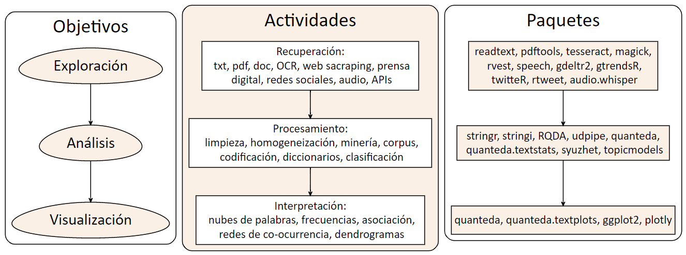
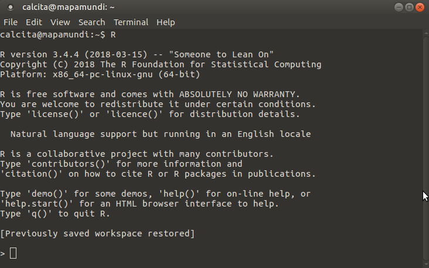
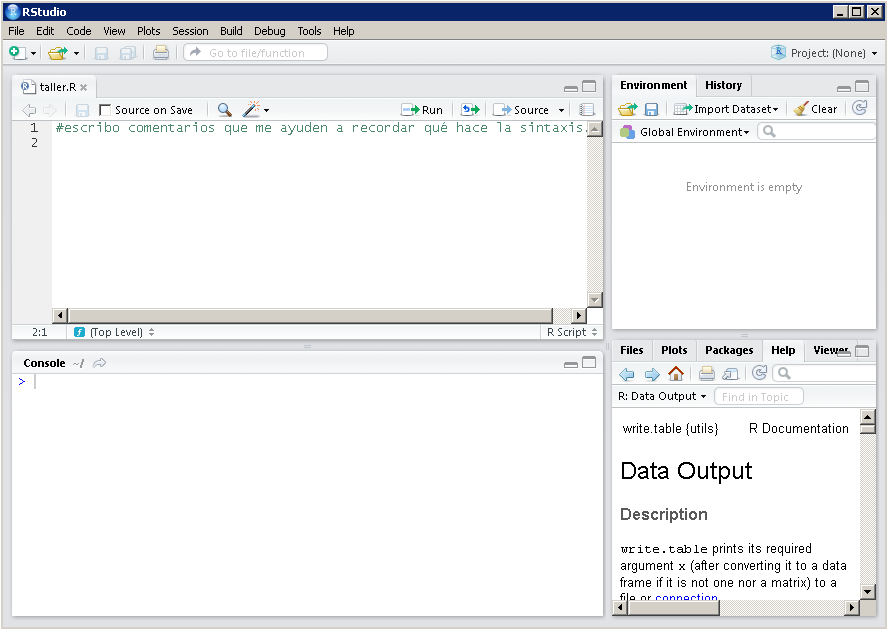
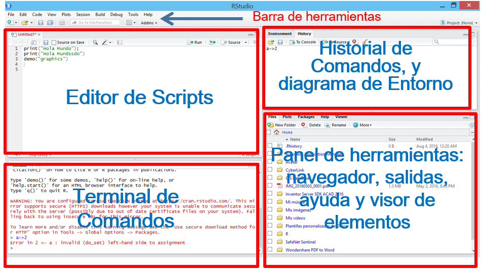
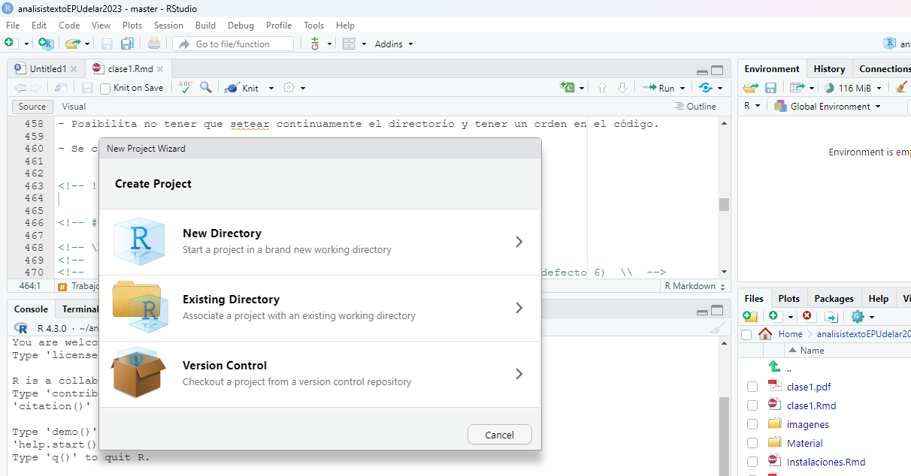

```{r echo=FALSE}
knitr::knit_hooks$set(mysize = function(before, options, envir) {
  if (before) 
    return(options$size)
})
```


```{r include=FALSE}
knitr::opts_chunk$set(mysize = TRUE, size = "\\tiny")

```


<center>

<!-- { width=25% }  -->
</center>


**Mag. Elina Gómez (UMAD)**

[elina.gomez@cienciassociales.edu.uy](elina.gomez@cienciassociales.edu.uy)

[www.elinagomez.com](www.elinagomez.com)


\

**Mag. Gustavo Méndez Barbato**

[gustavo.mendez@cienciassociales.edu.uy](gustavo.mendez@cienciassociales.edu.uy)


#


{ width=18% }  

Este trabajo se distribuye con una licencia Creative Commons Attribution-ShareAlike 4.0 International License


# Aspectos generales

- Curso presencial (Sala C3) 

- Del 28 de junio al 13 de julio. Lunes, miércoles y jueves de 10 a 12.30  

- Espacio virtual EVA y [repositorio GitHub](https://github.com/elinagomez/analisistextoEPUdelar2023)

- Requisito un 80% de asistencia, para certificado de asistencia.

- Para aprobación se prevé un Trabajo final (fecha de entrega a definir).


# **Objetivos del curso**

**Bases teóricas:** 

- Contextualizar las **Ciencias sociales computacionales**

- Emergencia de nuevos recursos y técnicas para la investigación social en la era digital. 


# **Objetivos del curso**

**Generalidades del lenguaje R:** 

- R como software libre y gratuito  
- Comunidades y foros 
- Tidyverse
- Manipulación básica de strings

# **Objetivos del curso**

**Exploración de fuentes de datos textuales:** 

- Exploración y obtención de datos de diversa índole, contemplando las diferentes fuentes posibles: OCR, web sacraping, prensa digital, redes sociales, audio, Youtube, APIs. 


# **Objetivos del curso**

**Análisis textual:** 

- Codificación manual de textos y creación de redes multinivel (categorías, códigos y citas) mediante la plataforma RQDA().
- Abordaje de los requerimientos previos (limpieza y homogeneización) para el análisis de textos.
- Trabajo con minería de textos, el cual se centrará en la noción de _corpus_ y sus posibilidades analíticas, desde lo más descriptivo a la aplicación de técnicas más complejas. 

# **Objetivos del curso**

**Análisis textual:** 

- Trabajo con diccionarios: Introducción al uso de diccionarios (manuales y automáticos), para la clasificación de documentos masivos según intereses particulares.

- Clasificación de textos:  clasificación de textos según temas o emociones asociadas a partir de la aplicación de diferentes técnicas existentes. 


# **Objetivos del curso**

**Visualización:** 

- Exploración de las diferentes posibilidades gráficas de visualización de los resultados del análisis textual (nubes de palabras, frecuencias, dendrogramas, etc.) y algunos ejemplos de visualización interactiva. 


# **Esquema del curso**



# **Metodología**

- El enfoque del curso es práctico (hands-on)

- Trabajaremos con estretagia de live-coding y ejercicios prácticos para cada tema.

- Posibilidad de clonar repositorio GitHub y trabajar con proyecto y control de versiones.

- [https://github.com/elinagomez/analisistextoEPUdelar2023](https://github.com/elinagomez/analisistextoEPUdelar2023)

[Tutorial R+ GitHub](http://destio.us.es/calvo/asignaturas/ge_esco/tutorialusargitgithubrstudio/UsarGitGithubconRStudio.html)

# **Consejo**

- Elegir un tema de interés
- Hacerse una pregunta inicial
- Identificar una fuente textual para responderla


# **Ideas / Ejemplos**

tema|política forestal uruguay
-----|-----
preguntas|¿cómo se desarrolló el debate parlamentario acerca de las modificaciones a la ley forestal? ¿qué palabras fueron más frecuentes? ¿qué temas fueron los preponderantes? ¿qué emociones y sentimientos se desprenden de cada texto? ¿hay diferencias entre los diferentes partidos políticos?
 | 
fuentes|diarios de sesiones parlamento

# **Ideas / Ejemplos**

tema|investigación ciencias sociales
-----|-----
preguntas|¿cuáles son los temas predominantes en la investigación en la FCS? ¿qué grado de pluralidad hay en las temáticas de investigación? ¿en qué nivel son citados los investigadores de la FCS?
 | 
fuentes|revistas de departamentos de FCS

# **Ideas / Ejemplos**

tema| carnaval murgas
-----|-----
preguntas|¿qué temas preponderan en los textos de murga 2023? Son textos positivos, negativos o neutros? ¿hay diferencias según el puesto de concurso? ¿hay diferencias según participación de mujeres?
 | 
fuente|textos de murgas


# **Ideas / Ejemplos**

tema|conflictividad laboral
-----|-----
preguntas|¿qué características tuvo la conflictividad laboral en Uruguay en la segunda quincena de agosto de 2021?
 | 
fuentes|la diaria


# **Ideas / Ejemplos**

tema|estudios constitucionales
-----|-----
preguntas|¿qué similitudes y diferencias tienen las constituciones de Uruguay y Costa Rica en materia de libertad economica y civil?
 | 
fuentes|constituciones

# **Ideas / Ejemplos**

tema|género y política
-----|-----
preguntas|¿cómo se componen los discursos parlamentarios alrededor de los productos de gestión menstrual y la  menstruación en Uruguay y Colombia?
 | 
fuentes|diarios de sesiones, leyes


# **Ideas / Ejemplos**

tema|política usa
-----|-----
preguntas|¿qué sentimientos preponderan en los tweets de Biden y Trump?
 | 
fuentes|twitter


# **Recursos bibliográficos básicos**


- [Bit by bit (Matthew J. Salganik)](https://www.bitbybitbook.com/)
- [Data Feminism o Feminismo de Datos (Catherine D'Ignazio y Lauren F. Klein)](https://data-feminism.mitpress.mit.edu/bienvenida)
- [R para Ciencia de Datos (Hadley Wickham y Garrett Grolemund)](https://github.com/elinagomez/analisistextoEPUdelar2023/blob/master/Bibliograf%C3%ADa/r-para-ciencia-de-datos-r-for-datascience-spanish-r4ds.pdf)
- [Text Mining with R!(Julia Silge y David Robinson)](https://www.tidytextmining.com/)
- [Hojas de ruta en español](https://github.com/rstudio/cheatsheets/tree/main/translations/spanish)
- [Intro web scraping con R (Riva Quiroga)](https://programminghistorian.org/es/lecciones/introduccion-al-web-scraping-usando-r)
- [Tutoriales Ciencias Sociales Computacionales - SICSS](https://sicss.io/overview)

[Repositorio con recursos varios](https://www.rstudio.com/resources/books/)


# **Objetivos de hoy**

- Introducción conceptual y teórica
- Generalidades de la exploración y manipulación de datos con _tidyverse_.
- Manipulación de strings


# Introducción conceptual y teórica

**Contexto**

- El abordaje metodológico y técnico que veremos en el curso se enmarca en las llamadas **ciencias sociales computacionales**


# Introducción conceptual y teórica

_"Una nueva disciplina como las Ciencias Sociales Computacionales (Cioffi-Revilla, 2017; Lazer et al., 2009; Mann, 2016) que aglutina la aplicación tanto de las ciencias de la complejidad como del análisis computacional en las Ciencias Sociales, aporta un enfoque innovador para la comprensión del comportamiento humano y social (...) Se promueven así no solo otro tipo de preguntas, sino también la cooperación y la colaboración entre disciplinas. Asimismo, se pueden explorar también nuevas hipótesis a partir de la disponibilidad de nuevos conjuntos de datos y nuevas capacidades de exploración de estos. El desarrollo de nuevos paradigmas y la colaboración entre diferentes campos de conocimiento tienen el potencial de promover nuevos escenarios de investigación, evitando la reiteración en construcciones interpretativas preexistentes (Cioffi-Revilla, 2017; Conte et al., 2012)."_ [(Caro, Jorge et al., 2020)](https://pressbooks.pub/terraincognita/chapter/ciencias-sociales-computacionales-y-humanidades-digitales-un-ejemplo-de-praxis-transdisciplinar/)


# Introducción conceptual y teórica

**Características:**

- Perspectiva transdisciplinar

- Dialogo con nuevos desarrollos vinculados a la ciencia de datos, el aprendizaje automático o estadístico, modelado, análisis espacial.

- Explotación del _big data_ como fuente de datos y nuevos campos de estudio. 


# Sobre Big data

_"Researchers are in the process of making a change akin to the transition from photography to cinematography."_ (Salganik, 2018)


- Bit by Bit: Social Research in the Digital Age (Matthew J. Salganik, 2018). [Reseña en español](https://blog.scielo.org/es/2018/08/09/resena-del-libro-bit-by-bit-social-research-in-the-digital-age/#.Y2k58eTMIol)


- Big Data: datos en línea (búsquedas y rrss); registros administrativos.

# Sobre Big data

- Diez características según Salganik (2018): _grande; siempre encendido; no reactivo; incompleto; inaccesible; no representativo; a la deriva; algorithmically confounded; sucio; y sensible_.

- Procesamiento: _"contar cosas; pronosticar cosas; y aproximar experimentos"_.

- Complementariedad con técnicas tradicionales (encuestas): preguntas enriquecidas y pregunta amplificada.

- Nuevas formas de colaboración (crowd-sourcing) y comunidades de desarrollo.

- Desafíos éticos, cajas negras


# Panorama regional 

- En América Latina existen diversos grupos académicos que trabajan esta línea ya sea desde las llamadas _humanidades digitales_ o de las _ciencias sociales computacionales_


# Panorama regional 


Algunas iniciativas regionales interesantes:

* [Programming Historian](https://programminghistorian.org/es/)
* [Laboratorio de Humanidades Digitales - UFBA](https://www.labhd.ufba.br/)
* [Observatorio de conflictividad - UNMdP](http://observatoriodeconflictividad.org/)
* [Nucleo de Innovación Social - Colegio de Sociólogos de la Provincia de Buenos Aires](https://www.nucleodeinnovacion.com/)
* [factor~data - Escuela IDAES (UNSAM)](https://unsam.edu.ar/escuelas/idaes/671/idaes/ciencias-sociales-computacionales-humanidades-digitales)
* [Observatorio de Redes](https://politicosentwitter.com/#quienes)
* [Instituto Milenio Fundamento de los Datos](https://imfd.cl/)
* [Maestría en Humanidades Digitales - Uniandes ](https://posgradosfacartes.uniandes.edu.co/programas/humanidades-digitales/)


# R

- ¿Qué es R?
- Consejos
- Generalidades de tidyverse
- Mnipulación de strings


# ¿Qué es R?

* Un lenguaje de programación y un programa estadístico.
* Es **software libre**: se distribuye con licencia [GNU General Public License](https://es.wikipedia.org/wiki/GNU_General_Public_License) que implica libertad de uso, modificación y  distribución.
* Es **gratuito**, se desacarga desde el [CRAN](http://www.r-project.org).
* Hay una **comunidad** mundial que usa R y lo mejora constantemente, hoy hay más de  
  10.000 [paquetes](https://cran.r-project.org/web/packages/) disponibles para descargar
* Usuarixs se ayudan entre sí: 
[stackoverflow](http://stackoverflow.com/questions/tagged/r),
[talkstats](http://www.talkstats.com/forumdisplay.php/14-R),
[(rusers)](\href{http://rusers.co/) y localmente [meetup R-Ladies Montevideo](https://www.meetup.com/es-ES/rladies-montevideo/). 

# Consejos
	
La curva de aprendizaje de R al comienzo suele resultar muy empinada. ¿Cómo podemos evitar o superar la frustración?
	
* **Usá** R a diario.
* **Traducí** a R una sintaxis sencilla de otro programa que conozcas.
* Recurrí a los **foros** y a la ayuda de R para encontrar las soluciones a los problemas que te surjan: stackoverflow
* Recurrí a otrxs **usuarixs** de R que conozcas.
* Prestá atención a los **mensajes** de error y advertencia.
* **Escribí** tus sintaxis en un script y **comentalas** detalladamente.
* **Reutilizá** sintaxis existentes.

[Hoja de ayuda de R](https://raw.githubusercontent.com/rstudio/cheatsheets/master/translations/spanish/introduccion-a-r.pdf)

<!-- # Introducción a R: ¿cómo interactúamos con R? -->

<!-- * Abrimos R.  -->
<!-- * Aparece un mensaje de apertura.  -->
<!-- * Debajo el 'prompt' que es el símbolo  **>**  ('mayor') e indica que R está listo para recibir órdenes.  -->


<!--  -->


<!-- # Introducción a R: ¿cómo interactúamos con R? -->

<!-- * Escribiendo un código en la consola -->
<!-- * O escribiendo en el script y luego enviando el código a la consola para obtener un resultado: CTLR + ENTER -->

<!-- * El código utiliza una serie de operadores ('+', '*', '\%in\%', etc.), funciones, números, caracteres, etc. -->
<!-- * El script se guarda en un archivo .R -->

<!-- # Introducción a R: ¿cómo interactúamos con R? -->

<!-- * Las órdenes elementales de R consisten en expresiones o asignaciones.  -->
<!-- * Una **expresión**, se evalúa, se imprime el resultado y su valor se pierde.  -->
<!-- ```{r } -->
<!-- 2 + 3 -->
<!-- ``` -->

<!-- # Introducción a R: ¿cómo interactúamos con R? -->

<!-- * Una **asignación**, crea un objeto y no se imprime el resultado. -->
<!-- ```{r } -->
<!-- x <- 2 + 3 -->
<!-- ``` -->

<!-- * Una asignación se hace utilizando el símbolo: <- o también con el símbolo = -->
<!-- * Mientras que otros programas estadísticos muestran directamente los resultados de un análisis, R guarda estos resultados como un 'objeto'.  -->

<!-- # Introducción a R -->

<!-- * R es un programa **'orientado a objetos'**: variables, datos, funciones, resultados, etc., se guardan en la memoria RAM en forma de objetos con un nombre específico sin usar archivos temporales.  -->

<!-- * Estos objetos se pueden modificar o manipular con **operadores** --lógicos, aritméticos, comparativos y especiales-- y **funciones** --que a su vez son objetos--.  -->
<!-- * Bajo este término se esconde la simplicidad y flexibilidad de R.  -->


<!-- # Introducción a RStudio -->

<!-- R es mucho más amigable utilizando un editor de código, elegimos [RStudio](https://www.rstudio.com/) porque da muchas facilidades. -->

<!-- { width=80% } -->


<!-- # Introducción a RStudio -->
<!--  -->

<!-- # Introducción RStudio -->

<!-- RStudio se organiza en 4 ventanas: -->

<!--   * **Ventana superior izquierda**: se escribe el documento, sintaxis, etc. -->
<!--   * **Ventana inferior izquierda**: se ubica la consola donde se imprimen resultados -->
<!--   * **Ventana superior derecha**: se muestran los objetos creados y el historial de comandos ejecutados. También se mostrarán los archivos modificados de un proyecto de control de versiones -->
<!--   * **Ventana inferior derecha**: se muestran los archivos, gráficos, paquetes y ayuda -->


<!-- # Introducción RStudio -->

<!-- * Para ejecutar una línea de código, colocar el cursor sobre esa línea y ejecutar **Ctrl + ENTER**. -->
<!-- * Para ejecutar varias líneas de código, debemos seleccionarlas todas y ejecutar **Ctrl + ENTER**. -->
<!-- * El símbolo **>** en la consola, indica que R está listo para recibir un comando, mientras que si aparece el símbolo  **+**, hay una sentencia no finalizada. -->
<!-- * Mensajes de error **(Error)**: errores en la sintaxis (no ejecuta la/s líneas erroneas, pero si el resto) -->
<!-- * Mensajes de advertencia **(Warnings)**: no necesariamente hay un error (ejecuta los comandos y solo te advierte de posibles inconvenientes). -->
<!-- * Importa saber qué tipo de objetos son los que estamos trabajando:  no toda función se puede aplicar a cualquier tipo de objeto. -->


<!-- # Creación de objetos  -->

<!-- * Al nombrar archivos u objetos, evitar usar tildes y ñ. No dejar espacio entre caracteres. -->
<!-- *  Nombre de un objeto debe comenzar con una letra (A-Z, a-z) -->
<!-- *  Puede incluir letras, dígitos (0-9), puntos (.) y guión bajo (\_). -->
<!-- * R discrimina entre letras mayúsculas y minúsculas: x y X son objetos diferentes. -->
<!-- * Son nombres válidos *raiz2* o *raiz\_2*, no así *2raiz* ni *raiz-2* -->


<!-- # Objetos: tipos de elementos y clases de objetos -->

<!-- \scriptsize -->
<!-- \textbf{Vector} (contiene \textcolor{blue}{elementos} de un \textcolor{blue}{mismo tipo}) \hfill { $[$  $]$} -->
<!-- \begin{semiverbatim} -->
<!-- a=c(1,0,1,1,1,0) \textcolor{gray}{\#  vector numérico} -->
<!-- \end{semiverbatim} -->
<!-- \begin{semiverbatim} -->
<!-- b=c("1","0","1","1","1","0") \textcolor{gray}{\# vector caracter} -->
<!-- \end{semiverbatim} -->
<!-- \begin{semiverbatim} -->
<!-- d=c(T,F,T,T,T,F) \textcolor{gray}{\#  vector lógico} -->
<!-- \end{semiverbatim} -->
<!-- \begin{semiverbatim} -->
<!-- f=factor(b,levels=c(1,0),labels=c('Sí','No')) \textcolor{gray}{\# factor} -->
<!-- \end{semiverbatim} -->

<!-- \textbf{Matriz} (contiene \textcolor{blue}{vectores} de una -->
<!-- \textcolor{blue}{misma clase}) \hfill { $[$ $,$ $]$} -->
<!-- \begin{semiverbatim} -->
<!-- e=matrix(c(1,0,1,1,1,0),nrow=3) \textcolor{gray}{\#  matriz numérica} -->
<!-- \end{semiverbatim} -->
<!-- \textbf{Data Frame} (contiene \textcolor{blue}{vectores} de -->
<!-- \textcolor{blue}{cualquier clase}) \hfill { \$} \ \ -->
<!-- \begin{semiverbatim} -->
<!-- g=data.frame(e) \textcolor{gray}{\# marco de datos, base de datos} -->
<!-- \end{semiverbatim} -->
<!-- \textbf{Lista} (contiene \textcolor{blue}{objetos} de -->
<!-- \textcolor{blue}{cualquier clase}) \hfill { $[[$  $]]$} -->
<!-- \begin{semiverbatim} -->
<!-- e=list(g,f) \textcolor{gray}{\#  lista} -->
<!-- \end{semiverbatim} -->

<!-- # Objetos: tipos de elementos y clases de objetos -->

<!-- Todo objeto pertenece a un tipo (`typeof()`), pero a su vez, -->
<!-- tiene instancias de una o varias clases (`class()`), -->
<!-- con determinados atributos (`attributes()`), -->
<!-- y tiene una estructura específica (`str()`). -->

<!-- |Objeto | \textbf{clase} | \textbf{tipo} | -->
<!-- |-------|----------------|---------------| -->
<!-- | x <- 1 | numeric | double | -->
<!-- | x <- 'hola' | character | character | -->
<!-- | x <- TRUE | logical | logical | -->
<!-- | x <- iris |  data.frame | list | -->

<!-- # Objetos: tipos de elementos y clases de objetos -->

<!-- | Tipo | Verificación | Cambio | -->
<!-- |------|--------------|--------| -->
<!-- | vector | `is.vector` |`as.vector` | -->
<!-- | list | `is.list` | `as.list` | -->
<!-- | data.frame | `is.data.frame` | `as.data.frame` | -->
<!-- | matrix | `is.matrix` | `as.matrix` | -->
<!-- | logical | `is.logical` | `as.logical` | -->
<!-- | factor | `is.factor` | `as.factor` | -->
<!-- | character | `is.character` | `as.character` | -->
<!-- | numeric | `is.numeric` | `as.numeric` | -->
<!-- | double | `is.double` | `as.double` | -->


<!-- # Funciones -->

<!-- *¿Qué es una función?* -->

<!-- * Una  función  es un  conjunto  de  instrucciones  que  operan  sobre unos argumentos y producen un resultado. -->
<!-- * Una función esconde líneas de código que permite reutilizarlo una y otra vez de manera sencilla. -->
<!-- * Las funciones tienen nombres descriptivos -en inglés- y se acompañan de paréntesis curvos. -->
<!-- * Dentro de los paréntesis se definen los valores de sus argumentos. -->
<!-- * La mayoría tiene al menos un argumento obligatorio y el resto con valores por defecto. -->


<!-- # Funciones -->

<!-- * La función _setwd()_ tiene como único argumento _'dir'_ y es obligatorio asignarle un valor que debe ser una ruta a una carpeta específica en la computadora: -->

<!-- ```{r echo=TRUE} -->
<!-- #	define el directorio de trabajo -->
<!-- #setwd(dir = 'home/username/Desktop/')  -->
<!-- ``` -->

<!-- Algunas funciones no necesitan que se defina ningún argumento: _getwd()_, _dir()_, _ls()_ -->


<!-- ```{r eval=FALSE, include=FALSE} -->
<!-- # indica el directorio de trabajo	actual -->
<!-- getwd( ) -->
<!-- # lista los archivos que hay en el directorio de trabajo -->
<!-- dir( ) -->
<!-- # lista los objetos de la sesión -->
<!-- ls( )  -->
<!-- ``` -->


# Carga de datos R

* load(file = "ruta/archivo.Rdata") _Carga archivo en formato .RData_
* save(obj1, obj2, obj3, file = "ruta/archivo.Rdata") _Respalda algunos objetos en formato .RData_
* save.image("ruta/respaldo.RData") _Respalda todo el entorno de trabajo_

A diferencia de otras funciones para cargar archivos, la función _load( )_ es la única en que no se debe asignar a un objeto, ya que para que un archivo sea guardado como Rdata debió haber sido un objeto de R y por ende, al cargar el archivo se carga en la memoria el objeto asociado. 


# Carga de datos csv o txt

Las rutas deben escribirse con la barra / y no la contrabarra \\. Si el archivo está en el directorio de trabajo, alcanza solo con llamar al archivo sin especificar la ruta. 

_Existen paquetes que facilitan la carga de datos, un ejemplo es_ [`rio`](https://cran.r-project.org/web/packages/rio/index.html)

```{r eval=FALSE}

datos <- read.table(file="ruta/archivo.txt", header=FALSE, 
        sep=" ")# otros posibles valores de sep= son ",", ";" o "/t"
datos <- read.csv(file="ruta/archivo.csv", header=TRUE, 
                  sep=",")
datos <- read.delim(file="ruta/archivo.txt", header = FALSE, 
                    sep = "/")
```


# Trabajo con proyectos

- Se recomienda el trabajo por **Proyectos** ya sea a nivel local o conectando con repositorio Git.

- Posibilita no tener que setear continuamente el directorio y tener un orden en el código.

- Se crea desde la barra de herramientas: File > New Project

- Se aloja en un archivo _.Rproj_

- [Tutorial R + GitHub](http://destio.us.es/calvo/asignaturas/ge_esco/tutorialusargitgithubrstudio/UsarGitGithubconRStudio.html)


# Trabajo con proyectos

 

# Ejercicio 1: Trabajo con proyectos

## Quienes tienen usuario/a de github:

1. Clonar el [repositorio del curso](https://github.com/elinagomez/analisistextoEPUdelar2023) en su pc local
2. Abrir el archivo del proyecto analisistextoEPUdelar2023.Rproj 
3. Abrir el archivo live_coding_1.R alojado en la carpeta Clase1/Material

## Quienes no tienen usuario/a de github:

1. Descargar el [repositorio del curso](https://github.com/elinagomez/analisistextoEPUdelar2023), (Code y luego download Zip) descomprimirlo y alojarlo en una carpeta local denominada analisistextoEPUdelar2023 
2. Abrir el archivo del proyecto analisistextoEPUdelar2023.Rproj 
3. Abrir el archivo live_coding_1.R alojado en la carpeta Clase1/Material


# Ejercicio 1: Trabajo con proyectos

- Quienes sigan la opción 1, cada vez que abran Rstudio se sugiere realizar un pull para visualizar posibles cambios en el repositorio. 

- Quienes sigan la opción 2, tengan en cuenta que no visualizarán los cambios que se realicen en el repositorio. _(Sugerimos que se hagan usuario de github y clonen el repositorio en la clase siguiente)._


<!-- # Algunas funciones básicas: exploración -->

<!-- \begin{tabular}{|c|p{8cm}|} -->
<!-- 			\hline \textbf{Función} & \textbf{Descripción}\\ -->
<!-- 			\hline head() & Muestra los primeros X casos de un objeto (por defecto 6)  \\  -->
<!-- 			\hline tail() & Muestra los últimos X casos de un objeto (por defecto 6)  \\  -->
<!-- 			\hline View() & Muestra la base de datos en el visor \\  -->
<!-- 			\hline length() & Muestra la longitud de un vector  \\  -->
<!-- 			\hline dim() & Muestra las dimensiones del objeto  \\  -->
<!-- 			\hline str() & Muestra la estructura del objeto\\  -->
<!-- 			\hline names() &  Muestra los nombres de las variables \\  -->
<!-- 			\hline summary() & Muestra resumen descriptivo del objeto\\ -->
<!-- 			\hline mean() & Muestra el promedio del vector numérico\\ -->
<!-- 			\hline min() & Muestra el valor mínimo del vector numérico \\ -->
<!-- 			\hline max() & Muestra el valor máximo del vector numérico  \\ -->
<!--     	\hline  -->

<!-- 		\end{tabular} -->

<!-- # Algunas funciones básicas: manipulación -->

<!-- \begin{tabular}{|c|p{8cm}|} -->
<!-- 		\hline \textbf{Función} & \textbf{Descripción}\\ -->
<!-- 		\hline which() & Indica cuales casos cumplan con la condición especificada\\  -->
<!-- 		\hline subset() & Selecciona casos según la condición especificada \\  -->
<!-- 		\hline merge() & Funde bases \\  -->
<!-- 		\hline apply &  Aplica una función a diferentes variables\\  -->
<!-- 		\hline tapply() & Aplica una función por grupo de casos\\  -->
<!--   	\hline  -->
<!-- 	 \end{tabular}  -->


<!-- # Algunas funciones básicas: presentación (tablas, gráficos, y figuras) -->

<!-- \begin{tabular}{|c|p{8cm}|} -->
<!-- 		\hline \textbf{Función} & \textbf{Descripción}\\ -->
<!-- 		\hline table() & Genera una tabla \\  -->
<!-- 		\hline plot() & Genera gráfico genérico según tipos de variables en cuestión\\  -->
<!-- 		\hline barplot() & Grafica un diagrama de barras. El argumento principal es una tabla \\  -->
<!-- 		\hline boxplot() & Grafica un diagrama de caja de una variable numérica o de una variable numérica según categorías. \\  -->
<!-- 		\hline hist() &  Grafica un histograma de frecuencias de un vector numérico\\  -->
<!-- 		\hline pie() &  Grafica un diagrama circular. El argumento principal es una tabla\\  -->
<!-- 		\hline ggplot() & Función del paquete ggplot2\\  -->
<!-- 		\hline ggmap() & Función del paquete ggplot2\\ -->
<!--   	\hline  -->
<!--   \end{tabular}  -->


<!-- # Usamos R: ejercicios prácticos -->

<!-- _Construcción y guardado de objetos:_ -->

<!-- * Creamos un objeto llamado 'dias' (sin tilde) que contenga los días a la semana, usamos la función _c()_ -->
<!-- * Creamos un objeto llamado 'curso' que contenga 0 y 1, donde los 1 se ubiquen en la posición que se encuentran lunes y miércoles, usamos la función _c()_ -->
<!-- * Combinamos ambos vectores en un nuevo objeto llamado 'datos', usamos la función _cbind()_ -->
<!-- * Reescribimos el objeto 'datos' y lo convertimos en data.frame con la función _as.data.frame_. -->
<!-- * Inspeccionamos la dimensión de 'datos', el nombre de las variables y realizamos una tabla de la segunda variable. Usamos las siguientes funciones: _dim()_, _names()_, _table()_. -->
<!-- * Exportamos el objeto a un archivo *csv*, usamos la función _write.csv()_. -->


<!-- # Usamos R: ejercicios prácticos -->

<!-- _Exploración:_ -->

<!-- * Abrimos el _data.frame_ **cars** que viene pre-cargada en el paquete **base** y le asignamos el nombre **autos**; la abrimos en el visualizador. -->
<!-- * Averiguamos el valor máximo y mínimo que tiene la variable **speed**. -->
<!-- * Exploramos la cantidad de filas y columnas que tiene la base -->
<!-- * Aplicar las funciones del tipo _is.x()_ y _as.x()_ que sirven para verificar si un objeto es de tal tipo y para convertir un tipo de objeto en otro, respectivamente. -->

<!-- # Usamos R: ejercicios prácticos -->

<!-- _Manipulación:_ -->

<!-- * Hacemos una nueva base únicamente con los datos que tengan un valor en la variable speed mayor a 15. -->
<!-- * Hacemos la suma de las columnas de la base **autos** con la función apply y las pegamos al final de la base. -->
<!-- * Creamos otra variable **dist_rec** que distinga tres tramos de **dist**: <20,>=20 & <=40, >=41 -->


<!-- # Usamos R: ejercicios prácticos -->

<!-- _Presentación:_ -->

<!-- * Hacemos una tabla de frecuencias de la variable **dist_rec** -->
<!-- * Hacemos un gráfico de barras de las frecuencias de **dist_rec** -->


# Generalidades de **tidyverse**


# Generalidades de **tidyverse**

- En R, paquetes como **ggplot2**, **dplyr** y **stringr** han adquirido gran popularidad, y ahora forman parte de **tidyverse**
- Estos paquete se basan en los principios de 'tidy data' para mayor consistencia y velocidad de procesamiento:

- Cada Variable forma una columna.
- Cada observación forma una fila.
- Cada tipo de unidad observacional forma una tabla.


# Generalidades de **tidyverse**

*Recomendamos la consulta:*

- [Hoja de ruta de dplyr en español](https://raw.githubusercontent.com/rstudio/cheatsheets/main/translations/spanish/data-transformation_es.pdf) 

- [Hoja de ruta de ggplot2 en español](https://diegokoz.github.io/intro_ds/fuentes/ggplot2-cheatsheet-2.1-Spanish.pdf) 

- [Hoja de ruta stringr en español](https://github.com/rstudio/cheatsheets/blob/main/translations/spanish/strings_es.pdf) 


# Selección por atributos

- _Base R_ incluye las funciones de selección `[`, `subset()` y `$`.
y **dplyr** aporta `select()`, `slice()`, `filter()`, and `pull()`.


# Selección por atributos

- `select()` selecciona columnas por nombre o por posición.
- `pull()`extrae una columna como un vector
- `slice()` es el equivalente de `select()` pero para las filas.
- `filter()` es el equivalente en **dplyr** al `subset()` del _base_ de R.
- Otras funciones: `contains()`, `starts_with()` y `num_range()` 

# Conectando funciones

- Un beneficio de **dplyr** es su compatibilidad con el operador ` %>% `.
- Este 'pipe' de R, toma su nombre del pipe de Unix  `|`, y es parte del paquete **magrittr**
- Su función es "conectar" la salida de un comando anterior al primer argumento de la siguiente función.
- Esto permite encadenar comandos de análisis de datos, pasando el marco de datos de una función a la siguiente.
- Una ventajas adicional es que fomenta la adición de comentarios a funciones autónomas y permiten líneas simples comentadas sin romper el código.


# Agregación de atributos: ejemplo

- Las operaciones de agregación resumen los conjuntos de datos por una 'variable de agrupación' (típicamente una columna de atributo) o un objeto espacial.
- Para calcular el número de personas por continente en base al objeto `world`
- usaremos la columna `pop` que contiene la población por país y la variable de agrupación `continent`.
- En la base R esto se hace con `aggregate()` y `sum()` de la siguiente manera:

# Agregación de atributos

```{r, eval=FALSE}
aggregate(pop ~ continent, 
          FUN = sum, 
          data = world, 
          na.rm = TRUE)
```

# Agregación de atributos

`summarize()` es el equivalente en **dplyr** de `aggregate()`, y usa la función `group_by()` para agrupar la variable. Y se implementaría así:

```{r, eval=FALSE}
group_by(world, continent) %>%
  summarize(pop = sum(pop, na.rm = TRUE))
```

# Agregación de atributos

- Este enfoque es flexible, lo que permite nombrar las columnas resultantes.
- El omitir la variable de agrupación pone todo en un grupo.
- Esto significa que `summarize ()` se puede usar para calcular la población total de la Tierra (~ 7 mil millones) y el número de países. 
- Utilicemos `sum()` and `n()` para generar las columnas `pop` y `n_countries` 

# Agregación de atributos

```{r, eval=FALSE}
world %>% 
  summarize(pop = sum(pop, na.rm = TRUE),
            n_countries = n())
```

# Agregación de atributos

Combinemos todo lo anterior para identificar los 3 continentes más poblados (usando `dplyr::n()` ) y el número de países que contienen:

```{r eval=FALSE, message=FALSE, warning=FALSE, paged.print=FALSE}
world %>% 
  dplyr::select(pop, continente = continent) %>% 
  group_by(continente) %>% 
  summarize(población = sum(pop, na.rm = TRUE), 
            n_paises = n()) %>% 
  slice_max(n = 3, order_by = población)
  
```

# Agregación de atributos

```{r include=FALSE}
library(tidyverse)
load("Material/world.Rdata")
```


```{r continents, echo=FALSE, message=FALSE, warning=FALSE}
world %>% 
  dplyr::select(pop, continente = continent) %>% 
  dplyr::group_by(continente) %>% 
  dplyr::summarize(población = sum(pop, na.rm = TRUE), 
                   n_paises = n()) %>% 
  dplyr::top_n(n = 3, wt = población) %>%
  knitr::kable(caption = "Los 3  continentes más poblados, y su número de países.")
```


# Ejercicio 2: Tidyverse

## Tidyverse

1. Cargar la base `world` en formato .RData

2. Imprimir una tabla con los tres continentes con mayor territorio 


# Combinando objetos

- `Join` combina tablas basadas en una variable compartida ("key")
- **dplyr** presenta varias funciones para ello: 
  - `left_join()` - Une las filas coincidentes de b en a
  - `right_join()` - Une las filas coincidentes de a en b
  - `inner_join()` - Une reteniendo solo las filas de ambos conjuntos, 
  - `full_join` - Une los datos conservando todos los valores, todas las filas
  - `semi_join()` - Todas las filas en a que tienen una coincidencia en b 
  - `anti_join()` - Todas las filas en a que no tienen una coincidencia en b
- Estos nombres de funciones siguen las convenciones utilizadas en el lenguaje de bases de datos [SQL](http://r4ds.had.co.nz/relational-data.html).

# Combinando objetos


# Combinando objetos

- Las funciones "..._join" de **dplyr** trabaja tanto con data.frames
- El orden de los factores altera el resultado... la clase del primer objeto es la que conserva el resultado.
- Nos centraremos en los left e inner "..._join" que son los más utilizados, que utilizan la misma sintaxis que los otros tipos de unión.

## Combinando objetos

| dplyr            | base                     |
|------------------|--------------------------|
| left_join(x, y)  | merge(x, y, all.x=TRUE)  |
| right_join(x, y) | merge(x, y, all.y=TRUE)  |


# Manipulación de _strings_


Antes de realizar un análisis o de construir un modelo de aprendizaje, la discusión de datos es un paso crítico para preparar los datos de texto sin procesar en un formato apropiado.

El texto puede ser considerado como una colección de documentos y un documento puede ser analizado en cadenas. 

En la limpieza de texto, los patrones de búsqueda se definen en expresiones regulares (abreviadas como regex() o regexp()) para "encontrar y eliminar" o "buscar y reemplazar" cadenas.

- No es simple ni intuitivo trabajar con expresiones regulares, [acá](https://vimeo.com/544021539) pueden ver un taller realizado por Stephanie Orellana y Riva Qiroga 


<!-- # grep -->

<!-- __grep(patrón, cadena)__ devuelve por defecto una lista de índices. Si la expresión regular, patrón, coincide con un elemento particular en la cadena vectorial, devuelve el índice del elemento. -->

<!-- Para devolver los valores reales de los elementos coincidentes, establezca la opción value=TRUE. -->

<!-- - Creamos un vector "strings" y asignamos cuatro valores (string) a la variable. -->
<!-- strings <- c("abcd", "cdab", "cabd", "c abd") -->

<!-- # grep -->

<!-- - Buscamos los valores que contengan 'ab', y nos indica sus posiciones -->
<!-- grep("ab", strings) -->

<!-- - Que es lo mismo que... -->
<!-- grep("ab", strings, value = FALSE) -->

<!-- -Mientras que para obtener los valores usaremos... -->
<!--  grep("ab", strings, value = TRUE) -->


<!-- # sub() y gsub() -->

<!-- __gsub(patrón, remplazo, string)__ devuelve la cadena modificada después de reemplazar cada ocurrencia de patrón con reemplazo en cadena. -->

<!-- __sub(patrón, remplazo, string)__ reemplaza la primera aparición del patrón. -->


# Stringr

- Para manipulación de strings hay varias funciones básicas de _R base_: `nchar()`, `paste()`, `grep()`, `grepl()`, `sub()`, `gsub()`, `substr()`, `substring()`, `regexec()`, entre otras

- Sin embargo, en el curso veremos principalmente las funciones de manipulación de strings que se incluyen en la librería [stringr](https://stringr.tidyverse.org/) de Tidyverse. 

- Una de las ventajas de stringr es que todas la funciones comienzan con `str_` a diferencia del base que hay que memorizar distintos nombres

```{r echo=FALSE, out.width = "10%", fig.align = "right"}
knitr::include_graphics("imagenes/stringr.png")
```

# Stringr

- [Hoja de ruta stringr](https://github.com/rstudio/cheatsheets/blob/main/translations/spanish/strings_es.pdf) 

- En esta [Introducción a la ciencia de datos](http://rafalab.dfci.harvard.edu/dslibro/procesamiento-de-cadenas.html#expresiones-regulares) encuentran una buena introducción al procesamiento de cadenas 

```{r echo=FALSE, out.width = "10%", fig.align = "right"}
knitr::include_graphics("imagenes/stringr.png")
```

<!-- # Stringr -->

<!-- Funciones para separar un texto: -->

<!-- [str_split](https://stringr.tidyverse.org/reference/str_split.html) -->

<!-- ```{r eval=FALSE} -->
<!-- library(stringr) -->

<!-- str_split(x "\r) -->

<!-- str_split(x, boundary("word")) -->

<!-- ##type = c("character", "line_break", "sentence", "word") -->
<!-- ``` -->

# Stringr

Funciones para separar un texto:

[str_split](https://stringr.tidyverse.org/reference/str_split.html)

```{r eval=FALSE}
x <- "Este es un curso de Recuperacion y analisis de texto con R"

# divido por espacio en blanco
str_split(x, " ")  # string, pattern

#> [[1]]
 [1] "Este" "es" "un" "curso" "de" "Recuperacion" "y" "analisis" "de"          
[10] "texto" "con" "R"

# la cadena puede ir en el argumento string sin crear un objeto previo
str_split("Este es un curso de Recuperacion y analisis de texto con R", " ") 

# variante con regex
str_split(x, "\\s") # string, pattern
# otra variante divido por palabra
str_split(x, boundary("word")) #string, boundary()
```

<!-- # Stringr -->

<!-- Funciones para combinar un texto: -->

<!-- [str_c](https://stringr.tidyverse.org/reference/str_c.html) -->

<!-- ```{r eval=FALSE} -->
<!-- library(stringr) -->

<!-- str_c("x", "y", sep = ", ") -->
<!-- > [1] "x, y" -->
<!-- ##sep para controlar -->
<!-- ``` -->

# Stringr

Funciones para combinar un texto:

[str_c](https://stringr.tidyverse.org/reference/str_c.html)

```{r eval=FALSE}
x <- "Este es un curso de Recuperacion y analisis de texto con R"
y <- "Es un curso de educación permanente."

# combino los vectores con un punto seguido de un espacio
str_c(x, y, sep = ". ") # string1, string2, sep (para controlar)

#> [1] "Este es un curso de Recuperacion y analisis de texto con R. Es un curso de educación permanente."
```

<!-- # Stringr -->

<!-- Funciones para reemplazar un texto: -->

<!-- [str_replace](https://stringr.tidyverse.org/reference/str_replace.html) -->

<!-- ```{r eval=FALSE} -->
<!-- library(stringr) -->
<!-- #la primera coincidencia -->
<!-- str_replace(string, pattern, replacement) -->

<!-- #todas las coincidencias -->
<!-- str_replace_all(string, pattern, replacement) -->

<!-- ``` -->

# Stringr

Funciones para reemplazar un texto:

[str_replace](https://stringr.tidyverse.org/reference/str_replace.html)

```{r eval=FALSE}
x <- "Este es un curso de Recuperacion y analisis de texto con R"

# reemplazo primera ocurrencia de "de" por un .
str_replace(x, "de", ".") # string, pattern, replacement 

#> [1] "Este es un curso . Recuperacion y analisis de texto con R"

# reemplazo todas las ocurrencias de "de" por un .
str_replace_all(x, "de", ".") # string, pattern, replacement

#> [1] "Este es un curso . Recuperacion y analisis . texto con R"

```


<!-- # Stringr -->

<!-- Funciones para pasar mayúscula/minúscula: -->

<!-- [str_to_upper / to_lower](https://stringr.tidyverse.org/reference/case.html) -->

<!-- ```{r eval=FALSE} -->
<!-- library(stringr) -->

<!-- str_to_upper(c("i", "ı")) -->
<!-- #> [1] "I" "I" -->

<!-- str_to_lower(c("I", "I")) -->
<!-- #> [1] "i" "ı" -->

<!-- ``` -->

# Stringr

Funciones para pasar mayúscula/minúscula:

[str_to_upper / to_lower](https://stringr.tidyverse.org/reference/case.html)

```{r eval=FALSE}
x <- "Este es un curso de Recuperacion y analisis de texto con R"

str_to_upper(x) # string

#>[1] "ESTE ES UN CURSO DE RECUPERACION Y ANALISIS DE TEXTO CON R"

str_to_lower(x) # string

#> [1] "este es un curso de recuperacion y analisis de texto con r"

```


# Stringr

Funciones para eliminar espacios en blanco:

[str_trim](https://stringr.tidyverse.org/reference/str_trim.html)

```{r eval=FALSE}
x <- "  Este es un curso de Recuperacion y analisis de texto con R  "

# elimino espacios al inicio de la cadena
str_trim(x, side = "left") # string, side = c("both", "left", "right")

#> [1] "Este es un curso de Recuperacion y analisis de texto con R  "

# elimino espacios al inicio y final de la cadena
str_trim(x) # por defecto side = both

#> [1] "Este es un curso de Recuperacion y analisis de texto con R"

```


# Stringr

Funciones para eliminar espacios en blanco:

[str_squish](https://stringr.tidyverse.org/reference/str_trim.html)

```{r eval=FALSE}
# elimino espacios al inicio y final de la cadena y reemplaza a un espacio el resto 
# str_squish(string)
str_squish(" Este es un   curso de Recuperacion   y analisis de texto con R\t")

#> [1] "Este es un curso de Recuperacion y analisis de texto con R"

```

# Stringr

Ejemplo extrayendo texto de internet:

```{r eval=FALSE}
library(readtext)
url_texto <- "https://www.ingenieria.unam.mx/dcsyhfi/material_didactico/Literatura_Hispanoamericana_Contemporanea/Autores_B/BENEDETTI/Poemas.pdf"
# Extraemos el texto
mario <- readtext(url_texto)

library(stringr)

# divido el texto en oraciones

# usando %>% 
mario_sentencias <- str_split(mario$text, boundary("sentence"))%>% # divido el texto en oraciones
  unlist()%>% # convierto el texto en un vector
  str_trim("both") # elimino espacios

# sin %>% 
mario_sentencias2 <- str_trim(unlist(str_split(mario$text, boundary("sentence"))), "both") 

# compruebo que son iguales
identical(mario_sentencias, mario_sentencias2)
#> [1] TRUE

```


# Ejercicio 3: stringr

## Manipulación de strings

1. Cargue, extraiga de internet o cree una cadena de texto

2. Aplique, de forma separada, al menos tres funciones de stringr

3. Simplifique el ejercicio anterior utilizando el %>% 


# Caracteres especiales

Para construir consultas que incluyan metacaracteres, i.e.

`\\$ \\* \\+ \\. \\? \\[ \\] \\^ \\{ \\} \\| \\( \\)`

Se debe agregar una retrobarra  `\\`

# Metacaracteres especiales

`\\t` : Tabulador

`\\n` : Nueva línea

`\\v` : Tabulación vertical

`\\f` : Salto de formulario

`\\r` : Salto de línea


# Cuantificadores

Los Cuantificadores especifican cuantas veces el patrón consultado pueda ocurrir.

`*` : coincide al menos 0 veces.

`+` : coincide al menos 1 vez.

`?` : coincide a lo sumo 1 vez.

`{n}` : coincide exactamente $n$ veces.

`{n,}` : coincide al menos $n$ veces.

`{,m}` : coincide a lo sumo $m$ vez.

`{n,m}` : coincides entre $n$ y $m$ veces.

# Posición

`^` : Al inicio de la cadena.

`$` : Al final de la cadena.

`\b` : En los extremos de la palabra.

`\B` : No en los extremos de la palabra.

`\<` : Al inicio de la palabra.

`\>` : Al final de la palabra.


# Caracteres por clases

`[[:digit:]] or \\d or [0-9]` : digitos 0 1 2 3 4 5 6 7 8 9
`\\D or [^0-9]` : no-digitos

`[[:lower:]] or [a-z]` : letras minúsculas
`[[:upper:]] or [A-Z]` : letras mayúsculas
`[[:alpha:]] or [[:lower:][:upper:]] or [A-z]` : caracteres alfabeticos

# Caracteres por clases

`[[:alnum:]] or [[:alpha:][:digit:]] or [A-z0-9]`: caracteres alfanuméricos

`\\w or [[:alnum:]_] or [A-z0-9_]` : caracteres de palabra
`\\W or  [^A-z0-9_]` : No caracteres de palabra

`[[:xdigit:]] or [0-9A-Fa-f]` :  dígitos hexadecimales (base 16) 0 1 2 3 4 5 6 7 8 9 A B C D E F a b c d e f

# Caracteres y espacios

`[[:blank:]]` : espacios y tabulaciones

`[[:space:]] or \s` : todo tipo de caracteres de espaciado: tabulación, nueva línea, tabulación vertical, salto de formulario, Salto de linea, espacios

`\\S` : Caracteres que no sean espacios

`[[:punct:]]` :  caracteres de punctuación
`! " # $ % & ( ) * + , - . / : ; < = > ? @ [  ] ^ _  { | } ~`

# Caracteres y espacios

`[[:graph:]] or [[:alnum:][:punct:]]` : caracteres gráficos (legibles)

`[:print:]] or [[:alnum:][:punct:]\\s]` : caracteres sin espacios

`[[:cntrl:]] or \\c` :  caracteres de control, como `\n` or `\r`, etc.


<!-- # ¿Qué es Análisis de Contenidos? -->

<!-- _“El análisis de contenido está considerado como una de las metodologías más importantes de la investigación, estableciendo que su objetivo descansa en estudiar de manera rigurosa y sistemática la naturaleza de los diferentes mensajes que se intercambian en los actos de comunicación que realizamos.”_  -->

<!-- _“(...) una técnica de investigación destinada a formular, a partir de ciertos datos, inferencias reproducibles y válidas que puedan aplicarse a su contexto”_  -->

<!-- __Krippendorff, 1990__ -->


<!-- # ¿Qué es Análisis de Contenidos? -->

<!-- - El análisis de contenido es descrito como un conjunto de técnicas de análisis de comunicaciones utilizando procedimientos **objetivos** y **sistemáticos** (cualitativos y cuantitativos) de mensajes con pretensión de representatividad, exhaustividad y con posibilidades de generalización.                -->
<!-- - Nos permite convertir los fenómenos captados _en bruto_ en datos que pueden ser tratados y manipulados científicamente para crear conocimiento. -->

<!-- # ¿Qué es Análisis de Contenidos? -->

<!-- Los datos creados deben ser: -->

<!-- - **Objetivos**  -->
<!-- - **Medibles** y **clasificables**  -->
<!-- - **Explicativos**  -->
<!-- - **Generalizables**  -->


<!-- # ¿Por qué usar Análisis de Contenidos? -->

<!-- Con el análisis de contenido accedemos y abarcamos estos tres niveles: -->

<!-- |**Nivel**         |  **Característica**                                                        |  -->
<!-- | :---------------- |  :-------------------------------------------------------------------------|  -->
<!-- |  Superficie            |  Descripción de la información                                             |  -->
<!-- | Analítico             |  Clasificación, ordenamiento de la información y construcción de categorías|  -->
<!-- | Interpretativo        |  Comprensión y constitución de sentido                                     |  -->


<!-- # Cómo realizar un Análisis de Contenidos? -->

<!-- El método de análisis incluye los siguientes pasos: -->

<!-- 1. Definición de objetivos, preguntas de investigación e hipótesis -->
<!-- 2. Definición de unidades de análisis, universo y muestreo -->
<!-- 3. Definición del sistema de categorías y códigos  -->
<!-- 4. Codificación -->
<!-- 5. Interpretación de la codificación  -->
<!-- 6. Análisis e interpretación -->


<!-- # Análisis de textos -->

<!-- Dentro del análisis de contenido, nos centraremos en el **análisis de textos**, el cual tiene un rol importante en la investigación en ciencias sociales.  -->

<!-- # Tipos de análisis de texto  -->

<!-- **Según el grado de tratamiento:** -->

<!-- * Codificación manual -->

<!-- _Categorias conocidas_ -->

<!-- _Categorias no prestablecidas_ -->

<!-- * Supervisada -->

<!-- * No supervisada  -->


<!-- # Análisis de texto clásica -->

<!-- Uso de codificadores humanos para implementar un esquema de codificación redefinido, leyendo y codificando textos -->

<!-- - Característica clave: toma de decisiones humanas, no automatizado -->
<!-- - Codificación: Clasificación de cada unidad de texto, basado en un esquema de categoría predefinido -->

<!-- # Confiabilidad y Validez -->

<!-- Confiabilidad: Un procedimiento de investigación es confiable cuando responde a los mismos fenómenos de la misma manera, independientemente de las circunstancias de sus implementaciones. -->

<!-- Validez: un análisis de contenido es válido si las inferencias extraídas de los textos disponibles resisten la prueba de evidencia disponible independientemente, de nuevas observaciones, de teorías o interpretaciones en competencia, o de poder informar acciones exitosas -->


<!-- # Ventajas de la codificación manual -->

<!-- - Validez: los enfoques de codificación manual están asociados con un alto grado de validez. -->
<!-- - Viabilidad: la codificación manual es bastante fácil de usar. -->
<!-- - Conocimiento del contenido: los investigadores tienen un conocimiento profundo del contenido de los textos analizados. -->
<!-- - Fenómenos complejos: la codificación manual permite la identificación de fenómenos altamente complejos. -->
<!-- - Lengua ciega: la codificación manual se puede aplicar en varios idiomas. -->
<!-- - Software: puede ser utilizado software para la unificación o registro de unidades codificadas (por ejemplo, atlas.ti, MAXQDA, NUDIST, Tatoe) -->

<!-- # Desventajas de la codificación manual -->

<!-- - Confiabilidad debido a la unificación: la unificación de los textos puede no ser confiable. -->
<!-- - Confiabilidad debida a la codificación: la asignación de unidades de texto al esquema de codificación puede no ser confiable. -->
<!-- - Uso intensivo de recursos: la codificación manual requiere mucho tiempo, muchos programadores humanos y muchos recursos financieros. -->


<!-- # Confiabilidad -->

<!-- Amenazas a la confiabilidad              -->
<!-- - Esquema de codificación mal ejecutado          -->
<!-- - Problemas de codificador (fatiga, entrenamiento, deshonestidad)                -->
<!-- - Contenido manifiesto vs latente.               -->


<!-- # Referencias -->


<!-- - Alexander Ruiz Silva (2004) “Texto, testimonio y metatexto : el análisis de contenido en la  investigación en educación”. UPN, Universidad Pedagógica Nacional, Bogotá.  -->

<!-- - Daniel Cassany (2006) “Tras las líneas. Sobre la lectura contemporánea”. Editorial Anagrama, -->
<!-- Barcelona. -->

<!-- - Jaime Andréu Abela “Las técnicas de Análisis de Contenido: una revisión actualizada.” Universidad de Granada, España -->

<!-- - José Antonio Tinto Arandes (2013) “El análisis de contenido como herramienta de utilidad para la realización de una investigación descriptiva. Un ejemplo de aplicación práctica utilizado para conocer las investigaciones realizadas sobre la imagen de marca de España y el efecto país de  origen”. Universidad de los Andes, Venezuela -->


