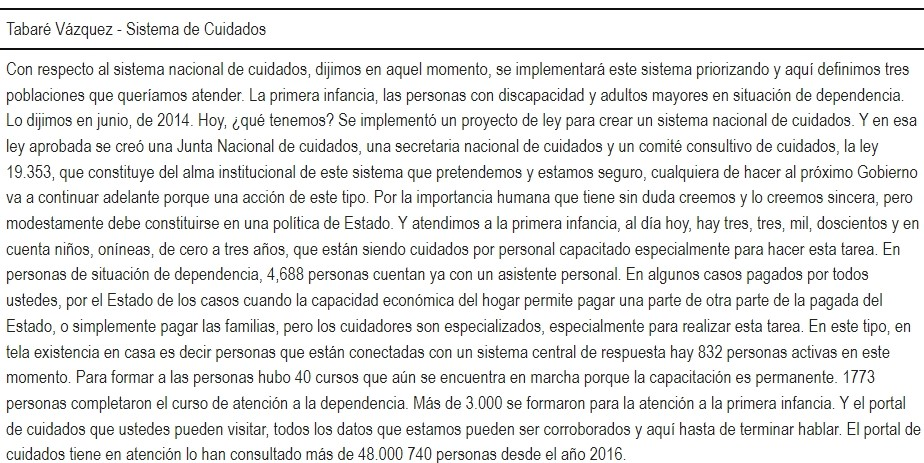

```{r echo=FALSE}
knitr::knit_hooks$set(mysize = function(before, options, envir) {
  if (before) 
    return(options$size)
})
```


```{r include=FALSE}
knitr::opts_chunk$set(mysize = TRUE, size = "\\tiny")

```


<center>

<!-- { width=25% }  -->
</center>


**Mag. Elina Gómez (UMAD)**

[elina.gomez@cienciassociales.edu.uy](elina.gomez@cienciassociales.edu.uy)

[www.elinagomez.com](www.elinagomez.com)


\

**Mag. Gustavo Méndez Barbato**

[gustavo.mendez@cienciassociales.edu.uy](gustavo.mendez@cienciassociales.edu.uy)


#


{ width=18% }  


Este trabajo se distribuye con una licencia Creative Commons Attribution-ShareAlike 4.0 International License


# Objetivos de hoy

```{r echo=FALSE, out.width = "80%", out.height = "80%", fig.align = "center"}
knitr::include_graphics("imagenes/explore.png")
```


# Objetivos de hoy

- Fuentes de datos


# Fuentes de datos

Las fuentes de datos que vamos a ver son:

1. Recuperación de documentos en imagen o pdf (OCR) 

2. Scraping web y parlamentario

3. Prensa digital

4. Audio

5. YouTube

6. APIs de redes sociales


# 1. Recuperación de documentos en imagen o pdf (OCR)


Existen diferentes librerías de R que nos permiten recuperar documentos en diferentes formatos:


- [readtext](https://cran.r-project.org/web/packages/readtext/vignettes/readtext_vignette.html)

- [pdftools](https://docs.ropensci.org/pdftools/)


<!-- - El paquete [readtext](https://cran.r-project.org/web/packages/readtext/vignettes/readtext_vignette.html) tiene una función con le mismo nombre _readtext()_ que permite cargar archivos en cualquier formato de texto (txt, pdf, doc, docx, odt o incluso alojado en uno de estos formatos en la web). -->


<!-- # readtext::readtext() -->

<!-- ```{r eval=FALSE, message=FALSE, warning=FALSE} -->
<!-- library(readtext) -->
<!-- ##Abro los textos en formato .txt y visualizo cómo los carga -->
<!-- txt <- readtext::readtext("Clase2/Material/Mujeres_Adultos_1.txt") -->
<!-- # Determinamos el pdf con el que trabajar -->
<!-- pdf <- readtext("Clase2/Material/text.pdf") -->
<!-- url <- readtext("https://www.ingenieria.unam.mx/dcsyhfi/material_didactico/Literatura_Hispanoamericana_Contemporanea/Autores_B/BENEDETTI/Poemas.pdf") -->
<!-- ``` -->


<!-- # pdftools::pdf_text() -->

<!-- Para recuperar textos en pdf existe la librería [pdftools](https://docs.ropensci.org/pdftools/) que se basa en el paquete _Rpoppler_ (Kurt Hornik). -->

<!-- # pdftools::pdf_text() -->

<!-- Tiene una función pdf_text() -->

<!-- ```{r eval=FALSE, message=FALSE, warning=FALSE} -->
<!-- library(pdftools) -->
<!-- # Extraemos el texto -->
<!-- pdf_texto <- pdf_text("Clase2/Material/marcha_1973.pdf") -->
<!-- ``` -->


# tesseract OCR

Tesseract es un motor de OCR ( _reconocimiento óptico de caracteres_) para varios sistemas operativos. Es software libre, liberado bajo la licencia Apache, Versión 2.0 y su desarrollo es financiado por Google desde el 2006.

[Acá se encuentra la documentación](https://opensource.google/projects/tesseract), cuenta con *más de 100 idiomas.*

# tesseract OCR

Existe un paquete de R [bien documentado](https://cran.r-project.org/web/packages/tesseract/vignettes/intro.html) que se llama _tesseract_ y que cuenta con funciones que permiten el reconocimiento de caracteres incluso en español, descargando una base de entrenamiento del motor.

# tesseract OCR: 

Descargo un documento histórico del repositorio [Internet Archive](https://archive.org/search.php?query=creator%3A%22Ateneo+del+Uruguay%22)

```{r message=FALSE, warning=FALSE, eval=FALSE}
##Chequear los idiomas disponibles 
tesseract_info()
# Bajar por unicamente español para entrenar
tesseract_download("spa")
# asignar
(espanol <- tesseract("spa"))
#Probamos:
transcribopdf <- ocr("analesUruguay.pdf", engine = espanol)
```

# tesseract OCR

La función _ocr_data()_ devuelve una tabla dónde cada fila es una palabra con la confianza asociada a la misma y la ubicación exacta. 


<!-- # Ejercicio  -->

<!-- - Replicar el OCR para la imagen _marcha_1973_ -->

<!-- - Hacer las tablas de ambas -->


# magick

El paquete _magick_ complementa a _tesseract_ en cuento a mejora de la calidad de las imagenes que sirven de input. Cuenta con varias funciones para mejorar la resolución, el color, contraste, espacios en blanco. Puede ser utilizado como paso previo. 


# 2. Web scraping


*¿Qué es web scraping?*

__Web scraping__ es una __técnica__ para obtener datos no estructurado (etiquetas HTML) de una página web, a un formato estructurado de columnas y renglones, en los cuales se puede acceder y usar más fácilmente.


# 2. Web scraping

*¿Para qué sirve Web scraping?*

- Obtener datos de texto.
- Consolidar datos de redes sociales o extraer comentarios de usuarios/as.
- Precios de tiendas online, a través del análisis histórico de la competencia.
- Búsqueda en Google de diversas palabras clave.
- Etiquetas de imágenes, para clasificación de imágenes.


# 2. Scraping web y parlamentario


En el curso vamos a ver tres formas de Web scraping:

- Paquete _rvest_
- Paquete _speech_ (Uruguay)
- Gdelt project


# rvest

*rvest* es un paquete para scraping (raspado) y análisis web de Hadley Wickham.

[Documentación](https://cran.r-project.org/web/packages/rvest/rvest.pdf)

- Tutorial recomendado de Riva Quiroga (Chile)

[https://programminghistorian.org/es/lecciones/introduccion-al-web-scraping-usando-r](https://programminghistorian.org/es/lecciones/introduccion-al-web-scraping-usando-r)


# ¿Cómo usar rvest?

Para usar rvest, se requiere conocer las instrucciones en código, a las que llamaremos funciones, para para hacer las tareas más comunes en la extracción y manipulación de datos web. 

- `read_html(«url»)` con esta función se crea un objeto que contiene todo el código o etiquetas HTML.
- `html_elements(«objeto html», «etiqueta css»)` se usa para seleccionar partes del objeto que contiene todo el código html. El segundo parámetros es la clase CSS que está relacionada con la sección que deseamos extraer. 

# ¿Cómo usar rvest?

- `html_name()` obtiene los atributos html
- `html_text()` extrae el texto html
- `html_attr()` regresa los atributos específicos html (ej. href)
- `html_attrs()` obtiene los atributos html
- `html_table()` convierte una tabla html en una estructura de datos en R


# Ejemplo rvest: texto

Descargo la extensión del [SelectorGadget](http://selectorgadget.com/) de Chrome e [instalo](https://chrome.google.com/webstore/detail/selectorgadget/mhjhnkcfbdhnjickkkdbjoemdmbfginb) y busco el nombre del nodo o elementos en una pagina que me interese scrapear 

# Ejemplo rvest: texto

```{r message=FALSE, warning=FALSE, eval=FALSE}
library(rvest)
library(dplyr)

#Defino mi sitio html: Montevideo portal
mvdportal = read_html("https://www.montevideo.com.uy/index.html") 

resumenes = mvdportal %>%
  html_elements(".text")%>% #defino los elementos que identifiqué con el SelectorGadget 
  html_text()

titulares = mvdportal %>%
  html_elements("a")%>%
  html_text()

```

# Ejemplo rvest: texto

[Un ejemplo](https://d4tagirl.com/2018/04/scrapeando-las-sesiones-parlamentarias-de-uruguay) concreto para el caso uruguayo !


# Ejemplo rvest: tabla


```{r eval=FALSE, message=FALSE, warning=FALSE}

url <- 'https://en.wikipedia.org/wiki/R_(programming_language)'

url %>% read_html() %>% 
        html_elements(css = '.wikitable') %>% 
        html_table() 

```


# _speech_


# _speech_

El [paquete speech](https://CRAN.R-project.org/package=speech) convierte los diarios de sesiones legisladorxs uruguayxs, en un marco de datos ordenado donde cada observación es la intervención de unx solx legisladorx.

Acá se encuentra la [documentación](https://cran.r-project.org/web/packages/speech/speech.pdf) del paquete con descripción de las funciones y argumentos.


# _speech_

```{r eval=FALSE, message=FALSE, warning=FALSE}

##Recomiendo instalar versión en desarrollo:

if (!require("remotes")) install.packages("remotes")
remotes::install_github("Nicolas-Schmidt/speech")

library(speech)

```


# _speech_

```{r eval=FALSE, message=FALSE, warning=FALSE}

url <- "http://bit.ly/35AUVF4"

sesion <- speech_build(file = url)

```


# _speech_

```{r eval=FALSE, message=FALSE, warning=FALSE}

#Función completa

sesion <- speech_build(file = url, 
#url a pdf
compiler = FALSE, 
#compila discursos de unx mismx legisladorx
quality = TRUE,
#aporta dos índices de calidad
add.error.sir = c("SEf'IOR"),
##forma errónea que lo que identifica a el/la legisladorx
rm.error.leg = c("PRtSIDENTE", "SUB", "PRfSlENTE"))
##identifica a el/la legisladorx que debe eliminarse
```

# _speech_

Variables que incluye la tabla ordenada:

- legislator: nombre
- speech: discurso/s
- date: fecha de sesión
- id: identificador
- legislature: número de legislatura
- chamber:  cámara del documento (representantes, senadores, asamblea general, comisión permanente)  

Si quality es TRUE:

- index_1: index_1. Proporción del documento recuperado con respecto al original. 
- index_2: index_2. Proporción del documento final en función del recuperado. Proporción del documento donde hay intervenciones de lxs legisladorxs.


# _puy_

- Es posible combinar con el paquete _puy_ para recuperar el dato del partido político al que pertenece


# _speech App_

- Existe una Shiny de speech que permite descargar de forma tabulada las sesiones sin escribir código: [https://bancodedatos-fcs.shinyapps.io/shiny_speech/](https://bancodedatos-fcs.shinyapps.io/shiny_speech/)


# 3. Prensa digital

**Monitor de prensa**

- Existe un monitor de prensa (en Twitter) que permite descargar [http://137.184.138.178](http://137.184.138.178)

- Desarrollada por Leandro Domínguez, Guillermo Eijo y Sebastian Felix en el marco del proyecto de grado "Análisis de publicaciones sobre seguridad ciudadana en redes sociales" (FING-Udelar) - Agosto 2022

- Acumula desde enero 2009. Tiene tres módulos: Indicadores, Entidades y Cluster.


# _Proyecto Gdelt_

[El proyecto GDELT](https://www.gdeltproject.org/) cuenta con _una base de datos global de la sociedad que monitorea las noticias de impresas y web del mundo desde casi todos los rincones de cada país en más de 100 idiomas e identifica las personas, ubicaciones, organizaciones, temas, fuentes, emociones, recuentos, citas, imágenes y eventos que impulsan nuestra sociedad global cada segundo de cada día, creando una plataforma abierta y gratuita para la informática en todo el mundo._


# _Proyecto Gdelt_


Existe un paquete de R llamado [gdeltr2](https://github.com/abresler/gdeltr2) que no se encuentra bien documentado pero que cuenta con mucho potencial. Las consultas a la base pueden hacerse también desde [Big Query de Google](https://console.cloud.google.com/bigquery?utm_source=bqui&utm_medium=link&utm_campaign=classic&project=snappy-flash-295118&pli=1) y procesamiento posterior en R. 


# _Proyecto Gdelt_

- GDELT Events Database [EVENTS]: Global Events, 1979 to present.
- GDELT Global Knowledge Graph [GKG] : GDELT’s Knowledge Graph, April 2013 to present.
- GDELT Full Text API [Full Text API]: Full text search for all monitored sources within a 24 hour window. Output includes raw data, sentiment, and word counts.
- GDELT Visual Knowledge Graph VGKG: Google Cloud Vision API output for every indexed piece of GKG media.


# _Proyecto Gdelt_


[Proyecto reciente en Argentina](https://www.youtube.com/watch?v=s_9GAeNSWkw) usando Gdelt para obtener noticias sobre antivacunismo. 


# _gdelt2_

[Tutorial](https://asbcllc.com/blog/2017/august/intro_to_programming_with_gdeltr2/index.html)

Instalación:
```{r eval=FALSE, message=FALSE, warning=FALSE}

devtools::install_github("hadley/devtools")
devtools::install_github("hafen/trelliscopejs")
devtools::install_github("abresler/gdeltr2")

```


# _gdelt2_

El mode _ArtList_ recupera todo los artículos que tienen esa mención en un determinado tiempo. Está restringido a 250 resultados y 52 semanas.  Para hacer búsquedas combinadas: '"Lacalle Pou" covid'

```{r eval=FALSE, message=FALSE, warning=FALSE}

articulos  = gdeltr2::ft_v2_api(
  terms = c("Lacalle Pou"),
  modes = c("ArtList"),
  visualize_results = F,
  timespans = "55 days",
  source_countries = "UY")

```

# _gdelt2_

El mode _TimelineVol_ recupera una métrica diaria de la intensidad del volumen de los artículos que coinciden con una búsqueda específica. 

```{r eval=FALSE, message=FALSE, warning=FALSE}

intensidad = gdeltr2::ft_v2_api(
  terms = c("Lacalle Pou"),
  modes = c("TimelineVol"),
  visualize_results = F,
  timespans = "55 days",
  source_countries = "UY"
) 

```


# _gdelt2_

El mode _TimelineVol_ recupera una métrica diaria de la intensidad del volumen de los artículos que coinciden con una búsqueda específica. El mode _TimelineVolInfo_ es igual pero con información anexa y desagregada para cada artículo. 

```{r eval=FALSE, message=FALSE, warning=FALSE}

intensidad = gdeltr2::ft_v2_api(
  terms = c("Lacalle Pou"),
  modes = c("TimelineVol"),
  visualize_results = F,
  timespans = "55 days",
  source_countries = "UY"
) 

```


# _gdelt2_

El mode _TimelineTone_ recupera el tono (positivo y negativo) de los artículos que coniciden con la búsqueda, por día. 

```{r eval=FALSE, message=FALSE, warning=FALSE}

tono_diario = gdeltr2::ft_v2_api(
  terms = c("Lacalle Pou"),
  modes = c("TimelineTone"),
  visualize_results = F,
  timespans = "30 days",
  source_countries = "UY"
) 

```

# _gdelt2_

El mode _ToneChart_ recupera el tono (positivo y negativo) de los artículos que coniciden con la búsqueda, por artículo. 

```{r eval=FALSE, message=FALSE, warning=FALSE}

prueba4 = gdeltr2::ft_v2_api(
  terms = c("Lacalle Pou"),
  modes = c("ToneChart"),
  visualize_results = F,
  timespans = "30 days",
  source_countries = "UY"
) 

```

# _gdelt2_

Últimos términos, lugares, personas, cosas, de los últimos 15 minutos a nivel mundial.

```{r eval=FALSE, message=FALSE, warning=FALSE}

ultimo = gdeltr2::ft_trending_terms() 

```

# _gdelt2_

Tablas de inestabilidad con variables _'instability', 'tone', 'protest', 'conflict','artvolnorm'_ . Es posible visualizar gráficos. 

```{r eval=FALSE, message=FALSE, warning=FALSE}

inestabilidad_zona <-
  gdeltr2::instability_api_locations(
    location_ids = c("UY"),
    use_multi_locations = c(T, F),
    variable_names = c('instability', 'tone', 'protest', 'conflict','artvolnorm'),
    time_periods = c('daily'),
    nest_data = F,
    days_moving_average = NA,
    return_wide = T,
    return_message = T,
    visualize = T
  )

```


# _gdelt2_

Por último, recuperar temas pre-calasificados con AA (IA), hay 59840.

```{r eval=FALSE, message=FALSE, warning=FALSE}
##cargo códigos de temas
df_gkg <-
  gdeltr2::dictionary_ft_codebook(code_book = "gkg")


tema =  ft_v2_api(gkg_themes = "WB_2901_GENDER_BASED_VIOLENCE",modes = c("Artlist"),
                    visualize_results = F,
                    timespans = "55 days")

```


# _gtrendsR_


- El paquete [gtrendsR](https://github.com/PMassicotte/gtrendsR)

- Permite realizar búsquedas de los términos más buscados en Google, proporciona una métrica propia para saber el volumen de búsqueda asociado. 

- Permite análisis longitudinales, por países,departamentos, etc. 

- Es útil para analizar intereses/preocupaciones de las personas lo cual nos puede dar información del ámbito _privado_, trascendiendo o complementando con los mensajes emitidos de carácter público (rrss)


# _gtrendsR_: ejemplo con análisis del tema **agua**


```{r echo=FALSE, message=FALSE, warning=FALSE}

library(tidyverse)
library(ggplot2)
library(gtrendsR)
library(trendyy)

##evolución por fechas

agua1 <- trendy("agua", "2022-05-10", "2023-06-14",geo = "UY") %>% get_interest()

ggplot(agua1, aes(x = as.Date(date), y = hits)) +
  geom_line(colour = "steelblue", size = 1.5) +
  xlab(label = "Fecha") + 
  ylab(label = 'Interés %')+
  theme_bw()+ labs(title="Evolución de búsquedas de 'Agua' en último año")

```

# _gtrendsR_: ejemplo con análisis del tema **agua**


```{r echo=FALSE, message=FALSE, warning=FALSE}

query=gtrends(keyword = c("agua","sub 20"),time = "now 7-d",geo = "UY")

agua_sub20 <- query$interest_over_time

agua_sub20 %>% 
  ggplot() + geom_line(aes(x = date,
                           y = hits,
                           color = keyword),size = 0.8) +
  xlab(label = "Fecha") + 
  ylab(label = 'Interés %')+
  theme_bw()+ labs(title="Evolución de búsquedas de 'Agua' vs 'sub 20' en la última semana") 

```


# _gtrendsR_: ejemplo con análisis del tema **agua**


```{r include=FALSE}
##cargo geometrías

depto=geouy::load_geouy("Departamentos")

```


```{r echo=FALSE, message=FALSE, warning=FALSE}

query=gtrends(keyword = c("agua"),time = "today 1-m",geo = "UY")


mapa=query$interest_by_region
mapa = mapa %>%
  mutate(location=stringr::str_replace_all(location,"Department",""))%>%
  mutate(location = stringr::str_trim(toupper(stringi::stri_trans_general(str = location,
                                                                          id = "Latin-ASCII"))))


mapa_geo = depto %>%
  left_join(mapa,by = c("nombre"="location")) 

ggplot(mapa_geo,aes(fill = hits)) + geom_sf() +
  geom_sf_text(aes(label = round(hits,1)), colour = "black",size=3,fontface = "bold")+
  scale_fill_gradient(low = "#9ECAE1", high = "#08306B")+
  labs(x = "",
       y = "",
       caption = "")+
  theme_bw()+
  theme(
    axis.line = element_blank(),
    axis.text.x = element_blank(),
    axis.text.y = element_blank(),
    axis.ticks = element_blank(),
    axis.title.x = element_blank(),
    axis.title.y = element_blank(),
    legend.text = element_blank(),
    legend.title = element_blank(),
     legend.position = "none")+
    # panel.grid.major = element_line(colour = "transparent"))+ 
  labs(title="Búsquedas de 'Agua' en último mes por departamento")

```


# _gtrendsR_: ejemplo con análisis del tema **agua**


```{r echo=FALSE, message=FALSE, warning=FALSE}

query=gtrends(keyword = c("agua"),time = "today 1-m",geo = "UY")

#Análisis de búsquedas más relacionadas con keyword

queries_relacionadas = query$related_queries

topics = query$related_topics

query$related_queries %>%
  filter(related_queries=="top"& value%in%c("tiktok sin marca de agua","fuego y agua", "agua y fuego")==F)%>%
  mutate(value=factor(value,levels=rev(as.character(value))),
         subject=as.numeric(subject)) %>%
  top_n(20,value) %>%
  ggplot(aes(x=value,y=subject)) + 
  geom_bar(stat='identity',show.legend = F,fill = "steelblue") + 
  coord_flip() + labs(title="Búsquedas más relacionadas con 'Agua' en último mes")+
  theme_bw()+
  theme(axis.title= element_blank())


```

# Otros recursos disponibles

- Recursos en línea para el estudio de la conflictividad [http://observatoriodeconflictividad.org/](http://observatoriodeconflictividad.org/)

- Paquete [ACEP: Analisis Computacional de Eventos de Protesta](https://github.com/agusnieto77/ACEP)

- _ACEP es un paquete de funciones en lenguaje R utiles para la deteccion y el analisis de eventos de protesta en corpus de textos periodísticos. Sus funciones son aplicables a cualquier corpus de textos. Ademas de las funciones, ACEP contiene también bases de datos con colecciones de notas sobre protestas y una colección de diccionarios de palabras conflictivas y otros tópicos referidos a diferentes aspectos del análisis de eventos de protesta._

- Autor: Agustín Nieto (Universidad Nacional de Mar del Plata)

# Otros recursos disponibles

- Paquete [internetarchive](devtools::install_github("ropensci/internetarchive", build_vignettes = TRUE)) permite scrapear del sitio **Internet Archive**

- Hemeroteca o biblioteca digital [archive.org](https://archive.org/) _gestionada por una organización sin ánimo de lucro dedicada a la preservación de archivos, capturas de sitios públicos de la Web, recursos multimedia, etc._


# 4. Audio 

El paquete [audio.whisper](https://github.com/bnosac/audio.whisper) permite utilizar en R la herramienta de reconocimiento de voz _["Whisper" Automatic Speech Recognition model](https://github.com/openai/whisper)_ desarrollada por openaAI.

Recuperar texto de audios es una fuente casi inagotable (entrevistas, discursos, conversaciones, podcast, etc.).


# audio.whisper

- Tiene diferentes modelos que van desde el menos potente _(tiny)_ al más potente _(large)_

- Cuanto mayor es la potencia y precisión del modelo más demora la transcripción

- No todos están disponibles para español

- Los pasos son sencillos y están bien explicados en el [repositorio del paquete](https://github.com/bnosac/audio.whisper)

- Se combina con la librería `av` para transformar los audios a formato de archivo _.wav de 16 bit_, que es el requerido por `audio.whisper`


# audio.whisper + av

Obtengo un audio de interés y lo convierto a **.wav** con el paquete `av`

```{r, whisper1, eval=F, echo=T}
library(av) # conversor a .wav
library(audio.whisper) # transcpción

# 1. OBTENGO UN ARCHIVO DE AUDIO
# descargo para el ejemplo un audio de la web (podría ser un archivo que ya tengo en mi pc)
download.file("https://medios.presidencia.gub.uy/tav_portal/2018/noticias/AD_103/vazquez-cuidados.mp3", # url del audio
              "cuidados.mp3", # nombre del archivo que quedará en mi pc
              mode="wb") # modo web

# 2. CONVERSIÓN (av)
# convierto a .wav 
av_audio_convert("cuidados.mp3", # nombre del archivo en mi pc
                 output = "cuidados.wav", # nombre del archivo convertido
                 format = "wav", sample_rate = 16000) # formato
```

# audio.whisper

Realizo la transcripción con el modelo _tiny_ (el menos potente)

```{r, whisper2, eval=F, echo=T}
# Descargo el modelo 
# (podría saltear este paso poniendo la ruta en la función predict())
model <- whisper("tiny") # descargo modelo liviano 
# lo corro indicando el idioma (es multilingual)
transcript <- predict(model, newdata = "cuidados.wav", language = "es")
# extraigo el df donde está el texto transcripto
texto_df <- transcript$data # df tiene 4 cols segmento, inicio, fin, texto 
# guardo el df
save(texto_df,file="texto_df.RData") #o en el formato que quieras

```
# audio.whisper

Construyo un cuadro con  `knitr` y `kableExtra` con el texto

```{r, whisper3, eval=F, echo=T}
#olapso la columna text también podría usar un identificador y agrupar
texto_vec <- paste(texto_df$text,collapse="")
tabla1 <- knitr::kable(texto_vec,
          col.names = "Tabaré Vázquez - Sistema de Cuidados", # agrego nombre 
          format = "html", table.attr = "style='width:100%;'") %>% #formato
  kableExtra::kable_styling(font_size = 24) %>% # defino tamaño de letra
  kableExtra::kable_classic() # defino el estilo de la tabla
```

# audio.whisper

```{r echo=FALSE, out.width = "100%", fig.align = "center"}

```

# audio.whisper + scraping

- La utilidad de la transcripción es mayor cuanto más audios tengamos

- Transcribir una entrevista puede ser divertido, 10 es agotador, más de 10 hay contratar a alguien y en general no tenemos recursos

- La potencia se acrecienta combinando herramientas

- Un buen ejemplo es realizar scrapeo de audios de la web con `rvest`


# audio.whisper + scraping + rgtp3

También podemos usar el paquete `rgtp3` que permite conectar R con la herramienta de openAI _chatGPT3_

La API es de pago, pero para un ejercicio básico alcanza con lo que te permite utilizar gratis

- [Acá](https://github.com/elinagomez/analisistextoEPUdelar2023/blob/master/Clase2/Material/Recuperación_texto_audios.html) pueden descargar un ejemplo con:

1. Descarga de audios `rvest`

2. Transcripción con `audio.whisper`

3. Resumen e identificación de tema principal con `rgpt3`

- _[Acá](https://www.elinagomez.com/blog/2023-02-21-gpt3-ccss/)_ hay otro ejemplo de uso de `rgtp3` (no de audio) donde pueden ver los pasos para conectar con la API


# 5. YouTube

El paquete [`youtubecaption`](https://github.com/jooyoungseo/youtubecaption) permite descargar los subtítulos de los videos de YouTube

Trabaja sobre la librería de Python `youtube-transcript-api` 

Es necesario conectar R y Pyhton, lo que puede realizarse con librería `reticulate` que permite la instalación de _miniconda_ o la interfaz _Anaconda_ para gestionar los paquetes (ver archivo _[instalaciones](https://github.com/elinagomez/analisistextoEPUdelar2023/blob/master/Clase1/Instalaciones.pdf)_ del curso)

```{r echo=FALSE, out.width = "30%", fig.align = "right"}
knitr::include_graphics("imagenes/youtube.png")
```

# 5. youtubecaption

- Es posible recuperar texto de todos los videos que cuentan con subtítulos (incoprorados o generados automáticamente)

- Si los subtítulos son automáticos la fidelidad generalmente depende de la claridad del audio 

- `youtubecaption` recupera la transcripción de forma tabulada y ordenada para cada secuencia del video, por lo que luego es necesario agrupar por el identificador y recuperar la metadata original (fecha, resumen, canal, visualizciones, etc.)

# 5. youtubecaption

Hay tantas alternativas como videos de YouTube existan: discursos, conferencias, entrevistas, canciones, películas, programas de tv...

```{r, youtube1, eval=F, echo=T}
# hadley wickham
url <- "https://www.youtube.com/watch?v=cpbtcsGE0OA"
caption <- get_caption(url)

# suarez
url2 <- "https://www.youtube.com/watch?v=KsE8a9NOtnU"
caption2 <- get_caption(url2, language = "es")

# agarrate catalina
url3 <- "https://www.youtube.com/watch?v=LApsPiejZLI"
caption3 <- get_caption(url3, language = "es")
```

# 5. youtubecaption

También `youtubecaption` se potencia con la combinación de herramientas

- [Acá](https://www.elinagomez.com/blog/2023-05-4-palabras-presidente/#fn1) hay un ejemplo de uso con videos del presidente Lacalle Pou:

1. Scraping con [Apify](https://apify.com/)

2. Descarga con  `youtubecaption`

3. Análisis con `quanteda` y `udpipe`

4. Visualización con `ggplot2`


# 6. APIs de redes sociales 

*¿Qué son las API?*

API significa _Application Programming Interfaces_ o _interfaz de programación de aplicaciones_ (en español), son un conjunto de protocolos usados para desarrollar aplicaciones y sirven para definir la comunicación entre dos aplicaciones de software a través de un conjunto de reglas ([ver más](https://www.xataka.com/basics/api-que-sirve)).

Las aplicaciones de redes sociales, por ejemplo, asignan algunos permisos de acceso a desarrolladores para interactuar con las mismas. El nivel de acceso varía de una a otra red.


<!-- # 3. APIs de redes sociales: Twitter -->

<!-- En este caso, veremos el caso de *Twitter* como una de las redes sociales que podemos conectar desde R para realizar análisis variados.  -->

<!-- Existen dos paquetes para esto: _twitteR_ y _rtweet_ -->

<!-- # ¿Por qué Twitter? -->

<!-- En mayo de 2020 -->

<!-- - *6.000 tweets por segundo* -->
<!-- - *350.000 tweets por minuto* -->
<!-- - *500 millones de tweets por día* -->
<!-- - *200 billones de tweets por día* -->

<!-- # ¿Por qué Twitter? -->

<!--   -->

<!-- # API de Twitter -->

<!-- - Twitter disponibiliza los datos en diferentes niveles a los que llama **puntos de conexión**. En este caso nos interesa acceder a los _Tweets y respuestas_ emitidos para su posterior clasificación, procesamiento y análisis.   -->

<!-- - Más información al respecto en: [Twitter API](https://help.twitter.com/es/rules-and-policies/twitter-api) -->


<!-- # Restricciones -->

<!-- * La antiguedad permitida para la obtención de tweets es de *8 días* -->

<!-- * Se pueden bajar 18 mil tweets que coincidan con la búsqueda de forma aleatoria. -->

<!-- * Si la búsqueda subera los 18 mil tweets se puede iterar la función para ampliar la búsqueda (hasta 54 mil tweets por hora!) -->


<!-- [Artículo recomendado!](https://rdrr.io/github/arcruz0/libroadp/f/qta.Rmd)  -->

<!-- # ¿Cómo me conecto a la API de Twitter desde RStudio?  -->

<!-- 1. Entro a la pagina para desarrolladores de Twitter [https://developer.twitter.com/en/apps](https://developer.twitter.com/en/apps)  -->
<!-- 2. Me logeo en Twitter con mi cuenta de usuario personal. -->

<!-- # ¿Cómo me conecto a la API de Twitter desde RStudio?  -->
<!-- 3. Voy a la opción **Create an app** -->

<!--   -->

<!-- # ¿Cómo me conecto a la API de Twitter desde RStudio?  -->

<!-- 4. Se debe especificar el usuario que se utilizará, los fines (organización o uso personal), área de interés vinculada al uso, país y descripción general de la aplicación. -->

<!-- 5. Vamos a la pestaña **Keys and tokens** dónde estarán todas las claves que necesito para hacer la conexión con R.  -->

<!-- # ¿Cómo me conecto a la API de Twitter desde RStudio?  -->

<!--   -->


