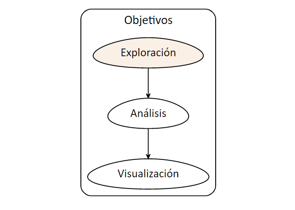
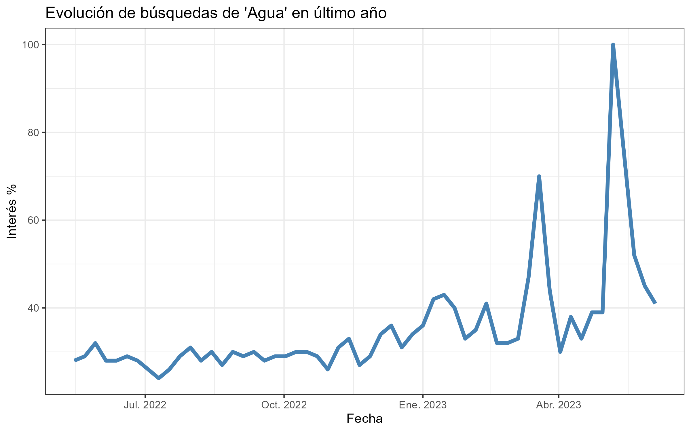
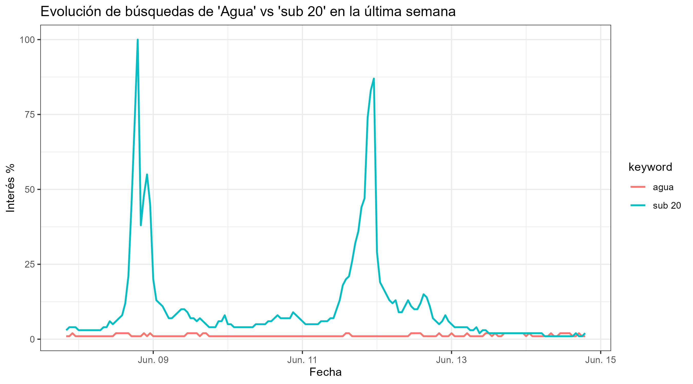
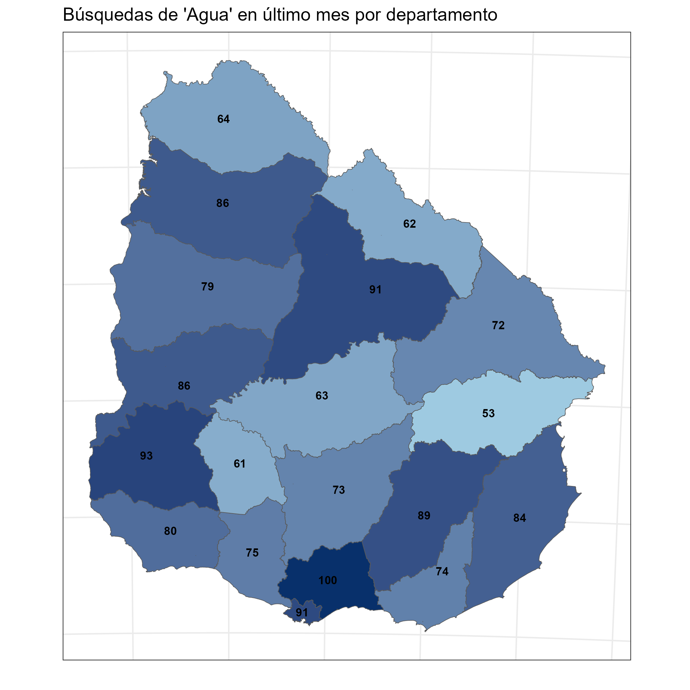
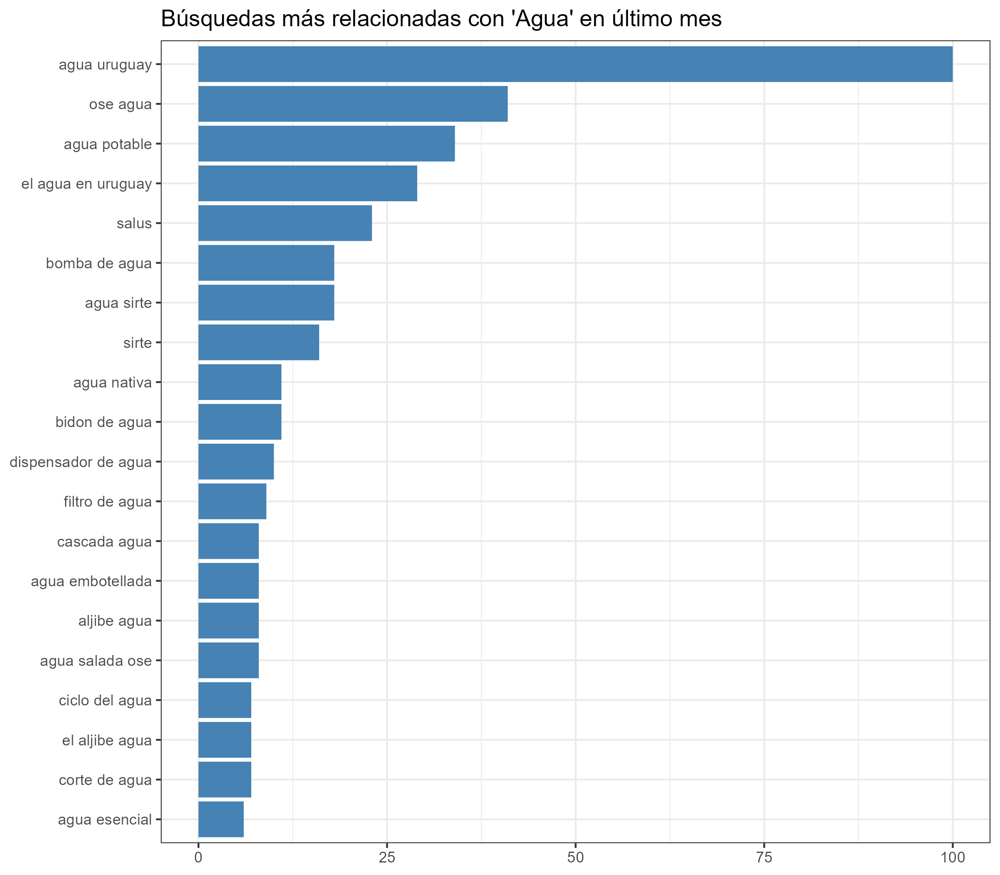
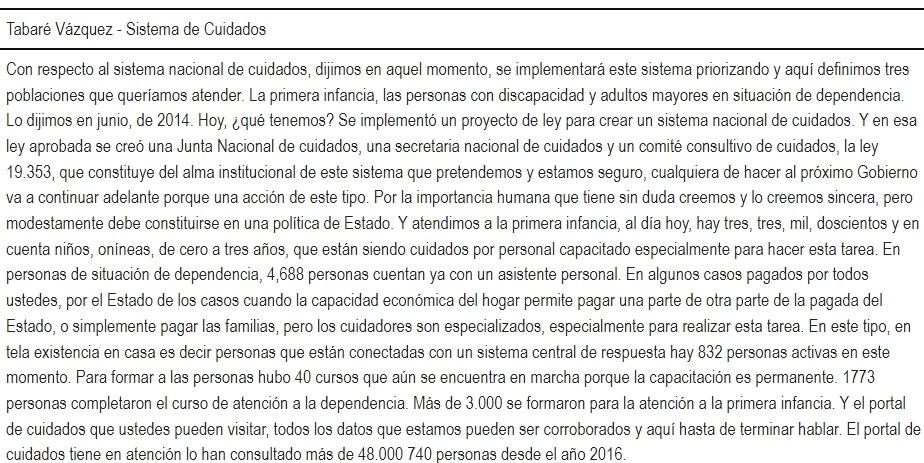

```{r echo=FALSE}
knitr::knit_hooks$set(mysize = function(before, options, envir) {
  if (before) 
    return(options$size)
})
```


```{r include=FALSE}
knitr::opts_chunk$set(mysize = TRUE, size = "\\tiny")

```


<center>

<!-- { width=25% }  -->
</center>


**Mag. Elina Gómez (UMAD)**

[elina.gomez@cienciassociales.edu.uy](elina.gomez@cienciassociales.edu.uy)

[www.elinagomez.com](www.elinagomez.com)


#


{ width=18% }  


Este trabajo se distribuye con una licencia Creative Commons Attribution-ShareAlike 4.0 International License


# Objetivos de hoy

```{r echo=FALSE, out.width = "80%", out.height = "80%", fig.align = "center"}

```


# Fuentes de datos

Las fuentes de datos que vamos a ver son:

1. Recuperación de documentos en imagen o pdf (OCR) 

2. Scraping web y parlamentario

3. Prensa digital

4. Google Trends

5. Audio

6. YouTube


# Objetivos de hoy

- Fuentes de datos: Google Trends, Audio y YouTube


# 4. _gtrendsR_


- El paquete [gtrendsR](https://github.com/PMassicotte/gtrendsR)

- Permite realizar búsquedas de los términos más buscados en Google, proporciona una métrica propia para saber el volumen de búsqueda asociado. 

- Permite análisis longitudinales, por países,departamentos, etc. 

- Es útil para analizar intereses/preocupaciones de las personas lo cual nos puede dar información del ámbito _privado_, trascendiendo o complementando con los mensajes emitidos de carácter público (rrss)


# 4. _gtrendsR_: ejemplo con análisis del tema **agua**


```{r echo=FALSE, out.width = "80%", out.height = "80%", fig.align = "center"}

```


# 4. _gtrendsR_: ejemplo con análisis del tema **agua**


```{r echo=FALSE, out.width = "80%", out.height = "80%", fig.align = "center"}

```


# 4. _gtrendsR_: ejemplo con análisis del tema **agua**


```{r echo=FALSE, out.width = "80%", out.height = "80%", fig.align = "center"}

```


# 4. _gtrendsR_: ejemplo con análisis del tema **agua**


```{r echo=FALSE, out.width = "80%", out.height = "80%", fig.align = "center"}

```

# EJERCICIO 1

## Búsquedas de google con gtrendsR

1. Realizar una búsqueda de interés general para el último mes 
2. Realizar una búsqueda de interés general para el último año
3. Graficar ambos resultados

# 5. Audio 

El paquete [audio.whisper](https://github.com/bnosac/audio.whisper) permite utilizar en R la herramienta de reconocimiento de voz _["Whisper" Automatic Speech Recognition model](https://github.com/openai/whisper)_ desarrollada por openaAI.

Recuperar texto de audios es una fuente casi inagotable (entrevistas, discursos, conversaciones, podcast, etc.).

Trabajar en el entorno local de R, garantiza privacidad de la información (ejemplo entrevistas confidenciales)


# audio.whisper

- Tiene diferentes modelos que van desde el menos potente _(tiny)_ al más potente _(large)_

- Cuanto mayor es la potencia y precisión del modelo más demora la transcripción

- Es multilingüe

- Los pasos son sencillos y están bien explicados en el [repositorio del paquete](https://github.com/bnosac/audio.whisper)

- Se combina con la librería `av` para transformar los audios a formato de archivo _.wav de 16 bit_, que es el requerido por `audio.whisper`


# audio.whisper + av

Obtengo un audio de interés y lo convierto a **.wav** con el paquete `av`

```{r, whisper1, eval=F, echo=T}
library(av) # conversor a .wav
library(audio.whisper) # transcpción

# 1. OBTENGO UN ARCHIVO DE AUDIO
# descargo para el ejemplo un audio de la web (podría ser un archivo que ya tengo en mi pc)
download.file("https://medios.presidencia.gub.uy/tav_portal/2018/noticias/AD_103/vazquez-cuidados.mp3", # url del audio
              "cuidados.mp3", # nombre del archivo que quedará en mi pc
              mode="wb") # modo web

# 2. CONVERSIÓN (av)
# convierto a .wav 
av_audio_convert("cuidados.mp3", # nombre del archivo en mi pc
                 output = "cuidados.wav", # nombre del archivo convertido
                 format = "wav", sample_rate = 16000) # formato
```

# audio.whisper

Realizo la transcripción con el modelo _tiny_ (el menos potente)

```{r, whisper2, eval=F, echo=T}
# Descargo el modelo 
# (podría saltear este paso poniendo la ruta en la función predict())
model <- whisper("tiny") # descargo modelo liviano 
# lo corro indicando el idioma (es multilingual)
transcript <- predict(model, newdata = "cuidados.wav", language = "es")
# extraigo el df donde está el texto transcripto
texto_df <- transcript$data # df tiene 4 cols segmento, inicio, fin, texto 
# guardo el df
save(texto_df,file="texto_df.RData") #o en el formato que quieras

```
# audio.whisper

Construyo un cuadro con  `knitr` y `kableExtra` con el texto

```{r, whisper3, eval=F, echo=T}
#olapso la columna text también podría usar un identificador y agrupar
texto_vec <- paste(texto_df$text,collapse="")
tabla1 <- knitr::kable(texto_vec,
          col.names = "Tabaré Vázquez - Sistema de Cuidados", # agrego nombre 
          format = "html", table.attr = "style='width:100%;'") %>% #formato
  kableExtra::kable_styling(font_size = 24) %>% # defino tamaño de letra
  kableExtra::kable_classic() # defino el estilo de la tabla
```

# audio.whisper

```{r echo=FALSE, out.width = "100%", fig.align = "center"}

```

# audio.whisper

- Los modelos utilizan mucha memoria RAM y esto puede crashear la sesión

- Una alternativa eficiente, sobre todo cuando se trabaja con modelos potentes es descargar los modelos y cargar los archivos locales

- [Sitio para descargar modelos](https://huggingface.co/ggerganov/whisper.cpp/tree/main)

# audio.whisper + scraping

- La utilidad de la transcripción es mayor cuanto más audios tengamos

- Transcribir una entrevista puede ser divertido, 10 es agotador, más de 10 hay contratar a alguien y en general no tenemos recursos

- La potencia se acrecienta combinando herramientas

- Un buen ejemplo es realizar scrapeo de audios de la web con `rvest`


# audio.whisper + scraping + rgtp3

También podemos usar el paquete `rgtp3` que permite conectar R con la herramienta de openAI _chatGPT3_

La API es de pago, pero para un ejercicio básico alcanza con lo que te permite utilizar gratis

- [Acá](https://github.com/elinagomez/analisistextoEPUdelar2023/blob/master/Clase2/Material/Recuperación_texto_audios.html) pueden descargar un ejemplo con:

1. Descarga de audios `rvest`

2. Transcripción con `audio.whisper`

3. Resumen e identificación de tema principal con `rgpt3`

- _[Acá](https://www.elinagomez.com/blog/2023-02-21-gpt3-ccss/)_ hay otro ejemplo de uso de `rgtp3` (no de audio) donde pueden ver los pasos para conectar con la API


# EJERCICIO 2 

## Recuperación de texto de audios

1. Recuperar y transcribir con modelo tiny un audio breve (menos de 3 minutos)
2. Recuperar y transcribir con modelo medium el mismo audio
3. Imprimir en consola ambos resultados y comparar los textos

_Opción de descarga: [sitio Presidencia de la República](https://www.gub.uy/presidencia/comunicacion/audios/breves)_


# 6. YouTube

El paquete [`youtubecaption`](https://github.com/jooyoungseo/youtubecaption) permite descargar los subtítulos de los videos de YouTube

Trabaja sobre la librería de Python `youtube-transcript-api` 

Es necesario conectar R y Pyhton, lo que puede realizarse con librería `reticulate` que permite la instalación de _miniconda_ o la interfaz _Anaconda_ para gestionar los paquetes (ver archivo _[instalaciones](https://github.com/elinagomez/analisistextoEPUdelar2023/blob/master/Clase1/Instalaciones.pdf)_ del curso)

```{r echo=FALSE, out.width = "30%", fig.align = "right"}

```

# 6. youtubecaption

- Es posible recuperar texto de todos los videos que cuentan con subtítulos (incoprorados o generados automáticamente)

- Si los subtítulos son automáticos la fidelidad generalmente depende de la claridad del audio 

- `youtubecaption` recupera la transcripción de forma tabulada y ordenada para cada secuencia del video, por lo que luego es necesario agrupar por el identificador y recuperar la metadata original (fecha, resumen, canal, visualizciones, etc.)

# 6. youtubecaption

Hay tantas alternativas como videos de YouTube existan: discursos, conferencias, entrevistas, canciones, películas, programas de tv...

```{r, youtube1, eval=F, echo=T}
# hadley wickham
url <- "https://www.youtube.com/watch?v=cpbtcsGE0OA"
caption <- get_caption(url)

# suarez
url2 <- "https://www.youtube.com/watch?v=KsE8a9NOtnU"
caption2 <- get_caption(url2, language = "es")

# agarrate catalina
url3 <- "https://www.youtube.com/watch?v=LApsPiejZLI"
caption3 <- get_caption(url3, language = "es")
```

# 6. youtubecaption

También `youtubecaption` se potencia con la combinación de herramientas

- [Acá](https://www.elinagomez.com/blog/2023-05-4-palabras-presidente/#fn1) hay un ejemplo de uso con videos del presidente Lacalle Pou:

1. Scraping con [Apify](https://apify.com/)

2. Descarga con  `youtubecaption`

3. Análisis con `quanteda` y `udpipe`

4. Visualización con `ggplot2`


# EJERCICIO 3

## Subtítulos de YouTube

1. Recuperar el texto de los subtítulos de un video corto de YouTube


# Otros recursos disponibles

- Recursos en línea para el estudio de la conflictividad [http://observatoriodeconflictividad.org/](http://observatoriodeconflictividad.org/)

- Paquete [ACEP: Analisis Computacional de Eventos de Protesta](https://github.com/agusnieto77/ACEP)

- _ACEP es un paquete de funciones en lenguaje R utiles para la deteccion y el analisis de eventos de protesta en corpus de textos periodísticos. Sus funciones son aplicables a cualquier corpus de textos. Ademas de las funciones, ACEP contiene también bases de datos con colecciones de notas sobre protestas y una colección de diccionarios de palabras conflictivas y otros tópicos referidos a diferentes aspectos del análisis de eventos de protesta._

- Autor: Agustín Nieto (Universidad Nacional de Mar del Plata)

# Otros recursos disponibles

- Paquete [internetarchive](devtools::install_github("ropensci/internetarchive", build_vignettes = TRUE)) permite scrapear del sitio **Internet Archive**

- Hemeroteca o biblioteca digital [archive.org](https://archive.org/) _gestionada por una organización sin ánimo de lucro dedicada a la preservación de archivos, capturas de sitios públicos de la Web, recursos multimedia, etc._

