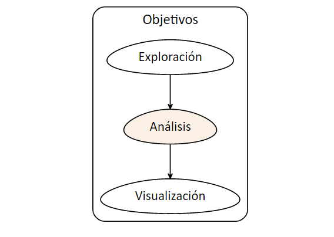
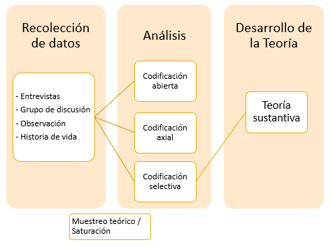
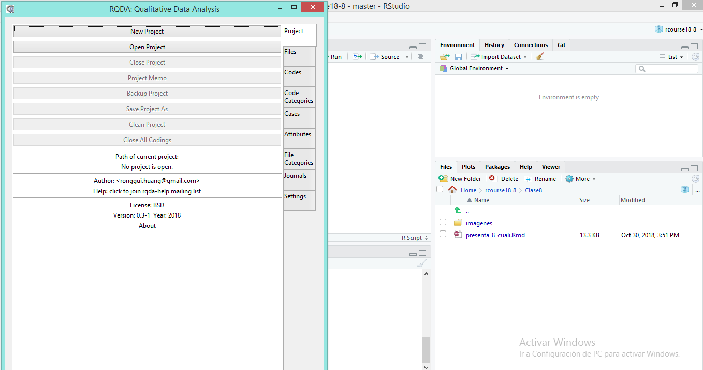
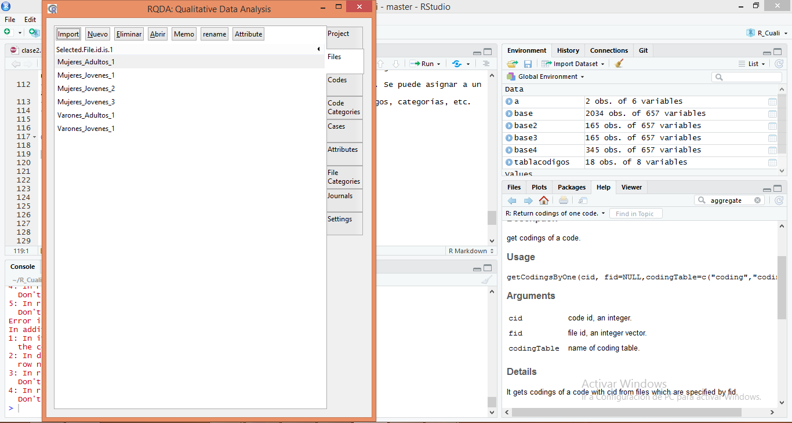
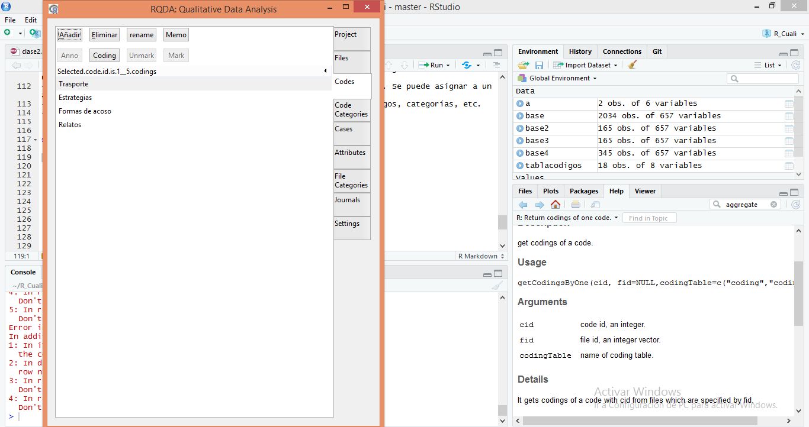
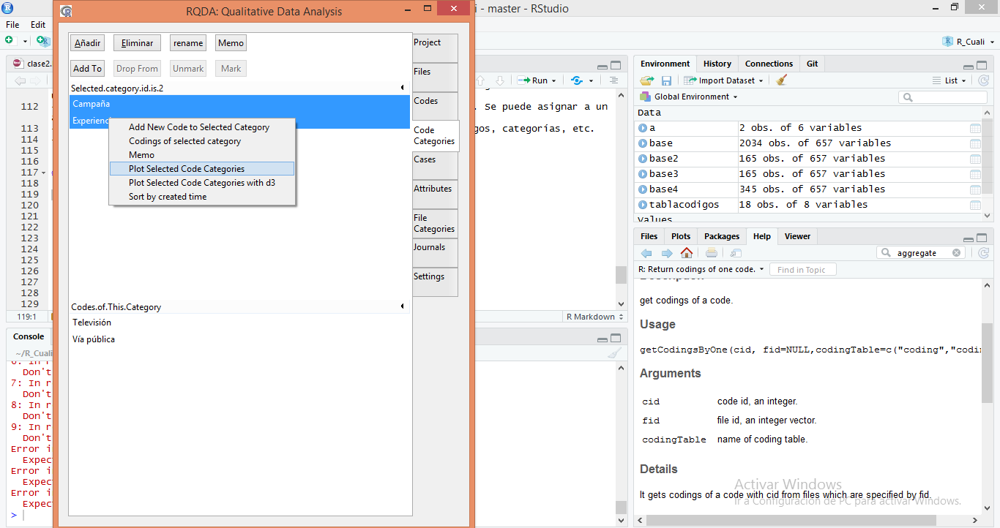
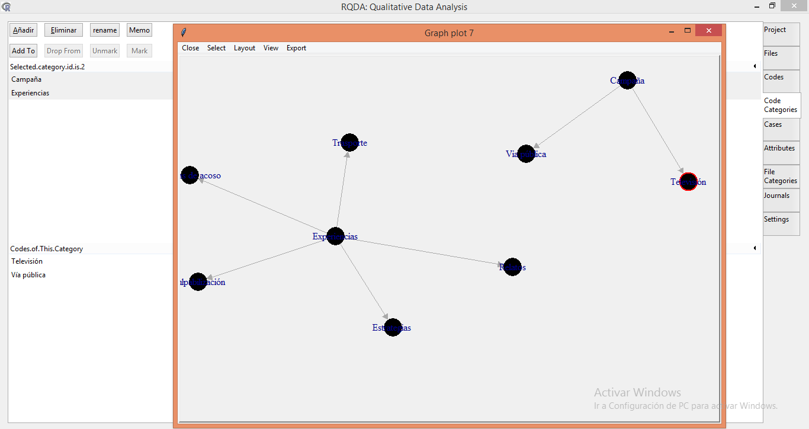

```{r echo=FALSE}
knitr::knit_hooks$set(mysize = function(before, options, envir) {
  if (before) 
    return(options$size)
})
```


```{r include=FALSE}
knitr::opts_chunk$set(mysize = TRUE, size = "\\tiny")

```


<center>

<!-- { width=25% }  -->
</center>


**Mag. Elina Gómez (UMAD)**

[elina.gomez@cienciassociales.edu.uy](elina.gomez@cienciassociales.edu.uy)

[www.elinagomez.com](www.elinagomez.com)


\

**Mag. Gustavo Méndez Barbato**

[gustavo.mendez@cienciassociales.edu.uy](gustavo.mendez@cienciassociales.edu.uy)


#


{ width=18% }  


Este trabajo se distribuye con una licencia Creative Commons Attribution-ShareAlike 4.0 International License


# Objetivos de hoy

```{r echo=FALSE, out.width = "80%", out.height = "80%", fig.align = "center"}

```

# Objetivos de hoy

- Presentación del paquete **RQDA** para procesamiento y codificación manual de textos. 

- Creación de redes multinivel (categorías, códigos y citas) mediante la plataforma RQDA().


# Encuadre teórico: Teoría Fundamentada


- Uno de los enfoques más difundidos para el análisis cualitativo es la denominada _Teoría Fundamentada_ (TF), planteada por Glaser y Strauss (1967) y con posteriores actualizaciones y modificaciones (Strauss  y  Corbin, 2012). 

- El objetivo central es la generación de teoría partiendo del análisis de los datos y plantea un proceso de estructuración y análisis de los datos que involucra un conjunto de pasos y reglas para su procesamiento. 


# Encuadre teórico: Teoría Fundamentada

Algunos aspectos distintivos comunes de la TF y posteriores:

* Comparación constante
* Muestreo teórico
* Elaboración de memorandos (metodológicos, teóricos, analíticos y descriptivos)
* Sensibilidad teórica

(Estrada, Giraldo y Arzuaga, 2020)

# Encuadre teórico: Teoría Fundamentada

- El método comparativo constante implica un proceso de recolección y codificación de forma **sistemática**, descubrimiento de patrones y generación de teoría que se encuentra fundamentada en los datos (método inductivo).  

- El proceso de codificación en la TF clásica, se divide en tres pasos: abierta, axial y selectiva.  

# Encuadre teórico: Teoría Fundamentada

**Abierta:** establecer códigos según categorías y conceptos

**Axial:** incorporación y comparación relacional de nuevos datos con categorías establecidas previamente (esquema)

**Selectiva:** al existir una insuficiencia de información y datos, se procede a la búsqueda de nuevos datos que aporten información relevante para expandir el análisis, con capacidad explicativa para generar teoría. 


# Encuadre teórico: Teoría Fundamentada

{width=80%}

# Encuadre teórico: Teoría Fundamentada

- La codificación permite estructurar los datos a partir de dimensiones, categorías, conceptos. Se asocian fragmentos de textos a cada uno.

Tipos:

- Pre-establecidos
- Emergentes
- En vivo (citas)


# Encuadre teórico: Teoría Fundamentada

Existen software y paquetes que ayudan al proceso de análisis y codificación de la información.

- Nvivo
- Atlas ti
- MAXQDA
- RQDA
- entre otros. 


# **RQDA**

- **RQDA** es un paquete para el análisis cualitativo de textos, el cual permite la codificación de textos.   
- Se conecta con todas las funcionalidades de R por lo que se puede combinar el análisis cualitativo y cuantitativo. 
- **Información completa:**  [http://rqda.r-forge.r-project.org/](http://rqda.r-forge.r-project.org/)


# **¿Qué nos permite?**

* Importar archivos de texto plano

* Producir documentos

* Codificar los documentos

* Agrupar códigos en categorías

* Hacer notas de documentos, de códigos, de codificaciones y de proyectos.

* Recuperar la codificación y regresar al documento original.

* Renombrar códigos y categorías de códigos.


# Instalación

```{r eval=FALSE}

##1) Instalar RTools 4.0: https://cran.r-project.org/bin/windows/Rtools/rtools40.html

##2)Instalación RGtk2 desde archivo zip alojado en el repositorio del curso

url="https://github.com/elinagomez/analisistextoEPUdelar2023/raw/master/Recursos%20iniciales/RGtk2.zip"
install.packages(url, repos=NULL)

library(RGtk2)
##OK + Instalar, luego reiniciar R.

##3)
devtools::install_github("jverzani/gWidgets2RGtk2", INSTALL_opts = "--no-multiarch")

##4)
devtools::install_github("RQDA/RQDA", INSTALL_opts = "--no-multiarch")

##5)
library(RQDA) ##Cargo y chequeo que esté bien
RQDA() #Abro interfaz
```

<!-- # Instalación  -->

<!-- #Documentación y adaptación para versión R nueva en: <https://github.com/RQDA/RQDA> -->

<!-- ```{r message=FALSE, warning=FALSE,eval=FALSE} -->

<!-- pkgs <- c("RSQLite", "gWidgets2RGtk2", "DBI", -->
<!--           "stringi", "RGtk2", "igraph", "gWidgets2",  -->
<!--           "devtools") -->
<!-- install.packages(pkgs) -->

<!-- library(RGtk2) ##Poner OK para instalar Gtk2  -->
<!-- devtools::install_github("RQDA/RQDA",  -->
<!-- INSTALL_opts = "--no-multiarch") -->
<!-- ``` -->


<!-- # Instalación  -->


<!-- ```{r message=FALSE, warning=FALSE,eval=FALSE} -->

<!-- library(RQDA) ##Cargo y chequeo que esté bien -->
<!-- RQDA() #Abro interfaz -->

<!-- ``` -->


# **Interface**




# **Interface**

- El **RQDA** funciona en base a archivos **.rqda** 

- El menú incluye: **Proyectos**, **Archivos**, **Códigos**, **Categoría de códigos**, **Casos**, **Atributos**, **Memos**

[Otras funcionalidades](http://rqda.r-forge.r-project.org/documentation_2.html)

# Ventajas y desventajas

Ventajas:

- Libre y gratuito
- Combinación con múltiples funcionalidades de R
- Permite exportación de conjuntos de códigos según filtros específicos

Desventajas:

- Por el momento sólo admite textos planos (.txt)
- No permite establecer relaciones lógicas complejas entre códigos. 

# Menú

- **Proyectos**: archivo .rqda que almacena todos los archivos, códigos, categorías, etc. Se puede configurar el nombre del codificador para identificar a el/la responsable del proyecto.
- **Archivos**: se importan los archivos de texto plano .txt (codificación ASII por defecto pero se puede modificar).  
- **Códigos**: son las _etiquetas_ que se asigna a cada cita en los diferentes archivos. Un resumen se puede obtener con getCodingTable() ("Número de codificaciones para cada código", "Número promedio de palabras asociadas con cada código" y "Número de archivos asociados con cada código"). 
- **Categoría de códigos**: son las categorías de nivel superior, a las que se asocia conceptualmente a los códigos. 

# Menú

- **Categoría de archivos**: son las categorías que agrupan a cada uno de los archivos según algún criterio de nivel superior.
- **Casos**: es la unidad de análisis que se está trabajando, se puede asignar a un archivo o una parte del mismo. 
- **Atributos**: los atributos sirven para la clasificación cuantitativa. Se puede asignar a un archivo o a un caso. 
- **Memos**: son notas que se pueden crear tanto para los archivos, códigos, categorías, etc. 
- **Journal**: notas de campo. 


# Ejemplo práctico

- Importo los archivos



# Ejemplo práctico

- Creo los códigos a lo largo del texto con la función _Mark_




# Ejemplo práctico

- Puedo plotear las categorías y códigos asociados



# Ejemplo práctico

- Puedo plotear las redes de categorías y códigos asociados a las mismas




# Funciones

- Existen funciones que me permiten enriquecer el análisis e interactuar con otros paquetes


# Resumen de los códigos

La función _summaryCodings()_ nos devuelve una lista con:

- Número de codificaciones por código
- Número de caracteres asociados a cada código
- Número de archivos asociados a cada código

Agregando el argumento _byFile= TRUE_ se puede obtener la información para cada archivo


# Tabla con codificaciones

Con la función _getCodingTable()_ obtenemos un data frame con todos los códigos y características de las codificaciones 

```{r eval=FALSE}
library(RQDA)
getCodingTable()
```


# Codificación por palabra


Con la función _codingBySearch()_ es posible codificar todas las menciones que involucren a una palabra o expresión determinada, con un código. Se debe indicar el separador que define hasta dónde se hará la codificación. 


```{r eval=FALSE}

codingBySearch("taxi", fid=1, cid=1, seperator = "\n")

#fid - número de archivo
#cid - número de código
#seperator - ("\n" ; "[.!?]")

```


# Relación entre archivos y códigos


La función _filesByCodes()_ devuelve un data.frame con los códigos asociados a cada archivo

```{r eval=FALSE}

filesByCodes()

##Para códigos específicos

filesByCodes(codingTable = c("coding", "coding2"))

```


# Búsqueda de códigos

La función _getCodingsByOne()_ sirve para buscar las codificaciones asociadas a los códigos. Es posible buscar codificaciones cruzadas.

```{r eval=FALSE}

#obtengo
getCodingsByOne(1)

#Para hacer búsquedas cruzadas

getCodingsByOne(1) %and% getCodingsByOne(9)

#podría ser: %and%; %or%; %not%

```


# Codificaciones y códigos

Para llegar a una tabla con los códigos y codificaciones, itero sobre cada uno.

```{r eval=FALSE}

tabla=RQDA::getCodingTable()
out = vector("list", length = max(tabla$cid))
for(i in 1:max(tabla$cid)) {         
  out[[i]] <- rbind(RQDA::getCodingsByOne(i) )
}
data = do.call(rbind, out)

```


# Co-ocurrencia de códigos

La función _crossTwoCodes()_ devuelve una matriz de co-ocurrencia de códigos.

```{r eval=FALSE}

#Busca la co-ocurrencia entre los códigos que se seleccionen por vector o seleccionando
crossTwoCodes(relation = "exact", data=tabla_cods, cid1 = 1, cid2 = 9)

#relation=c("overlap","inclusion","exact","proximity")

```

# Exporto a HTML

```{r eval=FALSE}

#Exporto los archivos codificados
exportCodedFile("archivos.html", fid = 1)

#Exporto los códigos
exportCodings("codigos.html")


```

# Otras funciones

Otras funciones se pueden encontrar en la documentación del paquete:


[RQDA](https://cran.r-project.org/web/packages/RQDA/RQDA.pdf)


# RQDAPlus

Es una shiny app que complementa las funcionalidades y permite un procesamiento visual de los datos. 

Instalación de RQDAPlus para el análisis rápido de datos

```{r eval=FALSE, message=FALSE, warning=FALSE}
# 1. Escriba
remotes::install_github ("stats4sd/RQDAPlus", upgrade = "always")

# 2. Escriba 
RQDAPlus::RQDAPlus("C:/FilePath/nombreDeArchivo.rqda")
```


# RQDAPlus

¿Qué puede hacer RQDAPlus?

- Tablas de frecuencia de co-ocurrencia de cualquier código(s), categorías de código y/o caso(s).  
- Tablas de texto de co-ocurrencias de cualquier código(s), categorías de código y/o caso(s).  
- Textos de salida de cualquier co-ocurrencia en formato csv o html.  
- Crear nubes de palabras para cualquier código(s), categorías de código, y/o caso(s) seleccionados.  
- Tabla de matriz de adyacencia que muestre la frecuencia de los códigos.  
- Crea análisis gráfico de redes  mostrando la relación de los códigos entre archivos (y agrupación de códigos basado en la ubicación entre archivos).  

# RQDAQuery

Para hacer consultas más específicas que no sean las de las funciones vistas, se debe utilizar la función `RQDAQuery` cuyo único argumento sera una consulta `SQL` en formato `character`  


# Ejercicio 1

## RQDA

1. Abrir el proyecto _Proyecto_InsercionInt.rqda_

2. Crear dos categorías con dos códigos en cada una y citas asociadas

3. Averiguar el número de caractéres asociado a cada código

4. Hacer un plot de las categorías y códigos

5. Hacer un data.frame _cods_ con los códigos asociados a cada documento.

6. Hacer un gráfico con ggplot con la frecuencia de los códigos asociados a cada documento


