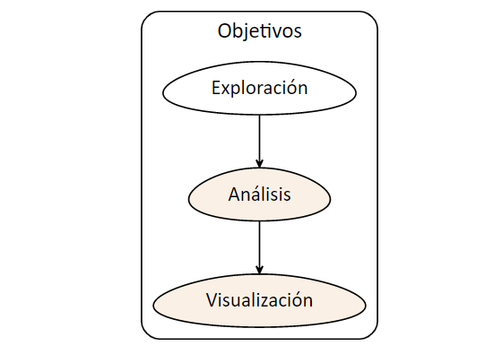
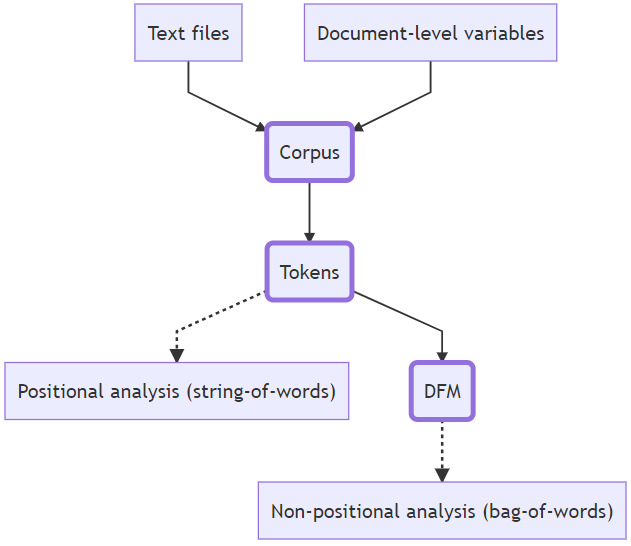

```{r echo=FALSE}
knitr::knit_hooks$set(mysize = function(before, options, envir) {
  if (before) 
    return(options$size)
})
```


```{r include=FALSE}
knitr::opts_chunk$set(mysize = TRUE, size = "\\tiny")

```


<center>

<!-- { width=25% }  -->
</center>


**Mag. Elina Gómez (UMAD)**

[elina.gomez@cienciassociales.edu.uy](elina.gomez@cienciassociales.edu.uy)

[www.elinagomez.com](www.elinagomez.com)


\

**Mag. Gustavo Méndez Barbato**

[gustavo.mendez@cienciassociales.edu.uy](gustavo.mendez@cienciassociales.edu.uy)


#


{ width=18% }  


Este trabajo se distribuye con una licencia Creative Commons Attribution-ShareAlike 4.0 International License

# Objetivos de hoy

```{r echo=FALSE, out.width = "80%", out.height = "80%", fig.align = "center"}

```


# Objetivos de hoy

- Presentación del paquete **quanteda** para el análisis de textos. 
- Nubes de palabras
- Asociaciones
- Redes
- Categorías gramaticales con paquetes **spacyr** y **udpipe**


# Algunas nociones previas

- Pre procesamiento: antes del análisis necesitamos realizar un conjunto de actividades destinadas a preparar el texto
- Su complejidad dependerá de las características del texto que tengamos 
- Siempre está en función de los objetivos de la tarea que nos propongamos
- No hay una receta única


# Algunas nociones previas

 Pre-procesamiento:
 
- Limipeza o eliminación del ruido (ej. números de página, encabezados, saltos de línea, etc.)

- Normalización:
1. Tokenización: dividir el texto en unidades más pequeñas (caracteres, palabras, oraciones)
2. Steeming: cortar las palabras para quedarnos con la raíz (gato, gata, gatitos -> gat*)
3. Lematización: quedarnos con la forma canónica de la palabra (ej. entradas de un diccionario)
4. Homogeneización: eliminación de números, puntuación, símbolos, convertir a minúsculas, eliminación de stopwords (palabras no sustantivas para el análisis), etc.


# Algunas nociones previas

- El lenguaje (y sus usos) son complejos y eso genera muchas veces necesidad de desambiguar. 

- Ejemplo: tokenizando por palabras ¿Nueva York o Graciela Bianchi son una palabra o dos? ¿Las tomamos como un token o como dos?

- En última instancia, la respuesta es una decisión que hay que justificar como cualquier otra decisión metodológica

- Además: es importante conocer cómo tokenizan las diferentes herramientas, especialmente si vamos a usar distintas
 

# Algunas nociones previas

- **Corpus**: colección de textos escritos, orales o ambos. 
En linguística [1] conjunto cerrado de textos o de datos destinado a la investigación científica concreta. 
[2] Muestra representativa de una lengua (datos lingüísticos reales que reflejen el uso de la lengua)

- **Palabras**: en nuestro contexto de análisis son palabras distintas en un corpus

- **Tokens**: en nuestro contexto de análisis son el total de palabras (apariciones) en un corpus (siempre que tokenizemos por palabras)


# Paquete quanteda

- **quanteda** es un paquete R para administrar y analizar datos textuales desarrollados por _Kenneth Benoit_ y otros colaboradores. Su desarrollo inicial fue apoyado por la beca del Consejo Europeo de Investigación.

- El paquete está diseñado para usuarios de R que necesitan aplicar el procesamiento de lenguaje natural a los textos, desde los documentos originales hasta el análisis final. 

- Sus capacidades coinciden o superan las que se ofrecen en muchas aplicaciones de software para usuarios finales, muchas de las cuales son caras y no de código abierto. 


# quanteda

- [Documentación quanteda](https://cran.r-project.org/web/packages/quanteda/quanteda.pdf)
- [Tutorial](https://tutorials.quanteda.io/) 
- [Cheat Sheet](https://posit.co/wp-content/uploads/2022/10/quanteda.pdf)
- [Más información](https://quanteda.io/) 


Algunos de los conjuntos de funciones de quanteda fueron independizándose en paquetes específicos:
`quanteda.textplots`, `quanteda.textmodels` y `quanteda.textstats`


# quanteda: objetos

`quanteda` tiene sus propios tipos de objetos

- `corpus`  
Guarda cadenas de caracteres y variables en un marco de datos  
Combina textos con variables a nivel de documento  

- `tokens`  
Almacena tokens en una lista de vectores  
Conserva las posiciones de las palabras

- `dfm` (document-feature matrix)   
Representa frecuencias de características en documentos en una matriz  
No tiene información sobre las posiciones de las palabras  

# quanteda: flujo

```{r echo=FALSE, out.width = "80%", out.height = "80%", fig.align = "center"}

```


# quanteda: corpus

- Creo un corpus a partir de un diario de sesión compilado con speech (por legislador/a)

```{r eval=FALSE}
library(speech)
library(quanteda)

# diario de sesion
url <- "https://parlamento.gub.uy/documentosyleyes/documentos/diarios-de-sesion/3339/IMG"

# compilo por legislador/a
sesion <- speech_build(url, compiler = TRUE)

# creo un corpus con la variable speech
sesion_corpus <- corpus(sesion, text_field = "speech") # data, variable donde está el texto

```

# quanteda: corpus

- El corpus permite trabajar con el texto y mantener el vínculo con las variables de origen 

- También da un conteo de types (palabras), tokens, sentences 

- En el ejemplo, el speech de cada legislador es un documento (text1, text2... text57) y en docvars se guardan todas las variables restantes de la base compilada con un identificador que permite combinar texto y variables

```{r eval=FALSE}

# Corpus consisting of 57 documents and 7 docvars.

```

# quanteda: tokens

- Tokenizo el corpus de la sesion en palabras y en oraciones

```{r eval=FALSE}
# tokenizo en palabras
sesion_corpus_toks <- tokens(sesion_corpus, what = "word") # what por defecto es palabras

# tokenizo en oraciones
sesion_corpus_toks3 <- tokens(sesion_corpus, what = "sentence")

# tokenizo en palabras y elimino puntuacion
sesion_corpus_toks2 <- tokens(sesion_corpus, what = "word", remove_punct = TRUE) 
```

# quanteda: tokens

- Los tokens permiten trabajar con unidades de texto más pequeñas que el corpus original, realizar análisis con operaciones posicionales y mantener el vínculo con las variables de origen de cada documento

- En el ejemplo, el speech de cada legislador es un string (text1, text2... text57) dividido en la unidad que definamos (caracter, palabra, oración) y en el objeto se guardan todas las variables restantes de la base compilada con un identificador que permite combinar tokens y variables

# quanteda: tokens

- Al tokenizar muchas veces se realizan conjuntamente operaciones de limpieza y homogeneización (ej, `remove_punct()`, `remove_numbers()`, `remove_url()`, etc.)

- Se puede clasificar los tokens a partir de diccionarios específicos con `tokens_lookup()` e identificar el contexto de aparición con `kwic()`


# quanteda: dfm

- Construyo una matriz de características del documento (dfm) al corpus de la sesion tokenizado en palabras

```{r eval=FALSE}
# creo un dfm con el corpus de la sesion tokenizado en palabras
sesion_corpus_toks_dfm <- dfm(sesion_corpus_toks)

# número de documentos (es el mismo número que en corpus y tokens: 57 = cada legislador/a)
ndoc(sesion_corpus_toks_dfm)

# número de caracetrísticas (es algo así como el token o unidad básica de un dfm)
nfeat(sesion_corpus_toks_dfm)

# número de tokens es distinto (devuelve tokens por documento)
ntoken(sesion_corpus_toks_dfm)
```

# quanteda: dfm

Es el objeto "estrella" de quanteda y permite entre otras cosas:

- Hacer análisis estadísticos a partir de las unidades básicas de un texto (ej. palabras)
- Realizar selecciones por características (ej. número de caracteres)
- Clasificar con diccionarios con `dfm_lookup()` 
- Agrupar por alguna variable de interés con `dfm_group()`

# quanteda: fcm

- Un `fcm` (feature co-occurrence matrix) es una matriz de co-ocurrencia de tokens
- Técnicamente es otro tipo de objeto de quanteda, que se construye a partir de un `dfm`
- Es lo que nos permite hacer análisis de redes de co-ocurrencia
- Generalmente se usa en conjunto con otras funciones que permiten selecciones más precisas de tokens, como las palabras más frecuentes con `top_features()`


# quanteda: análisis básicos

- Frecuencia de palabras y frecuencias ponderadas de términos
- Asociación y correlación 
- Identificación del contexto de aparición de palabras y co-ocurrencia
- Uso de diccionarios para identificar o clasificar textos
- Visualizaciones específicas: nubes de palabras, redes de co-ocurrencia


# Caso práctico: LUC en el Senado

- Análisis de los discursos vinculados a la discusión de la _Ley de Urgente Consideración (LUC)_ en la Cámara de Senadores del 5 de junio de 2020.


```{r message=FALSE, warning=FALSE, include=FALSE}

load("Material/intervenciones.RData")

```


# _"Limpieza"_ del texto


- Creo un Document feature matrix (DFM), aplicando algunos argumentos que me permiten limpiar las palabras que no me interesan al efecto del análisis. 
    - Homogeneizo las palabras en minúscula
    - Elimino números
    - Elimino puntuaciones 
    - Elimino stopwords (por defecto y lista propia con palabras varias (ej. "Risas"))
    - Elimino palabras con pocos caracteres (1 y 2)


# _"Limpieza"_ del texto

```{r eval=FALSE, message=FALSE, warning=FALSE}
dfm_intervenciones <- quanteda::dfm(quanteda::tokens(intervenciones$speech,
remove_punct = TRUE, ##saco puntuación
remove_numbers = TRUE), #saco números
tolower=TRUE, #paso a minúsculas
verbose = FALSE) %>% 
  quanteda::dfm_remove(pattern = c(quanteda::stopwords("spanish"),tolower(intervenciones$legislator)),
  min_nchar=3)%>% ##saco palabras específicas
   quanteda::dfm_trim(min_termfreq = 6)%>% 
  quanteda::dfm_group(groups = intervenciones$party) #defino grupos
```


```{r dfm, message=FALSE, warning=FALSE, include=FALSE}

library(quanteda) 
library(readtext) 
library(stringr)
library(dplyr)
library(ggplot2)
library(quanteda.textstats)
library(quanteda.textplots)
library(knitr)
library(kableExtra)
dfm_intervenciones <- quanteda::dfm(quanteda::tokens(intervenciones$speech,
                                                     remove_punct = TRUE,
                                                     remove_numbers = TRUE),
                                    tolower=TRUE,
                                    verbose = FALSE) %>%
  quanteda::dfm_remove(pattern = c("señor","señora","presidente","presidenta",quanteda::stopwords("spanish"),tolower(intervenciones$legislator)),min_nchar=3)%>%
  quanteda::dfm_trim(min_termfreq = 6)%>% 
  quanteda::dfm_group(groups = intervenciones$party)

```

# Ponderación

- Como factor de ponderación del dfm puedo usar la métrica *_tf-idf_* que relativiza el peso de cada término, poniendo en relación la frecuencia de aparición por el inverso de la frecuencia en los documentos. 
- Ayuda a identificar los términos más frecuentes en un documento pero que no lo son en todos.  
- No es posible usarlo en funciones que impliquen agrupación. 

- La función de quanteda es _dfm_tfidf()_

# Nubes de palabras: general

Las nubes de palabras las hago con la función **textplot_wordcloud** del paquete **quanteda.textplot**


```{r eval=FALSE, message=FALSE, warning=FALSE}
quanteda.textplots::textplot_wordcloud(dfm_tfidf(dfm_intervenciones), min.count = 2,max_words = 200,
   random.order = FALSE,colors = RColorBrewer::brewer.pal(8,"Dark2"),comparison = F)
```

# Nubes de palabras: general

```{r wcgeneral, echo=FALSE, message=FALSE, warning=FALSE, paged.print=FALSE,fig.height = 10, fig.width = 10, fig.align = "center",out.width = "150%"}
 quanteda.textplots::textplot_wordcloud(dfm_tfidf(dfm_intervenciones), min.count = 2,max_words = 200,
   random.order = FALSE,colors = RColorBrewer::brewer.pal(8,"Dark2"),comparison = F)
```


# Nubes de palabras: grupos

Para hacer nubes de palabras comparando entre grupos de interés, agregamos el argumento **comparison = T**

```{r eval=FALSE, message=FALSE, warning=FALSE, eval=FALSE}
quanteda.textplots::textplot_wordcloud(dfm_intervenciones, min.count = 2,max_words = 500,
      random.order = FALSE,colors = RColorBrewer::brewer.pal(8,"Dark2"),comparison = T)
```


# Nubes de palabras: partidos

```{r wccomp, echo=FALSE, message=FALSE, warning=FALSE, paged.print=FALSE}
quanteda.textplots::textplot_wordcloud(dfm_intervenciones, min.count = 2,max_words = 500,
      random.order = FALSE,colors = RColorBrewer::brewer.pal(8,"Dark2"),comparison = T)
```


# Palabras más frecuentes

Para analizar las palabras más frecuentes utilizo la función _topfeatures()_

```{r message=FALSE, warning=FALSE,eval=FALSE}

topfeatures(dfm_intervenciones,20)

```


# Palabras más frecuentes: 

```{r echo=FALSE, message=FALSE, warning=FALSE}
#creo un objeto con la 20 principales palabras 
top = data.frame(topfeatures(dfm_tfidf(dfm_intervenciones),20))

#las defino como rownames
top$palabra = rownames(top)

#hago el gráfico con ggplot
topplot = top[1:20, ] %>%
  ggplot(aes(x = reorder(palabra, topfeatures.dfm_tfidf.dfm_intervenciones...20.), 
             y = topfeatures.dfm_tfidf.dfm_intervenciones...20., fill = palabra)) + 
  geom_col(show.legend = FALSE) +
  coord_flip() +
  geom_text(aes(hjust = -0.1, label = round(topfeatures.dfm_tfidf.dfm_intervenciones...20.,1))) +
  theme_minimal() +
  theme(axis.title.y = element_blank(), axis.title.x = element_blank(), axis.text = element_text(size = 15)) +
  ggtitle("Palabras más frecuentes (n=20)") +
  scale_fill_manual(values = c(rep("#D7B5D8",20)))
topplot
```
 
 

# Asociación de palabras

- Buscamos la asociación de palabras en los documentos
- Analizamos la asociación con las palabras: _sindicato_, _reforma_
# Asociación de palabras

- Utilizamos la función _textstat_simil_ del paquete **quanteda.textstats**, cuyos argumentos son el/los términos con los que quiere buscar una asociación en un _dfm_ determinado.
- Defino el método de similitud ("correlation", "cosine", "jaccard", "ejaccard", "dice", "edice", "hamman", "simple matching")

```{r eval=FALSE, message=FALSE, warning=FALSE, eval=FALSE}
quanteda.textstats::textstat_simil(dfm_tfidf(dfm_intervenciones),selection = "sindicato",
                                   method = "correlation",margin = "features")%>%
  as.data.frame()%>%
  dplyr::arrange(-correlation)%>%
  dplyr::top_n(15)

```

# Asociaciónde palabras: $sindicato

```{r echo=FALSE, message=FALSE, warning=FALSE, paged.print=FALSE,fig.asp=0.60}

quanteda.textstats::textstat_simil(dfm_tfidf(dfm_intervenciones),selection = "sindicato",
                                   method = "correlation",margin = "features")%>%
  as.data.frame()%>%
  dplyr::arrange(-correlation)%>%
  dplyr::top_n(10)%>%
  kbl() %>%
  kable_minimal()


```


# Asociación de palabras: $reforma

```{r echo=FALSE, message=FALSE, warning=FALSE, paged.print=FALSE,fig.asp=0.60}
quanteda.textstats::textstat_simil(dfm_tfidf(dfm_intervenciones),selection = "reforma",
                                   method = "correlation",margin = "features")%>%
  as.data.frame()%>%
  dplyr::arrange(-correlation)%>%
  dplyr::top_n(10) %>%
  kbl() %>%
  kable_minimal()


```


# Contexto de la palabra: kwic


- Con la función [`quanteda::kwic()`]() podemos ver el contexto de aparición de una palabra, término o frase, según una ventana (cantidad de palabras previas y posteriores) determinada. 

- Extraer el contexto de ciertos términos puede ser de utilidad para construir un nuevo corpus y realizar un análisis focalizado y/o comparativo.


```{r message=FALSE, warning=FALSE, eval=FALSE}

quanteda::kwic(quanteda::tokens(intervenciones$speech,
remove_punct = TRUE,
remove_numbers = TRUE), 
pattern = quanteda::phrase(c("ley de urgente consideración")),
window = 5)

```


# Contexto de la palabra: redes de co-ocurrencia


- Con la función [`quanteda.textplots::textplot_network`]() podemos hacer redes de co-ocurrencia entre términos. 


# Contexto de la palabra: redes de co-ocurrencia


```{r echo=FALSE, message=FALSE, warning=FALSE}

base_fcm= dfm_tfidf(dfm_intervenciones)%>% ##armo una matriz de co-ocurrencia
  fcm(context = "document")

feat <- names(topfeatures(base_fcm, 25)) 
base_fcm_select <- fcm_select(base_fcm, pattern = feat, selection = "keep")
size <- log(colSums(dfm_select(base_fcm, feat, selection = "keep")))

set.seed(144)
quanteda.textplots::textplot_network(base_fcm_select, min_freq = 0.8, vertex_size = size / max(size) * 3,
                                     edge_color="#ff9d5c")


```

# EJERCICIO 1

## Diarios de sesiones del parlamento con `speech` y `quanteda`
1. Descargar menciones de un diario de sesión de interés
2. Realizar una nube de palabras desagregada por partido
3. Encontrar asociaciones de palabras relevantes 
4. Armar redes para un partido específico


# Categorías gramaticales 

La categorías gramaticales se dividen en dos:

- Categorías léxicas

- Categorías sintagmáticas

# Categorías léxicas

* Clases abiertas

– nombre/sustantivo (casa, casas, felicidad)

– verbo (cantar, cantando, cantado, canten, sabe, sé)

– adjetivo (alto, alta, lindos, inteligente, solo)

– adverbio (medio, simplemente, solo, ayer)

* Clases cerradas
– determinante (incluye artículo) (el, una, unos, esos,
nuestro, algún)

– preposición (a, de, por, contra)

– pronombre (yo, él, mí, se, aquello, donde, que)

– conjunción (y, o, pero, si, que, aunque)


# Categorías sintagmáticas

- Los sintagmas o grupos son conjuntos de palabras en donde podemos identificar un núcleo.
- Tienen estructura interna.
- Cumplen diversas funciones dentro de la oración.


# POS-tagging

- Analiza el texto a nivel de palabra

- Etiqueta las categorías gramaticales según [categorías universales](https://universaldependencies.org/u/pos/)

- Algunos taggers incorporan información sobre entidades (NER)


# **spacyr** y **udpipe**

- Algunos de los paquetes que realizan esto en R son:

* [spacyr](https://cran.r-project.org/web/packages/spacyr/vignettes/using_spacyr.html) 


* [udpipe](https://cran.r-project.org/web/packages/udpipe/vignettes/udpipe-annotation.html)


# Ejemplo de uso de **udpipe** en español


- En [esta entrada](https://www.elinagomez.com/blog/2023-05-4-palabras-presidente/) se encuentra un ejemplo de uso de _udpipe_ para anotar declaraciones del presidente y graficar categorías gramaticales. 


