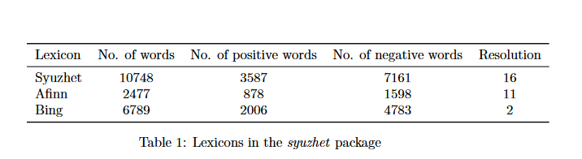

```{r echo=FALSE}
knitr::knit_hooks$set(mysize = function(before, options, envir) {
  if (before) 
    return(options$size)
})
```


```{r include=FALSE}
knitr::opts_chunk$set(mysize = TRUE, size = "\\tiny")

```


<center>

<!-- { width=25% }  -->
</center>


**Mag. Elina Gómez (UMAD)**

[elina.gomez@cienciassociales.edu.uy](elina.gomez@cienciassociales.edu.uy)

[www.elinagomez.com](www.elinagomez.com)


\

**Mag. Gustavo Méndez Barbato**

[gustavo.mendez@cienciassociales.edu.uy](gustavo.mendez@cienciassociales.edu.uy)


#


{ width=18% }  


Este trabajo se distribuye con una licencia Creative Commons Attribution-ShareAlike 4.0 International License


# Objetivos de hoy

- Diccionarios
- Análisis de sentimiento y su definición
- Método Syuzhet
- Modelos no supervisados


```{r include=FALSE}
library(quanteda)
library(stringr)
library(rtweet)
library(dplyr)
library(ggplot2)

##me logeo y autorizo
#rtweet::create_token()

load("~/rcuali2022/Clase6/Material/tweets_fa.RData")
load("~/rcuali2022/Clase6/Material/tweets_pn.RData")


##alguna limpieza previa de tweets:

# sacar URLs
tweets_fa$full_text <- str_replace_all(tweets_fa$full_text, "http[[:alnum;]]*","")
tweets_fa$full_text <- str_replace_all(tweets_fa$full_text, "s://t.co/[[:alnum;]]*","")

# sacar toda referencia a RT
tweets_fa$full_text <- str_replace(tweets_fa$full_text,"RT @[a-z,A-Z]*: ","")
# sacar hashtags
tweets_fa$full_text <- str_replace_all(tweets_fa$full_text,"#[a-z,A-Z]*","")
# sacar referencias a otros screen_names
tweets_fa$full_text <- str_replace_all(tweets_fa$full_text,"@[a-z,A-Z]*","")


##alguna limpieza previa de tweets:


# sacar URLs
tweets_pn$full_text <- str_replace_all(tweets_pn$full_text, "http[[:alnum;]]*","")
tweets_pn$full_text <- str_replace_all(tweets_pn$full_text, "s://t.co/[[:alnum;]]*","")

# sacar toda referencia a RT
tweets_pn$full_text <- str_replace(tweets_pn$full_text,"RT @[a-z,A-Z]*: ","")
# sacar hashtags
tweets_pn$full_text <- str_replace_all(tweets_pn$full_text,"#[a-z,A-Z]*","")
# sacar referencias a otros screen_names
tweets_pn$full_text <- str_replace_all(tweets_pn$full_text,"@[a-z,A-Z]*","")


##creo y limpio: Frente Amplio

dfm_fa <- quanteda::dfm(quanteda::tokens(tweets_fa$full_text,
                 remove_punct = TRUE,
                 remove_numbers = TRUE),
                 tolower=TRUE,
                  verbose = FALSE) %>%
  quanteda::dfm_remove(pattern = c(quanteda::stopwords("spanish")),min_nchar=3)


##creo y limpio: Partido Nacional

dfm_pn <- quanteda::dfm(quanteda::tokens(tweets_pn$full_text,
                                           remove_punct = TRUE,
                                           remove_numbers = TRUE),
                          tolower=TRUE,
                          verbose = FALSE) %>%
  quanteda::dfm_remove(pattern = c(quanteda::stopwords("spanish")),min_nchar=3)


```


# Diccionarios

Para hacer diccionarios utilizaremos la función _dictionary()_ de **quanteda**, donde defino mi diccionario con tantas categorías como quiera. 

```{r eval=FALSE}

midic <- dictionary(list(
social = c("pal1","pal2"),
economia = c("pal1","pal2"),                            
seguridad=c("pal1","pal2")))

```

# Diccionarios

Evalúo cada una de las categorías que integran mi diccionario en mi corpus. 

```{r eval=FALSE}

midic_result<-dfm_lookup(mydfm,dictionary=midic)

```


# Diccionarios

```{r echo=FALSE, message=FALSE, warning=FALSE, paged.print=FALSE}
### Armo un diccionario según mi interés

midic <- dictionary(list(social = c("social","politica social","politicas sociales", "plan social","planes sociales", "sociedad", "salud","educación","educacion"),
            economia = c("economía","empleo", "desempleo", "crisis", "economia","fiscal","dolar*","ajuste"),
            seguridad=c("seguridad","robo","reforma","delincuente")))


### Aplico el diccionario en mi dfm y saco el porcentaje


midic_result_fa<-dfm_lookup(dfm_fa,dictionary=midic,nomatch="no_aparece")
midic_result_fa=convert(midic_result_fa, to = "data.frame") 
midic_result_fa$partido="Frente Amplio"

midic_result_pn<-dfm_lookup(dfm_pn,dictionary=midic,nomatch="no_aparece")
midic_result_pn=convert(midic_result_pn, to = "data.frame") 
midic_result_pn$partido="Partido Nacional"

midic_result=rbind(midic_result_fa,midic_result_pn)

tabla = midic_result  %>%
  group_by(partido)%>%
 tidyr::pivot_longer(cols = c(social,economia,seguridad,no_aparece))%>%
  filter(name!="no_aparece")%>%
  group_by(partido, name)%>%
 summarise(N = sum(value)) %>%
  mutate(Prop = round((N/sum(N))*100,1))


tabla=as.data.frame(tabla)

library(knitr)
library(kableExtra)
kable(tabla)%>%
  kableExtra::row_spec(3, extra_css = "border-bottom: 3px solid;") 
```


# Análisis de sentimiento

El análisis de sentimiento se refiere a los diferentes métodos de lingüística computacional que ayudan a identificar y extraer información subjetiva del contenido existente en el mundo digital (redes sociales, foros, webs, etc.).

# Análisis de sentimiento


- Método Syuzhet: utiliza la función get_sentiment() de _syuzhet_ asigna puntajes a cada documento según el método y lenguaje indicado. El método **syuzhet** es un diccionario de sentimientos desarrollado en el Laboratorio Literario de Nebraska. 


- [Artículo interesante sobre Syuzhet](http://www.digitalhumanities.org/dhq/vol/16/2/000612/000612.html)


<!-- # Análisis de sentimiento -->


<!-- El Diccionario **Linguistic Inquiry and Word Count** (LIWC): _"Permite determinar el grado en que autores/hablantes usan palabras que connotan emociones positivas o negativas, auto-referencias, palabras extensas o palabras que se refieren a sexo, comer o religión. El programa fue diseñado para analizar simple y rápidamente más de 70 dimensiones del lenguaje a través de cientos de muestras de texto en segundos."_ -->

<!-- <http://www.liwc.net/liwcespanol/> -->


<!-- # Análisis de sentimiento -->

<!-- ```{r eval=FALSE, message=FALSE, warning=FALSE, paged.print=FALSE} -->
<!-- #Abro el diccionario -->
<!-- lwic <- readRDS("Clase6/Material/EmoPosNeg_SPA.rds") -->
<!-- sent_dfm_fa <- dfm_lookup(dfm_fa, dictionary = lwic) -->
<!-- sent_fa=convert(sent_dfm_fa, to = "data.frame")  -->

<!-- ##creo un score que es la diferencia entre términos positivos y negativos, y los vinculo con las variables de agregación de los documentos -->
<!-- sent_fa$puntaje <- sent_fa$EmoPos-sent_fa$EmoNeg -->
<!-- sent_fa$sentimiento=ifelse(sent_fa$puntaje<0,"Negativo","Positivo") -->
<!-- sent_fa$sentimiento=ifelse(sent_fa$puntaje==0,"Neutral",sent_fa$sentimiento) -->
<!-- sent_fa$partido="Frente Amplio" -->

<!-- ``` -->

<!-- # Análisis de sentimiento: LIWC -->

<!-- ```{r echo=FALSE, message=FALSE, warning=FALSE, paged.print=FALSE} -->
<!-- lwic <- readRDS("C:/Users/Usuario/Documents/rcuali2022/Clase6/Material/EmoPosNeg_SPA.rds") -->

<!-- sent_dfm_fa <- dfm_lookup(dfm_fa, dictionary = lwic) -->

<!-- sent_fa=convert(sent_dfm_fa, to = "data.frame")  -->

<!-- ##creo un score que es la difrencia entre términos positivos y negativos, y los vinculo con las variables de agregación de los documentos -->
<!-- sent_fa$puntaje <- sent_fa$EmoPos-sent_fa$EmoNeg -->
<!-- sent_fa$sentimiento=ifelse(sent_fa$puntaje<0,"Negativo","Positivo") -->
<!-- sent_fa$sentimiento=ifelse(sent_fa$puntaje==0,"Neutral",sent_fa$sentimiento) -->
<!-- sent_fa$partido="Frente Amplio" -->

<!-- sent_dfm_pn <- dfm_lookup(dfm_pn, dictionary = lwic) -->
<!-- sent_pn=convert(sent_dfm_pn, to = "data.frame")  -->
<!-- ##creo un score que es la difrencia entre términos positivos y negativos, y los vinculo con las variables de agregación de los documentos -->
<!-- sent_pn$puntaje <- sent_pn$EmoPos-sent_pn$EmoNeg -->
<!-- sent_pn$sentimiento=ifelse(sent_pn$puntaje<0,"Negativo","Positivo") -->
<!-- sent_pn$sentimiento=ifelse(sent_pn$puntaje==0,"Neutral",sent_pn$sentimiento) -->
<!-- sent_pn$partido="Partido Nacional" -->


<!-- sentimiento=rbind(sent_fa,sent_pn) -->


<!-- library(dplyr) -->
<!-- library(ggplot2) -->


<!-- sentimiento_tabla <- sentimiento %>% group_by(partido,sentimiento) %>% summarise(count=n()) %>%  -->
<!-- mutate(per = prop.table(count)*100) -->

<!-- ggplot(sentimiento_tabla, aes(x=partido, y=per, fill=sentimiento))+ -->
<!--   geom_bar(position="dodge", stat="identity")+ -->
<!--   scale_fill_manual(values = c("#EB594D", "#FFFAA4","#98E898")) -->
<!-- ``` -->


# Análisis de sentimiento: Syuzhet

**Syuzhet** es un paquete de identificación y análisis de sentimiento a partir de diccionarios, desarrollado en el _Laboratorio Literario de Nebraska_. 

Métodos o diccionarios que maneja el paquete: _syuzhet_, _bing_, _afinn_, y _nrc_.


# Análisis de sentimiento: Syuzhet

{ width=100% }


<!-- # Diccionario syuzhet -->

<!-- El léxico syuzhet es el predeterminado y fue desarrollado en el _Laboratorio Literario de Nebraska_ Comprende 10748 palabras con un valor de opinión asociado, que abarcan el rango de −1 a 1. -->

<!-- # Diccionario bing -->

<!-- El lexico de Bing fue desarrollado por Minqing Hu y Bing Liu como la diccionario de opiniones. Esta compuesto por 6789 palabras, de las cuales 2006 son positivas y 4783 son negativas. -->

<!-- # Diccionario afinn -->

<!-- El léxico afinn fue desarrollado por Finn Arup Nielsen. Ha sido construido a partir de un conjunto de palabras obscenas y gradualmente extendido examinando publicaciones en Twitter y conjuntos de palabras extraídos del Urban Dictionary y Wikcionario para incluir también acrónimos y abreviaturas. El diccionario está compuesto de 2477 palabras (1598 palabras negativas vs 878 positivas). -->


# Diccionario nrc

Para la clasificación en español, utilizaremos el diccionario de sentimientos _nrc_, el cual identifica la presencia en el texto de ocho emociones diferentes con valores asociados y dos sentimientos. 

Emociones: ira, miedo, anticipación, confianza, sorpresa, tristeza, alegría y disgusto
Sentimientos: positivo y negativo

[Más información sobre NRC](https://saifmohammad.com/WebPages/NRC-Emotion-Lexicon.htm)

# Diccionario nrc

Diccionario _nrc_

```{r eval=FALSE}
library(syuzhet)

sentimiento <- get_nrc_sentiment(tweets$texto, 
      language = "spanish")

```


# Diccionario nrc

```{r eval=FALSE}

tweets_fa$screen_name = "Frente Amplio"
tweets_pn$screen_name = "Partido Nacional"
tweets_df = rbind(tweets_fa,tweets_pn)
##llamo al diccionario nrc
Sentiment <- get_nrc_sentiment(tweets_df$full_text, language = "spanish")

tweets_df_senti <- cbind(tweets_df, Sentiment)

##Defino el sentimiento considerando la diferencia entre puntajes + y -

tweets_df_senti$puntaje<-tweets_df_senti$positive-tweets_df_senti$negative
tweets_df_senti$sentimiento=ifelse(tweets_df_senti$puntaje<0,"Negativo","Positivo")
tweets_df_senti$sentimiento=ifelse(tweets_df_senti$puntaje==0,"Neutral",tweets_df_senti$sentimiento)

tweets_sent <- tweets_df_senti %>% group_by(screen_name,sentimiento) %>% summarise(count=n())%>% mutate(per = round(prop.table(count)*100,1))

```


# Diccionario nrc

```{r echo=FALSE, message=FALSE, warning=FALSE, paged.print=FALSE}
library(syuzhet)
tweets_fa$screen_name = "Frente Amplio"
tweets_pn$screen_name = "Partido Nacional"
tweets_df = rbind(tweets_fa,tweets_pn)

Sentiment <- get_nrc_sentiment(tweets_df$full_text, language = "spanish")

tweets_df_senti <- cbind(tweets_df, Sentiment)

##Defino el sentimiento considerando la diferencia entre puntajes + y -

tweets_df_senti$puntaje<-tweets_df_senti$positive-tweets_df_senti$negative
tweets_df_senti$sentimiento=ifelse(tweets_df_senti$puntaje<0,"Negativo","Positivo")
tweets_df_senti$sentimiento=ifelse(tweets_df_senti$puntaje==0,"Neutral",tweets_df_senti$sentimiento)

tweets_sent <- tweets_df_senti %>% group_by(screen_name,sentimiento) %>% summarise(count=n()) %>% 
  mutate(per = round(prop.table(count)*100,1))

##Grafico

ggplot(tweets_sent, aes(x=screen_name, y=per, fill=sentimiento))+
  geom_bar(position="dodge", stat="identity")+
  scale_fill_manual(values = c("#EB594D", "#FFFAA4","#98E898"))+
  geom_text(data = tweets_sent, 
            aes(x = screen_name, y = per, label = per),position=position_dodge(width=0.9), vjust=-0.25)


```

# Conteo absoluto de puntajes

```{r echo=FALSE, message=FALSE, warning=FALSE, paged.print=FALSE}

tweets_sent_puntaje <- tweets_df_senti %>% group_by(puntaje,screen_name) %>% summarise(count=n()) %>% 
  mutate(per = round(prop.table(count)*100,1))

ggplot(tweets_sent_puntaje, aes(x=puntaje, y=count, fill=screen_name))+
  geom_bar(position="dodge", stat="identity")+
  scale_fill_manual(values = c("#df4a4a", "#add8e6"))+
  geom_text(data = tweets_sent_puntaje, 
            aes(x = puntaje, y = count, label = count),position=position_dodge(width=1.5), vjust=-0.25)


```


# Modelos de escalamiento

Los modelos de escalamiento de posiciones de documentos se dividen en:

- Supervisados

- No supervisados

Aquí veremos algunos con el paquete **quanteda**


<!-- # Modelos de escalamiento: supervisado -->

<!-- El método **wordscores** fue desarrollado por Laver, Benoit y Garry's (2003) para escalar textos en una sola dimensión, dado un conjunto de textos de referencia o de anclaje cuyos valores se establecen a través de puntuaciones de referencia. -->

<!-- Funciones: -->

<!-- _textmodel_wordscores()_ : entrena el modelo según puntuaciones de referencia conocidas. -->

<!-- _predict()_ : se estiman las posiciones para los textos sin puntajes conocidos. -->


<!-- # Modelos de escalamiento: supervisado -->

<!-- ```{r eval=FALSE, message=FALSE, warning=FALSE, paged.print=FALSE} -->
<!-- library(quanteda) -->

<!-- ws <- textmodel_wordscores(dfm, ref_scores, -->
<!-- scale="linear",smooth=0.01) -->

<!-- scores_dfm<-predict(ws, se.fit = TRUE, -->
<!-- interval = "confidence") -->

<!-- ``` -->


<!-- [Ejemplo práctico](https://tutorials.quanteda.io/machine-learning/wordscores/) -->


<!-- # Modelos de escalamiento: no supervisado -->

<!-- Modelo *wordfish* desarrollado en ciencias políticas para medir las posiciones ideológicas de los partidos políticos y políticxs con base en un enfoque de escala no supervisado (Slapin y Proksch, 2008; ver también Grimmer y Stewart, 2013). -->

<!-- Se consideran cuatro parametros: la longitud del texto, la frecuencia general de la palabra, la posición subyacente y el peso de la palabra para diferenciar entre las posiciones subyacentes. Un segundo supuesto clave de wordfish es que se supone que las posiciones subyacentes están en “una dimensión política de izquierda a derecha” (Slapin & Proksch, 2008, p. 709). -->

<!-- # Modelos de escalamiento: no supervisado -->

<!-- ```{r eval=FALSE, message=FALSE, warning=FALSE, paged.print=FALSE} -->
<!-- dfmat_irish <- dfm(data_corpus_irishbudget2010, remove_punct = TRUE) -->
<!-- tmod_wf <- textmodel_wordfish(dfmat_irish, dir = c(6, 5)) -->
<!-- summary(tmod_wf) -->

<!-- library(quanteda.textmodels) -->

<!-- wf <- textmodel_wordfish(mydfm) -->
<!-- summary(wf) -->
<!-- textplot_scale1d(wf) ##visualización, posible agrupación -->

<!-- ``` -->


# Modelos de escalamiento: no supervisado

Los **topicmodels** son técnicas de clasificación de documentos sin supervisión. Los modelos de temas identifican automáticamente los grupos de documentos más discriminatorios.


```{r eval=FALSE, message=FALSE, warning=FALSE, paged.print=FALSE}
library(topicmodels)

dtm <- convert(dfm_fa, to = "topicmodels")
lda <- LDA(dtm, k = 3)
get_terms(lda,10)

```

# Modelos de escalamiento: no supervisado

```{r echo=FALSE, message=FALSE, warning=FALSE, paged.print=FALSE}
library(topicmodels)

dtm <- convert(dfm_fa, to = "topicmodels")
lda <- LDA(dtm, k = 3)
get_terms(lda,10)

```


# Referencias


<https://tutorials.quanteda.io/>

En español:

<https://quanteda.io/articles/pkgdown/quickstart_es.html>


<https://code.datasciencedojo.com/rebeccam/tutorials/tree/master/Introduction%20to%20Text%20Analytics%20with%20R>


<https://www.thinkingondata.com/without-dictionaries-no-sentiment-analysis/>


