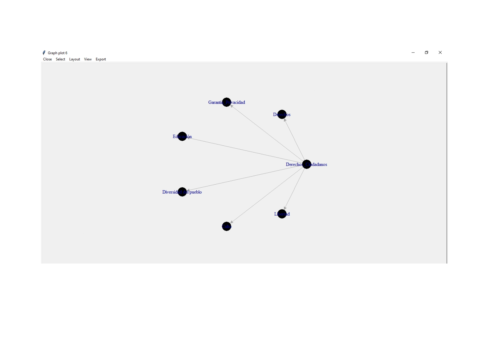
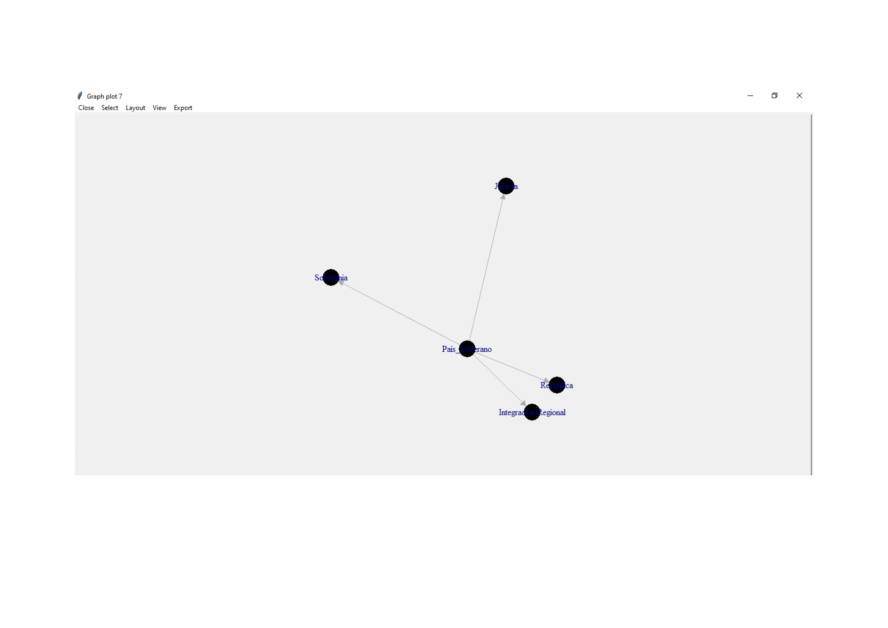

```{r setup, include=FALSE}
knitr::opts_chunk$set(echo = TRUE)
```

# Motivación para el análisis de las Constituciones una perspectiva desde la optica de la cultura general

Según las creencias populares las constituciones representan una *garantía de derechos y deberes* para algunos, un documento inviolable, para otros un documento que en la lejanía promete cumplir y garantizar deberes y derechos de los ciudadanos que habitan una ~~Nación~~, la **Real Academia Española** manifiesta en <https://dle.rae.es/naci%C3%B3n?m=form> que se entiende por Nación todo aquel conjunto de habitantes de un País regido por un mismo gobierno, entonces no es el término adecuado, veamos que significa **Constitución** es la ley fundamental de un Estado, con rango superior al resto de las leyes, que define el régimen de **_derechos y libertades de los ciudadanos_** y delimita los poderes e instituciones de la organización política. Hemos tomado para este ejercicio ciudadano las constituciones del *Uruguay* y de *Costa Rica* debido a los conceptos que toman cada vez más fuerza en relación a las libertades económicas y civiles que existen en ambas. El objeto es acercarnos con las herramientas aprendidas a los verdaderos fundamentos **_Contitucionales_** de ambas naciones. 

## Plan de trabajo realizado

Los pasos seguidos para el análisis son:

1. Descarga de ambos textos en PDF de los enlaces públicos.
2. Convertir para el análisis RQDA en .txt
3. Codificar en RQDA según los valores, codigos y categorias creadas.
4. Graficar la frecuencia de palabras y nube posterior a la limpieza de caracteres
5. Escribir las conclusiones más *relevantes*

#Codigos analizados

Antes de analizar los textos propiamente con RQDA, es importante destacar que se realizó un etiquetado completo de ambas constituciones, obteniendo por ejemplo  para el código *Diversidad del Pueblo* los siguientes resultados

**Constitución-de-la-República-Oriental-del-Uruguay [8219:8389]
  
Es libre la entrada de toda persona en el territorio de la República, su permanencia
en él y su salida con sus bienes, observando las leyes y salvo
perjuicios de terceros

Constitución-de-la-República-Oriental-del-Uruguay [21114:21190]
  
Los ciudadanos de la República Oriental del Uruguay son naturales o legales.

Constitución-de-la-República-Oriental-del-Uruguay [21566:21826]
  
Los hombres y las mujeres extranjeros de buena conducta, con familia
constituida en la República, que poseyendo algún capital en giro o
propiedad en el país, o profesando alguna ciencia, arte o industria, tengan tres años
de residencia habitual en la República

Constitución-de-la-República-Oriental-del-Uruguay [21830:22167]
  
Los hombres y las mujeres extranjeros de buena conducta, sin familia constituida
en la República, que tengan alguna de las cualidades del inciso
anterior y cinco años de residencia habitual en el país.
C)Los hombres y las mujeres extranjeros que obtengan gracia especial de la
Asamblea General por servicios notables o méritos relevantes

Constitución-de-la-República-Oriental-del-Uruguay [37584:37742]
  
Para ser Representante se necesita ciudadanía natural en ejercicio, o legal con
cinco años de ejercicio, y, en ambos casos, veinticinco años
cumplidos de edad

Constitución-de-la-República-Oriental-del-Uruguay [41663:41810]
  
Para ser Senador se necesita ciudadanía natural en ejercicio o legal con siete años
de ejercicio, y, en ambos casos, treinta años cumplidos de edad

constitucion_Costa_Rica [10082:10725]
  
on costarricenses por nacimiento:
1) El hijo de padre o madre costarricense nacido en el territorio de la
República;
2) El hijo de padre o madre costarricense por nacimiento, que nazca en el
extranjero, y se inscriba como tal en el Registro Civil, por la voluntad del
progenitor costarricense, mientras sea menor de edad, o por la propia hasta
cumplir veinticinco años;
3) El hijo de padres extranjeros nacido en Costa Rica que se inscriba como
costarricense, por voluntad de cualquiera de sus progenitores mientras sea
menor de edad, o por la propia hasta cumplir veinticinco años;
4) El infante, de padres ignorados, encontrado en Costa Rica

constitucion_Costa_Rica [10743:11689]
  
Son costarricenses por naturalización:
1) Los que hayan adquirido esta nacionalidad en virtud de leyes anteriores.
2) Los nacionales de otros países de Centroamérica, los españoles y los
iberoamericanos por nacimiento que hayan residido oficialmente en el país
durante cinco años como mínimo y que cumplan con los demás requisitos
que fije la ley.
3) Los centroamericanos, los españoles y los iberoamericanos que no lo sean
por nacimiento y los demás extranjeros que hayan residido oficialmente en el
país durante siete años como mínimo y que cumplan con los demás
requisitos que fije la ley.
4) La mujer extranjera que al contraer matrimonio con costarricense pierda
su nacionalidad.
5) Las personas extranjeras que al casarse con costarricenses pierdan su
nacionalidad o que luego de haber estado casadas dos años con
costarricenses, y de residir por ese mismo período en el país, manifiesten su
deseo de adquirir la nacionalidad costarricense.

constitucion_Costa_Rica [15219:15658]
  
Los extranjeros tienen los mismos deberes y derechos
individuales y sociales que los costarricenses, con las excepciones y
limitaciones que esta Constitución y las leyes establecen.
No pueden intervenir en los asuntos políticos del país, y están sometidos a la
jurisdicción de los tribunales de justicia y de las autoridades de la República,
sin que puedan ocurrir a la vía diplomática, salvo lo que dispongan los
convenios internacionales

constitucion_Costa_Rica [35279:35361]
  
Queda prohibido a los extranjeros ejercer dirección o autoridad en los
sindicatos.

constitucion_Costa_Rica [37639:37877]
  
No podrá hacerse discriminación respecto al salario, ventajas o
condiciones de trabajo entre costarricenses y extranjeros, o respecto de
algún grupo de trabajadores.
**En igualdad de condiciones deberá preferirse al trabajador costarricense**

#Visualización del gráfico de redes




Del etiquetado en RQDA de ambas constituciones se entiende en un primer análisis no especializado que la República Oriental del Uruguay tiene en su carta magda más claridad en cuanto a las condiciones para la permanencia de extranjeros en su territorio, además de brindar una igualdad de condiciones ante la ley que brindan una mayor garantía a la hora de instalarse ya sea para residir o para hacer negocios.

## Analisis de la Constitución de la República Oriental del Uruguay:

Tabla de palabras

```{r message=FALSE, warning=FALSE, include=FALSE}

library(tesseract)
library(readtext)
library(pdftools)
library(pdftools)
library(dplyr)
library(stopwords)
library(tidytext)
library(stringi)
library(stringr)
library(ggplot2)
library(scales)
library(tidyr)
library(widyr)
library(ggraph)
library(igraph)
library(quanteda)
library(topicmodels)
library(cvTools)
library(knitr)

# extraigo las constituciones de la República a ser analizadas

# Constitución de la República Oriental del Uruguay
getwd()
setwd("C:/Users/Usuario/Documents/rcuali_2021/TrabajosFinales/Maria de los angeles")
getwd()
Consti_UY_PDF <- ("C:/Users/Usuario/Documents/rcuali_2021/TrabajosFinales/Maria de los angeles/Constitución de la República Oriental del Uruguay.pdf")
Consti_UY_PDF
Const_UY_2 <- readtext(Consti_UY_PDF)
```


```{r include=FALSE}

Const_UY <- gsub("\\r", " ",Const_UY_2)
Const_UY <- gsub("\\n", "",Const_UY_2)
Const_UY <- gsub("\\d\\K\\.(?=\\d)", "",Const_UY_2, perl = TRUE)

# juntamos todas las páginas

Const_UY <- paste(Const_UY_2, collapse = "")
length(Const_UY)

Const_UY[1]


```


```{r include=FALSE}
# limpio

Const_UY <- gsub("\\r", " ",Const_UY_2)
Const_UY <- gsub("\\n", "",Const_UY_2)
Const_UY <- gsub("\\d\\K\\.(?=\\d)", "",Const_UY_2, perl = TRUE)

# juntamos todas las páginas

Const_UY <- paste(Const_UY_2, collapse = "")
length(Const_UY)

Const_UY[1]

# estructuro el texto

vector = c()
for (i in 1:length(Const_UY)) {
  temp<-(strsplit(Const_UY[[i]], "\\.")[[1]])
  print(temp)
  vector <- c(vector, temp)
}

length(vector)
class(vector)

# lo convertimos en un data frame

Constitu <- as.data.frame(vector)
Constitu
View(Constitu)
# limpieza nuevamente

colnames(Constitu)[1]<-"Contenido"

# quitamos los espacios de encabezado y pie de página

Constitu$Contenido <- trimws(Constitu$Contenido, "l")

# paso a cáracter
Constitu$Contenido <- as.character(Constitu$Contenido)

# limpio un poco mas

Constitu$Contenido <- gsub("CAPITULO", "", Constitu$Contenido)
Constitu$Contenido <- gsub("Artículo", "", Constitu$Contenido)

View(Constitu)
# Análisis exploratorio

Nomenclatura <- stopwords("es")

Nomenclatura <- as.data.frame(Nomenclatura)
Nomenclatura
names(Nomenclatura) <- "normativa"
names(Nomenclatura)
Nomenclatura$normativa <- as.character(Nomenclatura$normativa)

View(Nomenclatura)

```

Contamos las palabras

```{r include=FALSE}
# generamos un ID para análisis básico
library(tidyverse)
CUY <- tibble::rowid_to_column(Constitu, "ID")
CUY
View(CUY)
library(unnest)
library(tidyr)
library(dplyr)


review_words <- CUY%>%
  distinct(Contenido, .keep_all = TRUE)%>% 
  unnest_tokens(normativa, Contenido, drop = FALSE)%>%
  distinct(ID,normativa,.keep_all = TRUE)%>%
  anti_join(Nomenclatura)%>%
  filter(str_detect(normativa,"[^\\d]"))%>%
  group_by(normativa)%>%
  dplyr::mutate(normativa_total= n())%>%
  ungroup()

review_words
View(review_words)

```


```{r echo=FALSE}
#Contamos las palabras

word_counts  <- review_words%>%
  dplyr::count(normativa, sort = TRUE)
word_counts
View(word_counts)
head(word_counts)
```


Creo un gráfico de barras con las palabras más utilizadas en la Constitución Uruguaya

```{r echo=TRUE}
# Grafique segun numero de aparicion
word_counts%>%
  head(20)%>%
  mutate(normativa = reorder(normativa, n))%>%
  ggplot(aes(normativa, n)) +
  geom_col(fill = "green")+
  scale_y_continuous() +
  coord_flip() +
  labs(title = paste0("Palabras mas utilizadas"),
       subtitle = "Stopwords retiradas",
       x = "Palabra",
       y = "Numero de veces usada")
```

Generamos la nube de palabras 

```{r echo=TRUE, warning=FALSE}
# Generamos nuestra nube de palabras

library(wordcloud)
library(RColorBrewer)
library(textplot)

CUY_grouped_V <- review_words%>% group_by(normativa)%>%count(normativa_total)%>%
  mutate(frecuencia = n/dim(review_words)[1])
View(CUY_grouped_V)
CUY_grouped_V
View(CUY_grouped_V)
wordcloud(words = CUY_grouped_V$normativa, freq = CUY_grouped_V$normativa_total,
          min.words = 3 , random.order = FALSE, rot.per = 0.35,
          colors = brewer.pal(8,"Dark2")) 
```

Por ultimo observamos a través de un bigrama, las distintas combinaciones más frecuentes

```{r include=FALSE}

# bigramas
library(tidytext)
review_bigrams <- CUY %>% 
  unnest_tokens(bigram, Contenido, token = "ngrams", n = 2)
review_bigrams
bigrams_separated <- review_bigrams %>%
  separate(bigram, c("word1","word2"), sep = " ")
bigrams_filtered <- bigrams_separated %>% 
  filter(!word1 %in% Nomenclatura$normativa) %>%
  filter(!word2 %in% Nomenclatura$normativa)
bigram_counts <- bigrams_filtered %>%
  dplyr::count(word1, word2, sort = TRUE)
bigrams_united <- bigrams_filtered %>%
  unite(bigram, word1, word2, sep =  " ")
bigrams_united %>%
  dplyr::count(bigram, sort = TRUE)


```

```{r echo=FALSE, message=FALSE, warning=FALSE}
head(bigram_counts)
head(bigrams_united)
```


## Conclusiones finales

En la práctica sólo hicimos el análisis de la Cosntitución del Uruguay, ya que es más rica en contenido, además de no presentar exclusiones importantes para el ejercicio de derechos y deberes por parte de sus ciudadanos.

# Gracias !


